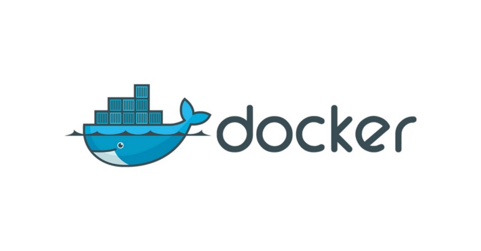

# Docker

Docker ကို ၂၀၁၃ မှာစတင် မိတ်ဆက်ခဲ့ပြီး application များကို လွယ်ကူစွာ containerizing, deploying, and consuming ပြုလုပ်နိုင်ခြင်းကြောင့် လူသိအများဆုံး container engine တစ်ခု ဖြစ်လာခဲ့ပါတယ်။ ယခုလက်ရှိမှာလဲ production အတွက် အဆင်သင့်ဖြစ်တဲ့ ရွေးချယ်စရာတစ်ခု ဖြစ်ပါတယ်။ Developer များ အတွက်လည်း Docker Hub မှာတစ်ဆင့် Official Image များနှင့် Pre-configured Image များကိုလွယ်ကူစွာ Download ပြုလုပ်ပြီး မိမိတို့ရဲ့ Application များကို မည်သည့် Environment \( Windows, Linux, Mac\) မှာမဆို အလွယ်တကူ Deploy ပြုနိုင်ပါသည်။ Kubernetes မှာဆိုရင်လည်း Pod/Container များအသုံးပြုနိုင်ရန်အတွက် Docker Engine ကို default အနေနဲ့ အသုံးပြုထားပါတယ်။ လွန်ခဲ့တဲ့ နှစ်အနည်းငယ်က Docker မှ container တစ်ခုတည်းမဟုတ်ပဲ Containers များစွာကို စည်းချက်ညီညီ manage ပြုလုပ်နိုင်သော ကိုယ်ပိုင် Orchestration Tool ဖြစ်တဲ့ Swarm ကိုမိတ်ဆက်ခဲ့ပါတယ်။ ယခုလူသိများတဲ့ Docker Swarm ဆိုတာပေါ့ဗျာ။ Docker Swarm က container များကို manage ပြုလုပ်နိုင်ဖို့ လိုအပ်တဲ့ features တွေနဲ့ Production မှာ အဆင့်သင့်အသုံးပြုနိုင်အောင်ပြုလုပ်ပေးထားတဲ့ tool ပဲဖြစ်ပါတယ်။


Reference:

* [https://www.docker.com/blog/demystifying-open-container-initiative-oci-specifications/](https://www.docker.com/blog/demystifying-open-container-initiative-oci-specifications/)
* [https://github.com/docker/docker-ce](https://github.com/docker/docker-ce)
* [https://www.docker.com/](https://www.docker.com/)


