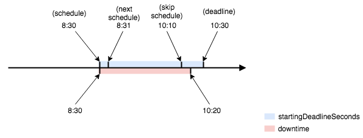

# CronJob

Kubernetes ရဲ့ [Job](https://blog.k8smm.org/job) resource အလုပ်လုပ်ပုံကို လေ့လာသိရှိပြီးကြပီဆိုရင် ဒီ Job တွေကို schedule နဲ့ run ချင်တဲ့အခါဆို ဘယ်လိုမျိုး လုပ်လို့ရမလဲ ?

Job တွေ များလာတဲ့အခါ၊ အချိန်တစ်ခုပေါ်မူတည်ပီး ပုံမှန် လုပ်ရမယ့် Job မျိုး၊ ကိုယ် run ရမယ့် Job က daily process ဖြစ်နေမယ်ဆိုရင် နေ့တိုင်း Job ကို သွား run ပေးနေရတာမျိုးက အဆင်မပြေနေဘူး။  
Linux OS တွေမှာ ကျွန်တော်တို့ လုပ်ချင်တဲ့ process တွေ run ချင်တဲ့ script တွေကို cronjob အဖြစ် crontab ထဲမှာ schedule ပေးပီး run ကြတယ်။  
Kubernetes မှာလဲ Job တွေကို cron format နဲ့ schedule ထားပီး run ပေးနိုင်တဲ့ **CronJob** resource ရှိတယ်။

CronJob တည်ဆောက်ဖို့အတွက် အရမ်း မရှုပ်ထွေးပါဘူး။  
kind မှာတော့ သူ့ရဲ့ resource name ဖြစ်တဲ့ CronJob  
spec မှာ schedule parameter နဲ့ cron format သတ်မှတ်ပေးရပီး  
cronjob က ဆောက်ရမယ့် job ကို jobTemplate property မှာ Job ရဲ့ spec ကို ထည့်ပေးရုံပါပဲ။

Job တစ်ခုကို တစ်နာရီခြားတစ်ခါ run မယ်ယူဆပါစို့။ ဒီလုပ်ဆောင်ချက်ကို CronJob နဲ့ ဆောက််မယ်ဆိုရင် -

```yaml
apiVersion: batch/v1beta1
kind: CronJob
metadata:
 name: throw-dice
 labels:
   app: throw-dice
spec:
 schedule: "0 * * * *"
 jobTemplate:
   spec:
   template:
    spec:
      containers:
      - name: throw-dice
        image: k8smm/throw-dice
      restartPolicy: Never  
```

CronJob resource မှ schedule တွင် သတ်မှတ်ထားတဲ့ အချိန်ရောက်ရင် Job resource ကို ဆောက်ပေးမယ်။ Job resource ဆောက်ပီးသွားရင်တော့ [Job](https://blog.k8smm.org/job) မှတစ်ဆင့် Pod ဆောက်ပေးပါတယ်။

အကယ်၍ ထို Job ဒါမှမဟုတ် Pod က schedule အချိန်မှာ run ဖို့ကြာနေတာ၊ လုံးဝမ run တဲ့အခါမျိုးမှာ နောက် schedule အချိန်မတိုင်ခင် အရှေ့ Job ကို အလုပ်လုပ်မလုပ် စစ်ဆေးဖို့ လိုအပ်ပါတယ်။  
CronJob controller အနေနဲ့ [10 စက္ကန့်](https://github.com/kubernetes/kubernetes/blob/27e5971c11cfcda703a39ed670a565f0f3564713/pkg/controller/cronjob/cronjob_controller.go#L93)တိုင်း Jobs တွေကို sync, healthy check လုပ်ပါတယ်။ ဒီလို စစ်ဆေးလို့ Job ဟာ **status.lastScheduleTime** မှစပီး လက်ရှိအချိန်ထိ အကြိမ် ၁၀၀ နဲ့အထက် schedule လုပ်လို့ မရဘူးဆိုရင် CronJob မှ schedule ထပ်မလုပ််တော့ပါဘူး။ သို့သော် schedule အချိန် ၂ခုကြားထဲမှာ အကြောင်းအမျိုးမျိုးကြောင့် Job မ run နိုင်ပေမဲ့ နောက် schedule ချိန်မှာ CronJob ကောင်းကောင်း run နိုင်မယ်ဆိုရင် မလိုအပ်ပဲ missed ဖြစ်တဲ့ အခြေအနေကို ဘယ်လို စီမံလို့ရနိုင်မလဲ?  
CronJob မှာ schedule တစ်ခုအတွင်း မစတင်နိုင်တဲ့ Job ကို **startingDeadlineSeconds** field နဲ့ deadline အချိန်တစ်ခုသတ်မှတ်ပီး ထိုအချိန်မရောက်မချင်း Job ကို retry ပြန်လုပ်စေပီး ထိုအချိန်ထက် ကျော်လွန်သည်အထိ မစတင်နိုင်တဲ့ Job ကိုတော့ failed state သတ်မှတ်လိုက်ပါတယ်။

```yaml
apiVersion: batch/v1beta1
kind: CronJob
spec:
  schedule: "30 * * * *"
  startingDeadlineSeconds: 60
```

ဒီ field အသုံးပြုပုံကို ပိုမိုမြင်သာအောင် သာဓက ၂ခုနဲ့ နှိုင်းယှဥ်ပြပါမယ်။


ပထမတစ်ခုက schedule ကို 8:30, 9:30 ... စသဖြင့် တစ်နာရီစီ run ခိုင်းမယ်။ **startingDeadlineSeconds** ကို စက္ကန့် 60 ထားမယ်။ 8:29 နဲ့ 8:35 အတွင်းမှာ အကြောင်းတစ်စုံတရာကြောင့် Job မစနိုင်ဘူး။ သတ်မှတ်ထားတဲ့ deadline ထိ Job မစနိုင်တဲ့အတွက် 8:30 schedule မှာ failed သွားပီး နောက် တစ်နာရီခြား 9:30 မှ schedule ပြန်လုပ်ပါလိမ့်မယ်။




အကယ်၍ deadline က schedule ရဲ့ စပ်ကြားကာလထက် များနေမယ်ဆိုတဲ့ အခြေအနေမျိုးမှာ ဘယ်လိုဖြစ်နိုင်မလဲ။ ဒုတိယပုံမှာ schedule ကို ၁မိနစ်ခြားစီ run စေပီးတော့ deadline က 2 နာရီ \( 7200 seconds\) ဖြစ်မယ်။ နောက် schedule ရောက်သိတိုင်အောင် Job မစနိုင်သေးတဲ့အတွက် Job စနိုင်ဖို့အတွက် ကြိုးစားတဲ့အကြိမ် ၁၀၀ ဖြစ်သွားတဲ့အခါမှာ CronJob controller မှ schedule ဆက်မလုပ်နိုင်တော့ပဲ error log ပြန်ပါလိမ့်မယ်။  
  
**Cannot determine if job needs to be started. Too many missed start time \(&gt; 100\). Set or decrease .spec.startingDeadlineSeconds or check clock skew.**

Kubernetes CronJob နဲ့ ပတ်သက်လို့ကတော့ ဒီလောက်ပါပဲ။ ရှေ့ဆက်ပြီးလဲ တခြား resource type တွေကို ရှင်းရှင်းလင်းလင်းနဲ့ အလွယ်တကူ လေ့လာလို့ရအောင် ကျွန်တော်တို့ community က ရေးသားပေးပါမယ်။  
Community ဆိုတဲ့အတိုင်း တစ်ဦးတစ်ယောက်မှ ဦးဆောင်မှုမျိုးမဟုတ်ပဲ လေ့လာသူအချင်းချင်းပူးပေါင်းပီး ပိုမိုကောင်းမွန်တဲ့ အဖွဲ့အစည်းတစ်ခု ဖြစ်ပေါ်လာဖို့ကိုသာ ရည်ရွယ်ပါတယ်။ Kubernetes သိနေရမှမဟုတ်ပါဘူး။ လေ့လာလိုတဲ့စိတ်တစ်ခုရှိရုံနဲ့ Community မှာ ပါဝင်ဖို့ ဖိတ်ခေါ်ပါတယ်။  
ကျေးဇူးတင်ပါတယ်။


```yaml
Reference:

https://kubernetes.io/docs/concepts/workloads/controllers/cron-jobs/
https://github.com/kubernetes/kubernetes/issues/73169
```

