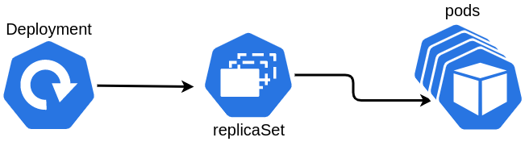
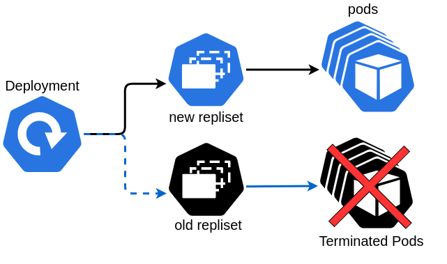
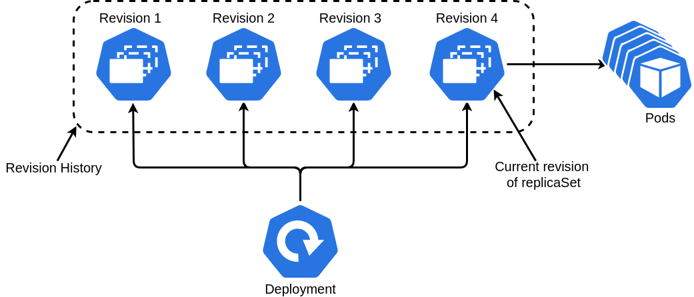
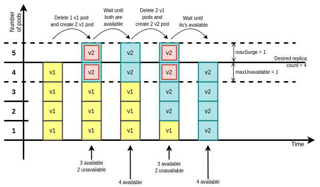

# Deployment

Deployment က kubernetes resources တွေထဲမှာ applications တွေကို deployment ပြုလုပ်ဖို့အတွက် High-level resource တစ်ခု ဖြစ်တယ်။ တကယ်ဆိုရင် Replication controller နဲ့ ReplicaSet စတဲ့ resources တွေရှိရုံဖြင့် application run နေတဲ့ containers တွေကို ကောင်းစွာ kubernetes က manage လုပ်နိုင်ပြီ၊ လုံလောက်ပြီ ဟု ယူဆနိုင်ပါတယ်။ ဒါဆို ကျွန်တော်တို့က ဘာလို့ Deployment ကို သုံးဖို့လိုအပ်မှာလဲ ? အဖြေကတော့ kubernetes တွင် applications တွေကို declarative ပုံစံနဲ့ Deploy ပြုလုပ်ဖို့ရန်နှင့် Update ပြုလုပ်နိုင်ရန် ဖြစ်ပါတယ်။ တကယ်လက်တွေ့မှာ ကျွန်တော်တို့ ရဲ့ applications တွေကို run ဖို့ Pod / Replication Controller / ReplicaSet တို့ကို တိုက်ရိုက် တည်ဆောက်ပြီး အသုံးပြုမယ့်အစား Deployment resource ကို ပဲ အသုံးပြုကြ ပါတယ်။ 

   Application တွေအတွက် တခြား resource တွေအစား ဘာလို့ Deployment resource ကို အသုံးပြုသင့် သလဲ / အသုံးပြုကြလဲ ? အဖြေကတော့ Deployment က high-level resource ဖြစ်တာရယ်၊ updating ကို Deployment Controller မှ ပြုလုပ်ပေးနိုင်တာကြောင့် ဖြစ်ပါတယ်။ ဘာလို့ high-level resource ဖြစ်တာလဲ ? အလွယ် နားလည် သဘောပေါက်အောင် ပြောရမယ်ဆိုရင် kubernetes ရဲ့ controllers တွေမှာ delegate လုပ်တဲ့ သဘောတရား မျိုးတွေရှိပါတယ်။ ဥပမာ - controller တစ်ခုက ကိုယ်စားလှယ်အနေနဲ့ task တွေကို လက်ခံပြီး task အကုန်လုံးကို ကိုယ်တိုင် မဖြေရှင်းဘဲ သက်ဆိုင်ရာ task အချို့ကို သက်ဆိုင်ရာ controllers တွေဆီသို့ လွှဲပြောင်းပေးတဲ့ သဘောမျိုးဖြစ်ပါတယ်၊ controller A က ကိုယ်စားလှယ် အနေနဲ့  လုပ်ပြီး controller B ကို task တွေလွှဲပြောင်းပေးတယ်ဆိုရင်  ဒီနေရာမှာ controller A က controller B ထပ် high-level ဖြစ်တယ်လို့ ပြောလို့ရပါတယ်။ ဒီပုံစံ အတိုင်း Deployment resource ကို create ပြုလုပ်လုပ်ချင်း Deployment Controller မှ ReplicaSet Controller ကို delegate ပြုလုပ်ပြီး ReplicaSet Object ကို တည်ဆောက်စေပါတယ်။ ReplicaSet Controller မှ တဆင့် delegate ထပ်ဆင့်ပြုလုပ်ကာ pods တွေကို တည်ဆောက်စေပါတယ်။ 



Deployment က update လုပ်ပေးနိုင်တယ်ဆိုတော့ ReplicaSet/ Replication Controller တို့က မလုပ်ပေးနိုင်ဘူးလား ? Replication Controller ကလည်း update ကိုလုပ်ပေးနိုင်ပါတယ်။ Replication Controller မှ မဟုတ်ဖူး kubernetes cluster ကို access သာ ရှိမယ်ဆိုရင် bash နဲ့ curl ကို အသုံးပြုပြီး kubernetes ထဲမှာ ရှိတဲ့ applications တွေကို update ပြုလုပ်နိုင်ပါတယ်။ အဓိက ကွာခြားတာကတော့ client side မှာ update ပြုလုပ်တာနဲ့ controller မှ update ပြုလုပ်တာ ဖြစ်ပါတယ်။ client side ဘက်မှ update ပြုလုပ်တဲ့ အခါမှာ update မပြီးမချင်း ကိုယ့်စက်ထဲမှာ update အတွက် process ကို run ထားရပါတယ်၊ အဲဒီ အချိန်မှာ အကြောင်းအမျိုးမျိုးကြောင့် မတော်တဆ connection ပျက်တောက်သည်ဖြစ်စေ၊ laptop restart/shutdown ဖြစ်စေတစ်ခုခု ဖြစ်ခဲ့ပါက application ကို update ပြုလုပ်ခြင်းက fail ဖြစ်သွားမှာ ဖြစ်ပါတယ်။ အဆင်ပြေတော့မှ မဟုတ်တော့ပါဘူး။ controller ဘက်မှ  update ပြုလုပ်ခြင်းကတော့ controller မှ လိုချင်တဲ့ desire version ထိ update ဖြစ်အောင် တာ၀န်ယူပေးသွားမှာ ဖြစ်ပါတယ်။ Replication Controller ကတော့ client ဘက်မှ update ပြုလုပ်ရတဲ့ အမျိုးအစားဖြစ်ပြီး ခုနက ပြောခဲ့ သလို အားနည်ချက်တွေ ရှိနေပါတယ်။  ခုနက ပြောခဲ့တဲ့ client ဘက်မှ အားနည်ချက်တွေကို မဖြစ်စေဖို့  Deployment  ကို အသုံးပြုပြီး applications တွေကို update ပြုလုပ်ခြင်းက အသင့်လျှော်ဆုံး၊ အကောင်းဆုံး နည်းလမ်းဖြစ်ပါတယ်။ ဒါ့အပြင် Deployment တွင် applications တွေကို updating ပြုလုပ်ဖို့ တခြားသော features ပါရှိပါတယ်။ ဒါတွေကတော့  applications တွေကို ဘယ်လို ပုံစံ updating ပြုလုပ်မှာလဲ ဆိုတဲ့ deployment strategies နဲ့  updating ပြုလုပ်တဲ့ application တွေရဲ့ roll-out rate ကို ထိန်းချုပ် တာတွေ ဖြစ်ပါတယ်။ features တွေအကြောင်း အရင် မပြောခင် Deployment ဘယ်လို လုပ်တယ်ဆိုတာ ကို အရင် ပြောပြသွားမှာ ဖြစ်ပါတယ်။

Deployment ကို create လုပ်ဖို့က Replication Controller နဲ့ အရမ်းမခြားနားလှပါဘူး။  အနည်းဆုံး Deployment ရဲ့ spec မှာ replica count တွေပြန်ပါမယ်။ နောက်ပြီးတော့ ဘယ်လို deploy လုပ်မယ်ဆိုတဲ့ strategy ပါမယ်။ 

```yaml
apiVersion: apps/v1
kind: Deployment
metadata:
  name: hola-deployment
spec:
  replicas: 3
  template:
    metadata:
      name: hola
      labels:
        app: hola
    spec:
      containers:
      - image: quay.io/dther/hola:v1
        name: golang
```

Updating ပြုလုပ်တဲ့ အခါမှာလဲ update လုပ်ဖို့ kubernetes ကို သီးသန့် command တွေရိုက်စရာမလိုဘူး။ Updating ပြုလုပ်ဖို့ အတွက် pod ရဲ့ template ကို ပြင်လိုက်ရုံပဲ။ pod ရဲ့ template ကို ပြင်ဖို့ နည်းလမ်းတွေကတော့ အများကြီးရှိပါတယ်။ ဒါတွေကတော့ -

```bash
$ kubectl edit deployment hola-deployment
$ kubectl patch deployment hola-deployment -p {"spec":{"template":{"spec": {"containers:[{"name":"golang","image": "quay.io/dther/hola:v2"}]}}}}
$ kubectl apply -f hola-deployemnt-v2.yaml
$ kubectl set image deployment hola-deployment golang=quay.io/dther/hola:v2
$ kubectl replace 
```

Deployment ကို စတင် create လုပ်လိုက်တဲ့ အခါမှာ အပေါ်မှာ ပြောခဲ့ သလို pods တွေကို တန်းပြီး တည်ဆောက်သွားတာ မဟုတ်ပါဘူး။ Deployment create ပြုလုပ်လုပ်ချင်း ReplicaSet ကို create လုပ်သွားပါတယ်၊ ReplicaSet ကမှ pods တွေကို တည်ဆောက်ပြီး တကယ် manage လုပ်တာပါ။ Deployment က Pods တွေကို တိုက်ရိုက် manage မလုပ်ပါဘူး။ Deployment ကို update ပြုလုပ်တဲ့ အခါမှာ နောက်ထပ် ReplicaSet အသစ်ကို ထပ်ပြီးတော့  create လုပ်ပါတယ်။ ReplicaSet အသစ်မှာ version အသစ် pods များ running ဖြစ်တဲ့ အခါမှာ ReplicaSet အဟောင်းမှ Pods တွေကို Terminate ပြုလုပ်သွားပါတယ်။ ဒါပေမဲ့ ReplicaSet အဟောင်းကို တော့ မဖျက်ပါဘူး။



Deployment က ReplicaSet အဟောင်းတွေကို မဖျက်သွားရတဲ့ အကြောင်းအရင်း ကတော့ multiple application versions တွေကို track လုပ်ချင်တာကြောင့်ရယ်၊ အလွယ် တကူ rollback ပြုလုပ်ဖို့ရန် အတွက် ဖြစ်ပါတယ်။



Deployment ရဲ့ ReplicaSet တွေနဲ့  manage လုပ်တဲ့ `kubectl` ရဲ့ subcommand ကတော့ `rollout` ဖြစ်ပါတယ်။ အပေါ်ပုံကတော့ Deployment တစ်ခုရဲ့ update  လုပ်ခဲ့တဲ့ ReplicaSet \(Revision\) တွေဖြစ်ပါတယ်။ Update တစ်ခုခုလုပ်လိုက်လို့ လက်ရှိ ReplicaSet မှာ bugs တွေပါလာတဲ့ အခါ stable version ပြန်ဆင်းဖို့၊ revision history တွေကြည့်ဖို့ စတဲ့ `rollout` အသုံးပြုပုံကို အောက်မှ နမူနာဖော်ပြပေးပါ့မယ်။

```bash
$ kubectl set image deployment hola-deployment golang=quay.io/dther/hola:v3 --record
$ kubectl rollout undo deployment hola-deployment
$ kubectl rollout history deployment hola-deployment
$ kubectl rollout undo deployment hola-deployment --to-reversion=1
$ kubectl rollout pause deployment hola-deployment
$ kubectl rollout resume deployment hola-deployment
```

Applications တွေကို Updating ပြုလုပ်တဲ့ အခါမှာ Deployment Strategy types ၂ မျိုး ရှိပါတယ်။ Recreate နဲ့ RollingUpdate ဖြစ်ပါတယ်။ RollingUpdate ကတော့ Default Strategy Type ဖြစ်ပါတယ်။ Recreate Strategy ကတော့ ရှင်းပါတယ်။ Update ပြုလုပ်လိုက်တဲ့ အခါမှာ ရှိသမျှ pods အားလုံးကို Terminate ပြုလုပ်ပြီး new version ကို create ပြုလုပ်ပီးတော့ update ပြုလုပ်တဲ့ Strategy ဖြစ်ပါတယ်။ RollingUpdate Strategy ကတော့ Recreate လို မဟုတ်ပါဘူး။ New ReplicaSet တွင် pod တစ်ခုချင်း create ပြုလုပ်ပြီး running ဖြစ်တော့ မှာ Old ReplicaSet မှာ pod တစ်ခုကို Terminate ပြုလုပ်ပြီး ဖြည်းဖြည်းချင်း အေးဆေး တစ်ခုချင်းစီ Update ပြုလုပ်တဲ့ strategy ဖြစ်ပါတယ်။ 



RollingUpdate Strategy ကို အသုံးပြုမယ်ဆိုရင် update လုပ်တဲ့ အခါမှာ ရှိသမျှ replica count မှ တစ်ကြိမ်မှာ pods ဘယ်နှစ်ခုကို တပြိုင်တည်း update လုပ်မယ်၊ pods ဘယ်နှစ်ခုကတော့ အသုံးပြုဖို့ မရရှိနိုင်ဖူးဆိုတာကို maxSurge နဲ့ maxUnavailable ကိုသုံးပြီး control လုပ်နိုင်ပါတယ်။ maxSurge ကတော့ လက်ရှိ replicas count ထက် ဘယ်နှစ်ခု ပိုလုပ်မလဲ ဆိုတာ  ကိုပြောတာဖြစ်ပါတယ်။ Default ကတော့ 1 ပါ။ အပေါ်က ပုံမှာလဲ `maxSurge = 1` ပါ။ maxUnavailable ကတော့ rolling update ပြုလုပ်နေတဲ့ အချိန်မှာ လက်ရှိ replicas count ထဲမှ pods ဘယ်နှစ်ခုက  ready မဖြစ်ခင် \(အသုံပြုလို့ မရ\) တဲ့ အခြေအနေ ဖြစ်ခွင့် ရှိတယ်လို့  ရည်ရွယ်တာဖြစ်ပါတယ်။ Default က 0 ဖြစ်ပြီး ပုံမှာတော့ မြင်သာအောင် `maxUnavailable = 1`  ထားပြထားပါတယ်။ `maxSure = 1` နဲ့ `maxUnavailable = 1` ထားသော်လည်း လက်တွေ့မှာတော့ pods  ၂ ခု unavailable ဖြစ်သွားမှာ ဖြစ်ပါတယ်။ ဘာကြောင့်လဲ ဆိုတော့ လက်ရှိ replicas count ၄ ခုထဲမှ တစ်ခု unavailable ဖြစ်ခွင့်ရှိပြီး၊ တစ်ခု update ပိုလုပ်ခွင့် ရှိသောကြောင့် ဖြစ်ပါတယ်။ အောက်မှာ အပေါ်ပုံ ရဲ့ manifest ကို ဖော်ပြပေးပါ့မယ်။

```yaml
apiVersion: apps/v1
kind: Deployment
metadata:
  name: hola-deployment
spec:
  replicas: 4
  minReadySeconds: 10
  strategy:
    rollingUpdate:
      maxSurge: 1
      maxUnavailable: 1
    type: RollingUpdate
  template:
    metadata:
      name: hola
      labels:
        app: hola
    spec:
      containers:
      - image: quay.io/dther/hola:v4
        name: golang
```

