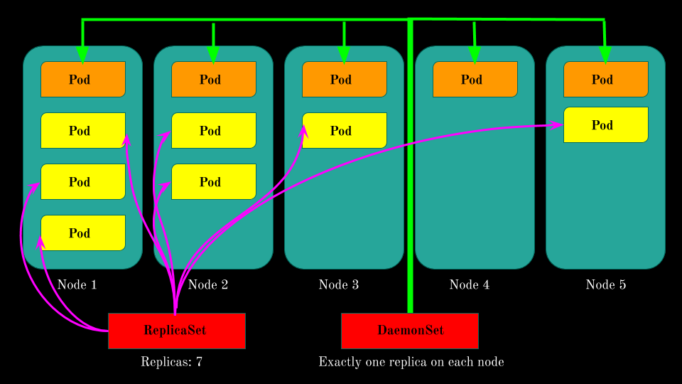

# DaemonSet

ReplicationControllers နဲ့ ReplicaSets တွေကို အသုံးပြုပြီး pod တွေကို create လုပ်တဲ့ အခါ cluster အတွင်း အဆင်ပြေတဲ့ သင့်လျော်တဲ့ worker node တွေ အပေါ်မှာ scheduler အလိုကျ သို့ မဟုတ် user အလိုကျ deploy လုပ်ကြပါတယ်။ ဒါပေမဲ့ တချို့ use case တွေ အတွက် replicas count အလိုက် cluster တစ်ခုလုံး အတွင်း ပျံ့နှံ့ deploy လုပ်ချင်တာ မျိုး မဟုတ်ဘဲ၊ cluster အတွင်း ရှိသမျှ node တိုင်း အတွက် \(သို့\) သီးခြား node အစုအဝေး များ အတွက် node တစ်ခု လျှင် pod တစ်ခု deploy ပြုလုပ်ချင်သည့် ပုံစံမျိုး \(ဥပမာ cluster အတွင်းရှိ node တိုင်းတွင် monitoring agent များ ကို pod အနေနဲ့ deploy ပြုလုပ်ခြင်း၊ log collector များကို pod တစ်ခု အနေနဲ့ deploy ပြုလုပ်ခြင်း စသည့် use case များ။\) အတွက် kubernetes က DaemonSets Controller ကို Design ထုတ်ထား ခြင်း ဖြစ်တယ်။ ဒါကြောင့်မို့ DaemonSets တွေကို အများအားဖြင့် system level operations တွေ လုပ်ဆောင်တဲ့ infrastructure နဲ့ သက်ဆိုင်တဲ့ pod တွေကို deploy လုပ်ချင် တဲ့ အခါ မျိုးမှာ အသုံးပြုကြလေ့ ရှိပါတယ်။ DaemonSets သည် ReplicationControllers နဲ့ ReplicaSets တို့ နဲ့ အလုပ်လုပ်ပုံချင်း တူညီ ကြပြီး ခြားနားသည်မှာ replica count \(.spec.replicas\) ပါဝင်မှု မရှိခြင်း၊ replica count အစား node count အရေအတွက် ကိုသာ အသုံးပြုခြင်း၊ node တစ်ခု လျှင် pod တစ်ခုသာ deploy ပြုလုပ်ခြင်း နှင့် kubernetes ရဲ့ scheduler ကို skip/bypass လုပ်နိုင်ခြင်း \(တချို့ အခြေအနေတွင် scheduler ကို ဂရုစိုက်မှုမရှိခြင်း\) စသည်တို့ ဖြစ်သည်။



    DaemonSets သည် ReplicaSets ကဲ့သို့ desired replica count မရှိ သော်လည်း desired state ကို node အပေါ်တွင် မူတည်ပြီး count လုပ်သည်။ node တစ်ခု cluster အထဲသို့ တိုးလာလျင် DaemonSet ၏ pod template \(spec.template.spec\) ထဲမှ pod တစ်ခု ကို တိုးလာသည့် node အသစ်ပေါ်တွင် အလို အလျောက် ချက်ချင်း တည်ဆောက်သွားပြီး DaemonSet ၏ selector \(.spec.selector\) ထဲတွင် ရှိသော label ဖြင့် node အသီးသီး ပေါ်တွင် ရှိသော သက်ဆိုင်ရာ pod များကို managed လုပ်ပေးသည်။ node အပေါ်တွင် ရှိ နေ သော pod များတွင် DaemonSet ၏ Selector ထဲမှာ ရှိသည့် label နဲ့ ကိုက်ညီမှု မရှိသည့် အခါ မှသာ DaemonSets ၏ pod template မှ ယူ၍ DaemonSet ၏ pod ကို ဆောက်ပေးမည် ဖြစ်သည်။ node တစ်ခုကို cluster မှာ remove လုပ်ခြင်း ဖြစ်စေ၊ node down သွားခြင်း ဖြစ်စေ၊ node အပေါ်တွင် ရှိသော DaemonSets ရဲ့ pod ကို တစ်ခြား node တစ်လုံး ပေါ်သို့ ပြန် reschedule လုပ်ပေး သွားခြင်း မရှိပေ၊ မည်သည့် အကြောင်းကြောင့်ဖြင့် ဖြစ်စေ cluster ထဲမှာ node မရှိတော့ သည့်အခါ ထို DaemonSets ၏ pod သည်လည်း ရှိတော့ မည် မဟုတ်ချေ။ DaemonSets ကို သီးခြား node group များ အတွက် pod template အထဲ တွင် node selector ထည့်၍ အသုံးပြုနိုင်မည်။ ဥပမာ kubernetes cluster ထဲတွင် worker node ၄ လုံးရှိပြီး ၃ လုံးတွင် ssd တပ်ဆင် အသုံးပြု တပ်ဆင်းထားပြီ ssd အတွက် ssd ရှိသည့် node များကို သီးခြား monitoring ပြုလုပ်ချင် သည့် အခါမျိုး အစရှိသည့် ပုံစံ များတွင် သုံးကြသည် သုံးနိုင်သည်။


   Scheduler သည် pod \(သို့\) ReplicationController/ ReplicaSet/Deployment/etc .. အစ ရှိသည်တို့ မှ တည်ဆောက်သည့် pod များကို အရည်အသွေး \(သို့\) အခြေအနေ နှင့် ကိုက်ညီမှု မရှိသည့် node များ ပေါ်သို့ pod များ ကို schedule မလုပ်ပေးပါ၊ ရှိနေပြီသား pod များကို လဲ node အခြေအနေနဲ့ အဆင် မပြေသည့် အခါ တွင်လဲ unschedulable ပြုလုပ်နိုင်သည့် attribute ရှိသည်။ \(နောက်ပိုင်းတွင် scheduler အကြောင်း ရေးဖို့ရှိသည်။ ယခု အခါ တွင်မှု မပြည့်စုံပါ\) ထိုကဲ့သို့ တချို့ အဆင်မပြေသည့် node များ ပေါ်သို့ DaemonSet သာလျှင် scheduler ကို bypass ပြုလုပ် နိုင်ပြီး DaemonSet မှ managed လုပ်ထားသော pod များသာ ထို node ပေါ်တွင် deploy ပြုလုပ်နိုင်သည်။ ဘာကြောင့်လဲ ? DaemonSets သည် system services များ အတွက် အသုံးပြု ဖို့ Design ထုတ်ထားသောကြောင့် ဖြစ်သည်။ schedule မလုပ်နိုင်သည့် ပြဿနာ ရှိသော node များ တွင် system level operation များ \(ဥပမာ monitoring / logging / networking related task /etc ...\) တွင် DaemonSet ကို အသုံးပြုနိုင်သည်။

```yaml
# Sample Simple YAML Manifest for DaemonSet
apiVersion: apps/v1
kind: DaemonSet
metadata:
  name: ssd-monitor
spec:
  selector:
    matchLabels:
      app: ssd-monitor
  template:
    metadata:
      labels:
        app: ssd-monitor
    spec:
      nodeSelector:
        disk: ssd
      containers:
      - name: main
        image: quay.io/dther/ssd-monitor
```

  အပေါ်က manifest ကို `ssd-monitor.yaml` အနေနဲ့ save ပြီး `kubectl create -f ssd-monitor.yaml` command နဲ့ DaemonSet ကို create ပြုလုပ်နိုင်ပြီး အောက်တွင် ပြထားသည့် အတိုင်း `kubectl get daemonset` or `kubectl get ds -A` ဖြင့် cluster တစ်ခုလုံးတွင် ရှိသည့် DaemonSet တွေရဲ့ information ကို retrieve လုပ်ယူနိုင်ပါသည်။ `-A` သည် all namespace ကို ဆိုလိုသည် \(နောက်ပိုင်းတွင် namespace အကြောင်း ဆက်ရေးရန် ရှိပါသည်\) `kubectl describe ds ssd-monitor` command ဖြင့် လက်ရှိ DaemonSet ရဲ့ အခြေအနေ အသေးစိပ် များကို သိရှိနိုင်သည်၊ troubleshoot ပြုလုပ်ရတွင် လည်း အသုံးဝင်သည်။

```bash
[dther@opslab labcluster]$ kubectl get ds -A # -A for all namespace (later explain namespace)
NAMESPACE        NAME           DESIRED   CURRENT   READY   UP-TO-DATE   AVAILABLE   NODE SELECTOR                 AGE
kube-system      calico-node    9         9         9       9            9           <none>                        125d
kube-system      kube-proxy     9         9         9       9            9           beta.kubernetes.io/os=linux   125d
kube-system      ssd-monitor    3         3         3       3            3           disk=ssd                      125d
kube-system      nodelocaldns   9         9         9       9            9           <none>                        125d
metallb-system   speaker        9         9         9       9            9           beta.kubernetes.io/os=linux   125d
```

```bash
[dther@opslab labcluster]$ kubectl describe ds ssd-monitor 
Name:           ssd-monitor
Selector:       app=ssd-monitor
Node-Selector:  disk=ssd
Labels:         <none>
Annotations:    deprecated.daemonset.template.generation: 1
Desired Number of Nodes Scheduled: 3
Current Number of Nodes Scheduled: 3
Number of Nodes Scheduled with Up-to-date Pods: 3
Number of Nodes Scheduled with Available Pods: 3
Number of Nodes Misscheduled: 0
Pods Status:  3 Running / 0 Waiting / 0 Succeeded / 0 Failed
Pod Template:
  Labels:  app=ssd-monitor
  Containers:
   main:
    Image:        quay.io/dther/ssd-monitor
    Port:         <none>
    Host Port:    <none>
    Environment:  <none>
    Mounts:       <none>
  Volumes:        <none>
Events:
  Type    Reason            Age   From                  Message
  ----    ------            ----  ----                  -------
  Normal  SuccessfulCreate  51s   daemonset-controller  Created pod: ssd-monitor-wfc8r
  Normal  SuccessfulCreate  51s   daemonset-controller  Created pod: ssd-monitor-495lg
  Normal  SuccessfulCreate  51s   daemonset-controller  Created pod: ssd-monitor-vvjcp

```

nodeSelector တွင် disk=ssd label ပါရှိသောကြောင့် node ၉ လုံးအနက် ssd label ရှိသော node ၃ လုံးတွင်သာ pod များကို DaemonSet က deploy လုပ်ပါတယ်။ -l disk=ssd နဲ့ -l app=ssd-monitor ကတော့ label ဖြင့် လိုချင်သည့် resource ရဲ့ object များကို ဆွဲရန် အတွက် ဖြစ်ပါသည်။ -o wide ကတော့ ပုံမှန် kubectl get pod ထက် ပိုမြင်ရတဲ့ output ကို ဖေါ်ပြသည့် output format တစ်ခု ဖြစ်ပါသည်။ -o wide တွင် run နေသည့် pod ၏ node,IP အစ ရှိသည်တို့ကို ပို၍မြင်ရသည်။

```bash
[dther@opslab labcluster]$ kubectl get node -l disk=ssd
NAME    STATUS   ROLES    AGE    VERSION
node7   Ready    <none>   125d   v1.15.3
node8   Ready    <none>   125d   v1.15.3
node9   Ready    <none>   125d   v1.15.3
[dther@opslab labcluster]$ kubectl get pod -l app=ssd-monitor -o wide
NAME                READY   STATUS    RESTARTS   AGE   IP             NODE    NOMINATED NODE   READINESS GATES
ssd-monitor-495lg   1/1     Running   0          10m   10.233.69.34   node8   <none>           <none>
ssd-monitor-vvjcp   1/1     Running   0          10m   10.233.97.29   node9   <none>           <none>
ssd-monitor-wfc8r   1/1     Running   0          10m   10.233.95.29   node7   <none>           <none>

```

