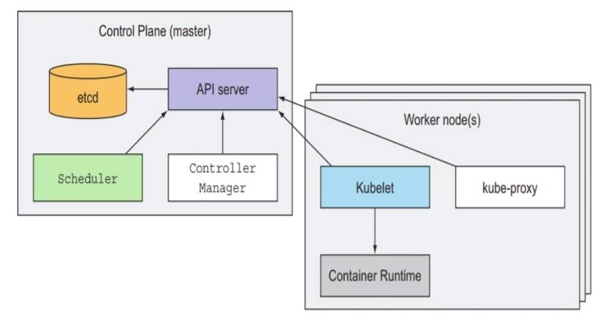

# K8s Cluster Achitecture


**Computer cluster - a group of loosely coupled computers that work together\(wiki\)**. cluster ဆိုသည်မှာ အကြမ်းဖျင်း ပြောရရင် အလုပ်တွေကို အတူတကွ တွဲလုပ်ဖို့ physical machine သို့ မဟုတ် VM စတဲ့ ကွန်ပျူတာ အစုအဝေး တစ်ခု ဖြစ်တယ်။ cluster တွေမှာ ယေဘုယျ အားဖြင့် master ရယ်၊ minion တွေ ရယ် ဆိုပြီး ရှိကြတယ်။ Kubernetes cluster တွင်လဲ ထိုနည်းတူ master node ရယ် worker node\(minion\) တွေ ပါဝင်ကြပါတယ် တချို့ကြတော့လည်း လိုအပ်ချက် အပေါ် မူတည်ပြီ infra node ဆိုပြီး ထပ်ခွဲအသုံး ပြုကြပါသေးတယ်။ အဲတော့ master node ဆိုတာ ဘာလဲ ဘာ components တွေ ပါဝင်သလဲ ? worker node ဆိုတာ ဘာလဲ ဘာ components တွေပါဝင်သလဲ ? ရိုးရိုးရှင်းရှင်းပြောရရင် တော့ master node က kubernetes system ရဲ့ Control Plane ဖြစ်ပြီး cluster တစ်ခုလုံးကို control နဲ့ manage လုပ်ပေးပါတယ်။ worker node ကတော့ ကျွန်တော်တို့ လိုချင်တဲ့ တကယ် applications တွေ ကို worker node အပေါ်မှာ deploy လုပ်ကြပါတယ်။

Master \(Control Plane\) မှာ အကြမ်းဖျင်း အဓိက components ၄ ခု က မပါမဖြစ် ပါဝင်ပြီး အရေးကြီးပါတယ်။ ဒါတွေကတော့ - -

* **API Server** - API server ကတော့ cluster အတွင်း\(master/worker\) ထဲမှာ ရှိတဲ့ components တွေ နဲ့ k8s cluster client တွေ ကြား အဓိက ဆက်သွယ်ပေးတဲ့ components တစ်ခုဖြစ်ပါတယ်။ အလွယ် ပြောရရင်တော့ communication လုပ်ပေးတဲ့ အရာပေါ့။
* **Controller Manager** - ဒါကတော့ controllers တွေ များစွာ ပါဝင်ပြီ cluster level အလုပ်တွေ functions တွေကို လုပ်ပါတယ်။ ဘာတွေလုပ်သလဲ ဆိုရင်တော့ အကြမ်းဖျင်း ပြောရရင် replication အလုပ်တွေ၊ worker nodes တွေရဲ့ အခြေနေ စောင့်ကြည့်တာတွေ၊ ဘယ် worker nodes က failures ဖြစ်သွားတဲ့ အခြေနေမျိုးကို ကိုင်တွယ် ဖြေရှင်းခြင်း အစရှိတဲ့ အလုပ်တွေကို လုပ်ပေးပါတယ်။
* **Scheduler** - ဒါကတော့ application တွေကို deploy လုပ်တဲ့ အခါ ဘယ် worker တွေ အပေါ်ကို သွားပြီး deploy လုပ်ရမယ် သို့မဟုတ် ဘယ် worker node တွေက deploy လုပ်မယ့် application တွေ အတွက် သင့်လျော်တယ်ဆိုတာမျိုးကို ပြုလုပ်ပေးတဲ့ အရာ မျိုးပေါ့။ သူ့ အလုပ်ကတော့ အလွယ်တကူမှတ်ရင် assign ချတာ၊ နေရာ ချရတာနဲ့ တူတယ်။
* **etcd** - သူကတော့ k8s cluster ကြီး တစ်ခုလုံးရဲ့ configuration တွေ ကို persistently စိတ်ချစွာ \(distributed\) သိုလှောင်းထားတဲ့ အရာ ဖြစ်ပါတယ်။ ဥပမာ k8s cluster က application ဆိုရင် သူက အဲ့ application ရဲ့ backend database လိုမျိုးပေါ့။

Worker node \(minion\) မှာ အကြမ်းဖျင်း အဓိက အရေးကြီးတဲ့ components ၃ ခု မဖြစ်မနေ ပါဝင်ပါတယ်။ ဒါတွေကတော့ - -

* **Container runtime** - ဒါကတော့ node အပေါ်မှာ applications တွေကို container image ကနေ container အနေနဲ့ တကယ် run မဲ့ container runtime ဖြစ်ပါတယ်၊ ဥပမာ docker, rkt, containerd အစ ရှိတာတွေဖြစ်ပါတယ်။
* **Kubelet** - kubelet က master node မှာ ရှိတဲ့ api server နဲ့ ဆက်သွယ်ပြီး node အပေါ် container တွေကို ဘယ်လို run မည်ကို manages လုပ်ပေးပါတယ်။ အလွယ်ပြောရရင်တော့ docker တို့ rkt တို့ကို api ကနေ container ကို ဘယ်လို run ပါဆိုပြီ api server က လာသည့် အမိန့်အတိုင်း ပြန် ခိုင်းပေးတဲ့ အကောင်နဲ့ တူတယ်။
* **Kube-proxy** - သူကတော့ deploy လုပ်လိုက်တဲ့ applications တွေရဲ့ network traffic တွေကို ကိုင်တွယ်ပေးတဲ့ အရာ၊ load-balances လုပ်ပေးတဲ့ အရာ ဖြစ်တယ်။

  ဒါတွေက တော့ k8s cluster ရဲ့ architecture အကြမ်းဖျင်း ဖြစ်တယ်။



```text
Reference: - https://kubernetes.io/docs/
           - kubernetes in action book
```

