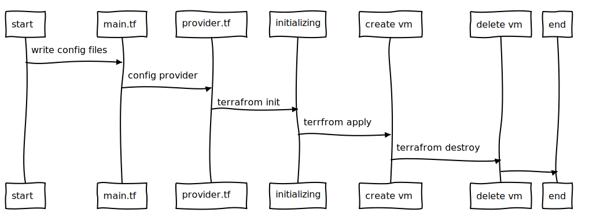

# Hello Terraform!

ပထမဆံုး Terraform ကို အသံုးျပဳျပီး infrastructure ကို provisioning လုပ္ေတာ့မယ္ဆိုရင္ hashicorp configuration language နဲ႔  code ဘယ္လုိ ေရးရသလဲ၊ Terraform ဘယ္လုိ အလုပ္လုပ္သလဲ ဆိုတာ သိဖုိ႔ အေရးၾကီးပါတယ္။ ဒါမွ ကြ်န္ေတာ္တို႔ infrastructure ကို လိုခ်င္တဲ့ ပံုစံ ေရးသားတဲ့ အခါမွာ၊ တည္ေဆာက္တဲ့ အခါမွာ၊ ပိုမိုနားလည္သေဘာေပါက္ျပီး ျပသနာ တစ္ခုခု ျဖစ္တဲ့ အခါ ေတြးေတာ ေျဖရွင္နိုင္မွာ ျဖစ္ပါတယ္။ Terraform ကို အလြယ္ဆံုး ဘယ္လို အလုပ္လုပ္လဲ ဆိုတာ ကို နာလည္ဖုိ႔ အေကာင္းဆံုးနည္းလမ္းက ေတာ့ cloud\(AWS, GCP, Azure\) ဒါမွ မဟုတ္ Vsphere အေပၚမွာ VM တစ္ခုခု စမ္း ေဆာက္ၾကည့္တာပါဘဲ။ အခု ေျပာမဲ့ ထဲမွာ ေတာ့ AWS ေပၚမွာ VM တစ္ခု ေဆာက္ျပ ျပီး step ေတြကို အေသးစိပ္ ေျပာသြားမွာ ျဖစ္ပါတယ္။ တကယ္ေတာ့ အကုန္လံုးကေတာ့ သေဘာတရား တူပါတယ္၊ ဘာလို႔ AWS နဲ႔ လဲ ဆိုေတာ့ ကြ်န္ေတာ္ရွိမွာ အလြယ္ တကူ AWS နဲ႔ အဆင္သင့္ျဖစ္ေနလို႔ပါဘဲ။ အဲေတာ့ အခု ေျပာမဲ့ scenarios မွာ terraform ရဲ႕ AWS provider ကို အသံုးျပဳသြားမွာ ျဖစ္ပါတယ္။ Terraform ရဲ႕ AWS provider ကေတာ့ လိုအပ္တဲ့ API calls ေတြကို ျပဳလုပ္ျပီး VM\(EC2\) ကို တည္ေဆာက္ေပးသြားမွာ ျဖစ္ပါတယ္။ ျပီးသြားရင္ေတာ့ ျပန္ဖ်တ္သြားမွာပါ။ AWS အေပၚမွာ တည္ေဆာက္မွာ ျဖစ္တဲ့ အတြက္  AWS credential လိုပါတယ္။ ျပီေတာ့  ကို္ယ္သံုးမဲ့ credential ရဲ႕ access key, secret key ေတြက AWS ရဲ႕ IAM မွာ အနည္းဆံုး EC2 ကို create delete လုပ္လို႔ ရတဲ့ permission  လိုပါတယ္။ 

ဒီ scenario အတြက္ prerequisite ေတြကေတာ့ - terraform 0.12.X ကို စက္ထဲထည့္ ထားရမွာျဖစ္ပါ တယ္။ ျပီးေတာ့ aws cli လုိအပ္ပါတယ္။ ဒါျပီးသြားရင္ VM deploy ျပဳလုပ္မဲ့ operation ေတြကေတာ့ - 

* vm  ကို တည္ေဆာက္မဲ့ terrafrom configuration files ကို ေရးရပါမယ္
* AWS provider ကို configure ျပဳလုပ္ရပါမယ္
* ျပီးရင္ terraform ကို initializing ျပဳလုပ္ရပါမယ္
* terraform နဲ႔ vm ကို create လုပ္မယ္
* ဒါေတြ အားလံုး ျပီးရင္ေတာ့ တည္ေဆာက္ခဲ့တဲ့ vm ကို ျပန္ဖ်က္ပါမယ္။

