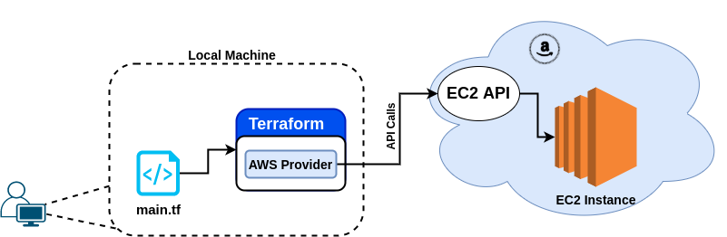
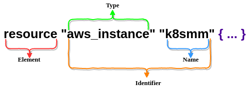
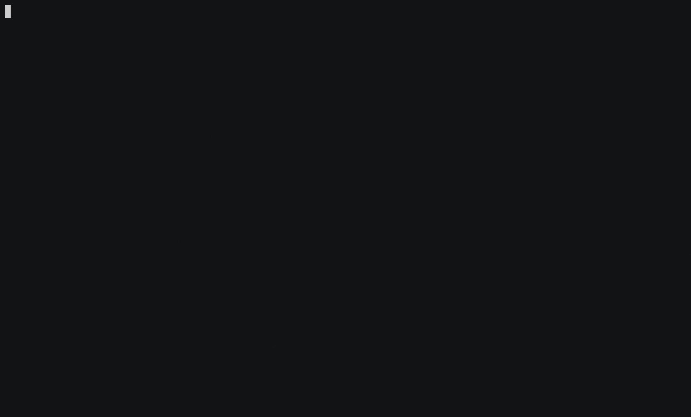

# Hola Terraform !

ပထမဆုံး Terraform ကို အသုံးပြုပြီး infrastructure ကို provisioning လုပ်တော့မယ်ဆိုရင် Hashicorp configuration language နဲ့ code ဘယ်လို ရေးရသလဲ၊ Terraform ဘယ်လို အလုပ်လုပ်သလဲ ဆိုတာ သိဖို့ အရေးကြီးပါတယ်။ ဒါမှ ကျွန်တော်တို့ infrastructure ကို လိုချင်တဲ့ ပုံစံ ရေးသားတဲ့ အခါမှာ၊ တည်ဆောက်တဲ့ အခါမှာ၊ ပိုမိုနားလည်သဘောပေါက်ပြီး ပြသနာ တစ်ခုခု ဖြစ်တဲ့ အခါ တွေးတော ဖြေရှင်းနိုင်မှာ ဖြစ်ပါတယ်။ Terraform ကို အလွယ်ဆုံး ဘယ်လို အလုပ်လုပ်လဲ ဆိုတာ ကို နားလည်ဖို့ အကောင်းဆုံးနည်းလမ်းက တော့ cloud\(AWS, GCP, Azure\) ဒါမှ မဟုတ် Vsphere အပေါ်မှာ VM တစ်ခုခု စမ်း ဆောက်ကြည့်တာပါဘဲ။ အခု ပြောမဲ့ ထဲမှာ တော့ AWS ပေါ်မှာ VM တစ်ခု ဆောက်ပြ ပြီး step တွေကို အသေးစိတ် ပြောသွားမှာ ဖြစ်ပါတယ်။ တကယ်တော့ အကုန်လုံးကတော့ သဘောတရားချင်း တူပါတယ်။ ဘာလို့ AWS နဲ့ လဲ ဆိုတော့ ကျွန်တော်ရှိမှာ အလွယ် တကူ AWS နဲ့ အဆင်သင့်ဖြစ်နေလို့ပါဘဲ။ အဲတော့ အခု ပြောမဲ့ scenarios မှာ terraform ရဲ့ AWS provider ကို အသုံးပြုသွားမှာ ဖြစ်ပါတယ်။ Terraform ရဲ့ AWS provider ကတော့ လိုအပ်တဲ့ API calls တွေကို ပြုလုပ်ပြီး VM\(EC2\) ကို တည်ဆောက်ပေးသွားမှာ ဖြစ်ပါတယ်။ ပြီးသွားရင်တော့ ပြန်ဖျက်သွားမှာပါ။ AWS အပေါ်မှာ တည်ဆောက်မှာ ဖြစ်တဲ့ အတွက် AWS credential လိုပါတယ်။ ပြီတော့ ကိုယ်သုံးမဲ့ credential ရဲ့ access key, secret key တွေက AWS ရဲ့ IAM မှာ အနည်းဆုံး EC2 ကို create delete လုပ်လို့ ရတဲ့ permission လိုပါတယ်။



ဒီ scenario အတွက် prerequisite တွေကတော့ - `terraform 0.12.X` ကို စက်ထဲထည့် ထားရမှာဖြစ်ပါ တယ်။ ပြီးတော့ aws cli လိုအပ်ပါတယ်။ ဒါပြီးသွားရင် VM deploy ပြုလုပ်မဲ့ operation တွေကတော့ -

* vm ကို တည်ဆောက်မယ့် terrafrom configuration files ကို ရေးရပါမယ်
* AWS provider ကို configure ပြုလုပ်ရပါမယ်
* ပြီးရင် terraform ကို initializing ပြုလုပ်ရပါမယ်
* Initialization ပြုလုပ်ပြီးရင်တော့ vm ကို deploy ပြုလုပ်ပါ့မယ်
* ဒါတွေ အားလုံး ပြီးရင်တော့ တည်ဆောက်ခဲ့တဲ့ vm ကို ပြန်ဖျက်ပါမယ်။


 အခု အချိန်မှာ `terraform 0.12.x` ကို laptop ထဲမှာ ထဲမှာ ထည့်သွင်းပြီး aws cli ကိုပါ configure ပြုလုပ်ပြီးပြီး ဟု ယူဆပါမယ်။ ပထမဆုံး ကျွန်တော်တို့ HCL ကို ရေးဖို့ `main.tf` ဆိုတဲ့ file ကို တည်ဆောက်ပါမယ်။ `.tf` extension ကတော့ terraform ရဲ့ configuration ဖြစ်တယ်လို့ terraform run တဲ့ အချိန်မှာ အချက်ပြလိုက်သလိုပါဘဲ၊ main ကတော့ convention ပေါ့ terraform ရဲ့ entry point ပေါ့၊ ဒါပေမဲ့ ဒီ main နေရာမှာ ကြိုက်တဲ့ နာမည် ထားလို့ ရပါတယ် ကျွန်တော်ကတော့ ပုံမှန် main နဲ့ ဘဲ အသုံးများတယ်။ terraform တကယ် ဂရုစိုက်တာကတော့ သူ run သွားတဲ့ directory အောက်က `.tf` file ပါဘဲ။




```text
resource "aws_instance" "k8smm" {
  ami           = "ami-0520e698dd500b1d1"
  instance_type = "t2.micro"
  }
```




```javascript
{
  "Resources": {
    "k8smm": {
      "Type": "AWS::EC2::Instance",
        "Properties": {
          "ImageId": "ami-0520e698dd500b1d1",
          "InstanceType": "t2.micro"
         }
       }
     }
   }
```



Terraform က declarative \(declare what we want\) ဆိုတဲ့ အတိုင်း `main.tf` file ထဲမှာ ကျွန်တော်တို့ တည်ဆောက်ချင်တဲ့ image ရဲ့ AMI ရယ်၊ instance type ရယ်ကို ထည့်ပေးရပါတယ်။ ami id ကို တော့ `Red Hat Enterprise Linux 8` ကိုသုံးထားပါတယ်။ instance type ကိုတော့ `t2.micro` ဆိုတဲ့ အသေးစားလေးဘဲ သုံးထားပါတယ်။ နောက် တစ် tab မှာ ရှိတဲ့ syntax တွေကတော့ အခု terraform ကို သုံးပြီး တည်ဆောက်မဲ့ HCL language ရဲ့ code တွေနဲ့ အဓိပ္ပါယ် တူညီတဲ့ AWS ရဲ့ CloudFormation json syntax ဖြစ်ပါတယ်။


ဒီ RHEL8 ami ကတော့ us-east-2 အတွက်ဘဲ valid ဖြစ်ဖို့ များပါတယ်။




အပေါ်က ပုံကတော့ အခု provision လုပ်တဲ့ အခါမှာ သုံးသွားတဲ့ terraform ရဲ့ keyword တွေ နဲ့ syntax ပုံစံ တွေ ဖြစ်ပါတယ်။ Terraform ကို အသုံးပြုပြီး Infra Resources တွေကို တည်ဆောက်တဲ့ အခါမှာ type resource နဲ့ resource ရဲ့ name ဆိုတဲ့ label နှစ်ခု အတိအကျ ပါဝင်ရမှာ ဖြစ်ပါတယ်။ resource ဆိုတာကတော့ terraform ရဲ့ element ဖြစ်ပြီး အရေးပါ ပါတယ်။ terraform မှာ resource က အများဆုံး သုံးရတဲ့ element ဖြစ်တယ်။ ကျွန်တော်တို့ ဘယ် resource ကို သုံးပြီး ဘာလုပ်မယ်ဆိုတာကို ကြေငြာတဲ့ သဘောပါ။ variable, data, provider တို့ကတော့ resource လိုမျိုး တစ်ခြားသော terraform ရဲ့ element တွေ ဖြစ်ပါတယ်။ resource အနောက်မှာ တော့ ဘာကို create လုပ်မယ်ဆိုတဲ့ resource type ကို ထည့်ပေးရပါတယ်။ အခု လက်ရှိဒီမှာ တော့ ec2 instance ကို တည်ဆောက်မှာမို့ aws\_instance ကိုထည့်ထားပါတယ်။ ဒါကတော့ ပထမ label ဖြစ်ပြီး ရှေ့က resource ရဲ့type ဖြစ်ပါတယ်။ အဲနောက်မှာ ဒုတိယ label ကတော့ resource ရဲ့ name ဖြစ်ပါတယ်။name မှာတော့ ကိုယ် ကြိုက်တာ ပေးလို့ ရပါ တယ်။ အဓိက name ကတော့ resource တွေကို reference ပြုလုပ်ဖို့ သုံးတာ ဖြစ်ပါတယ်။ ပြီတော့ type နဲ့ name နှစ်ခု ပေါင်းကတော့ identifier ဖြစ်ပါတယ်။ ဒါကြောင့်မို့ identifier ဆိုတာက identified ပြုလုပ်နိုင်ဖို့ unique ဖြစ်ရပါ မယ်။

resource တစ်ခု စီတိုင်းမှာ inputs တွေ နဲ့ outputs တွေ ရှိကြပါတယ်။ inputs တွေကိုတော့ arguments တွေ ဖြစ်ကြ ပြီး outputs တွေကတော့ attributes တွေဖြစ်ကြပါတယ်။ arguments တွေကတော့ resource name နောက်က တွန့် ကွင်း အဖွင့် အပိတ်ထဲမှာ ရေးရပြီးတော့ output အနေနဲ့ attributes အနေနဲ့ ပြန်ရရှိနိုင်ပါတယ်။ ဒါပေမဲ့ attributes တိုင်း တော့ မဟုတ်ပါဘူး အဲဒီ တခြားသော attributes တွေကတော့ ကျွန်တော်တို့ output အနေနဲ့ set လုပ်စရာမလိုဘဲ resource တည်ဆောက်ပြီးမှ သာလျှင် ရရှိမှာဖြစ်ပါတယ်။ ဒါကိုတော့ computed attributes တွေလို့ ခေါ်ပြီး အဲ့ computed attributes တွေက အမြဲတမ်း resource ရဲ့ information တွေနဲ့ metadata တွေကို တွက်ချက်ပါတယ်။


အပေါ်က ပြောခဲ့တဲ့ operations အတိုင်း ec2 instance တည်ဆောက်ဖို့ terraform configuration file ကို ရေးပြီး တော့ aws provider အတွက် configure ထပ် လုပ်ပါမယ်။ AWS provider ကတော့ AWS ကို API Calls တွေ ခေါ်ပြီး authenticated ဖြစ်စေရန်အတွက် ဖြစ်ပါတယ်။ Terraform က သူရဲ့ configuration code တွေကို ဖတ်ပြီး evaluate လုပ်တဲ့ အခါမှာ provider မှ လိုအပ်တဲ့ resource တွေကို dynamically ရှာဖွေပြီး လိုအပ်တာတွေကို လုပ်ပေးပါတယ်။ ဒီနေရာ မှာ provider ကို auth ပြုလုပ်ဖို့ အရင် `terrform version 0.11` အထိ aws credentials ကို file ကနေ ဖတ်ပြီး သုံး ကြ ပါတယ်။ `terraform version 0.12` မှ စပြီး file မှ credentials တွေ ဖတ်တာ deprecated ဖြစ်သွားပါပြီ။ `terraform version 0.12` မှာတော့ `~/.aws/credentials` က နေ သို့ မဟုတ် `environment variable` မှ တ ဆင့် credentials ကို ဖတ်ပါတယ်။



```text
provider "aws" {
  version = "2.12.0"
  region = "us-east-2"
}
```



```text
provider "aws" {
  version = "2.12.0"
  region  = "us-east-2"
}

resource "aws_instance" "helloworld" {
  ami           = "ami-0520e698dd500b1d1"
  instance_type = "t2.micro"
}
```



အပေါ်မှာ ပြထားတဲ့ အတိုင်း provider ကိုတော့ `provider.tf` ဆိုပြီး နောက် တစ် file ခွဲ ရေးလို့ ရသလို main.tf file ထဲမှာလဲ တစ်ခါထဲ ပေါင်းရေးလို့ ရပါတယ်။ provider မှာတော့ output မရှိပါဘူး။ code block ထဲမှာ ထည့်ပေးရမဲ့ inputs \(configuration arguments\) ဘဲ ရှိပါတယ်။ အခု ဒီမှာ သုံးထားတဲ့ inputs configurations တွေကတော့ region နဲ့ provider version ဘဲ ဖြစ်ပါတယ်။ credentials တွေကို inputs configuration ထဲမထည့်တော့ပါဘူး အပေါ်မှာ ပြောခဲ့သလို `~/.aws/credentials` ထဲကနေဘဲ အလိုအလျောက် ဖတ်ပါ့မယ်။ ဒါဆိုရင်တော့ ကျွန်တော်တို့ နောက်တဆင့်ဖြစ်တဲ့ terraform ကို Initialization ပြုလုပ်လို့ရပါပီ။ အခု terraform code တွေ ရေးထားတဲ့ folder က terraform အတွက် workspace အသစ် ဖြစ်နေပြီး workspace အသစ် တိုင်း အတွက် Initialization ပြုလုပ်ဖို့ လို အပ် ပါတယ်။ Initialization ပြုလုပ်ဖို့ အတွက်ကတော့ `terraform init` command ကို run ရုံးပါဘဲ။ `terraform init` လုပ်လိုက်တဲ့ အခါမှာ လိုအပ်တဲ့ provider binary တွေကို .`terraform/plugins` အောက်ထဲကို ဒေါင်းလော့ ဆွဲ ချ ပေးသွားမှာ ဖြစ်ပါတယ်။


Initialization လုပ်ပြီးသွားရင်တော့ `terraform apply` command နဲ့ AWS အပေါ်မှာ ec2 instance ကို တည်ဆောက် သွားမှာ ဖြစ်ပါတယ်။ `terraform apply` ရိုက်ရိုက်ချင်း ec2 instance ကို တန်းပြီး create မလုပ်သေးပါဘူး။ terminal မှာ output အနေနဲ့ execution plan ကို ထုတ်ပြပြီး ဒါကို လုပ်ဆောင်မှာလား မလုပ်ဆောင်ဖူးလာဆိုတာ ကို `yes` နှိပ်ခိုင်းပြီး confirm ပြုလုပ်ခိုင်းပါတယ်။ terraform plan ဆိုတဲ့ command နဲ့ execution plan ကိုပဲ သီးသန့် ထုတ်ကြည့်လို့ ရပါတယ်။ ဒါကတော့ ကိုယ် တစ်ခုခု မလုပ်ခင်မှာ သေချာ အောင် အရင် review လုပ်ဖို့ ကောင်းတဲ့ idea ပါဘဲ။ `Yes` နှိပ်ပြီး အတည်ပြုပြီးတဲ့ အခါမှာတော့ အချိန်အနည်းငယ် အတွင်းမှာ ပြီးစီးသွားပြီး apply complete ဆိုပြီး ပြပါတယ်။ အဲနောက်မှာတော့ aws cli ကနေ create လုပ်သွားတဲ့ instance ကို verify ပြုလုပ်နိုင်ပါတယ်။



Aws အပေါ် resource တည်ဆောက်သွားသမျှ track လုပ်ထားတဲ့ stateful information အားလုံးကို `terraform.tfstate` file ထဲမှာ json အနေနဲ့ သိမ်ဆည်းထားပါတယ်။ `terraform.tfstate` file ထဲမှာ metadata များစွားပါဝင်ပြီး ဖတ်ရတာ json အနေနဲ့ ဖတ်ရတာ ခက်ခဲပါတယ်။ ဒါကို `terraform show` command ကို အသုံးပြုပြီး terraform state file မှ data များကို human readable ပုံစံ ပြန် ထုတ်ပြီး အလွယ် တကူ ဖတ်နိုင်ပါတယ်။ သတိထားမိလားတော့ မသိဘူး။ ကျွန်တော်တို့ ec2 instance တည်ဆောက် ဖို့ ami နဲ့ instance\_type နှစ်ခုကိုပဲ inputs အနေနဲ့ ထည့်ခဲ့ပြီး state file ထဲမှာတော့ data တွေ အများကြီး \( ဥပမာ - security\_groups, subnet\_id, vpc\_security\_group\_ids \) တွေကို တွေ့ရမှာပါ။ အဲဒါတွေ အာလုံးက မထည့်လည်းရတဲ့ optional arguments တွေနဲ့ resource တည်ဆောက်ပြီးတဲ့ အခါမှာ ထွက်လာတဲ့ computed attributes တွေဘဲ ဖြစ်ပါတယ်။ ဒါကြောင့်မလို့ optional attributes တွေကတော့ default values အနေနဲ့ တည်ဆောက်သွားပါတယ်။


ျဖစ်ပြီး ပျက်ဆိုတဲ့ အတိုင်း၊ အခုကတော့ တည်ဆောက်ပြီးပြီးဆိုတော့ ပြန်ဖျက်ဖို့ဘဲ ကျန်တော့တယ်။ တစ်ကယ်တော့ ကျွန်တော်တို့ တည်ဆောက် ခဲ့တာတွေဟာ တချိန်မှာ အသုံးမလိုတော့တဲ့ အခြေအနေမျိုးတွေ ဖြစ်လာတတ်ပါတယ်။ အဲလို အခြေအနေမျိုးအတွက် ခုနက `terraform.tfstate` file သာ ရှိတယ်ဆိုရင် `terraform destroy` command ကို အသုံးပြုပြီး တည်ဆောက်ခဲ့ သမျှ resource အားလုံး ကို ပြန်လည် ဖျက်ပြစ် နိုင်ပါတယ်။


တကယ်တော့ `terrafrom destroy` ပြုလုပ်လိုက်တဲ့ အခါမှာ ကျွန်တော်တို့ အမြင်မှာက တည်ဆောက်ခဲ့တာကို ပြန်လည် ဖျက်ပြစ်တာဖြစ်ပြီး terraform အနေနဲ့ တော့ destroy ပြုလုပ်တဲ့ plan တစ်ခု ဖြစ်ပါတယ်။ အခုလို ဖျက်ပြစ်တဲ့ action ပြုလုပ်လိုက်တာကို destroy plan လို့ ခေါ်ပါတယ်။ အခုလို မဖျက်ခင်မှာ တကယ် ဆိုရင် ဖျက်မလား မဖျတ်ဖူးလားကို အတည်ပြုခိုင်းဦးမှာပါ။ `terraform apply` ပြုလုပ်တုန်းက plan executed မဖြစ်ခင် confirm ပြုလုပ်ခိုင်းတာနဲ့ တူညီပါတယ်။ ဒီတခါမှာတော့ ကိုယ်ဘက်က သေချာ နေတဲ့ အခြေအနေမို့ yes ရိုက်ထည့်မယ့်အစား `-auto-approve` ထည့်ပေးလိုက်တာပါ။ destroy လုံး၀ အပြီး အစီး ပြုလုပ်ပြီးတဲ့ အခါမှာတော့ `terraform apply` ပြုလုပ်ခဲ့ သမျှ အရာတွေ အားလုံးဟာ အတိအကျ ပျက်စီး သွားမှာ ဖြစ်ပါတယ်။ `terraform show` နဲ့ verify ပြုလုပ်နိုင်ပါတယ်။

