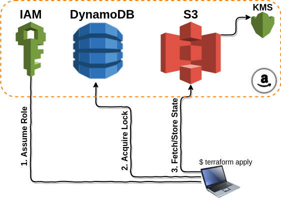
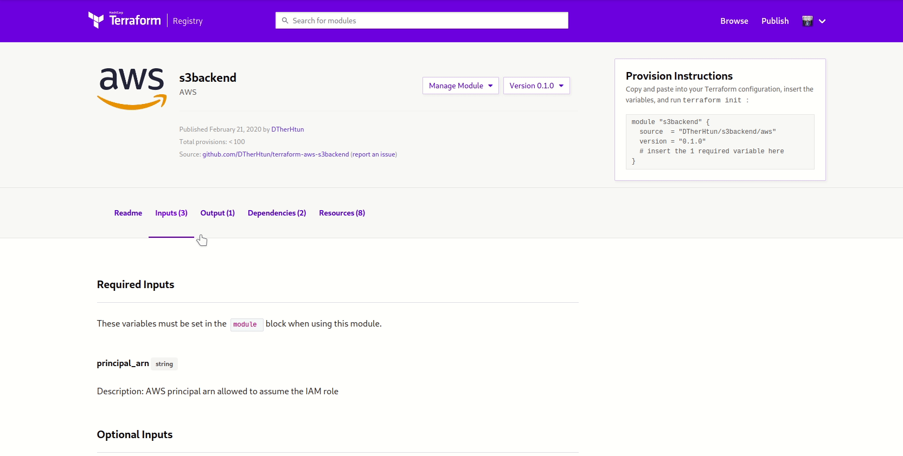
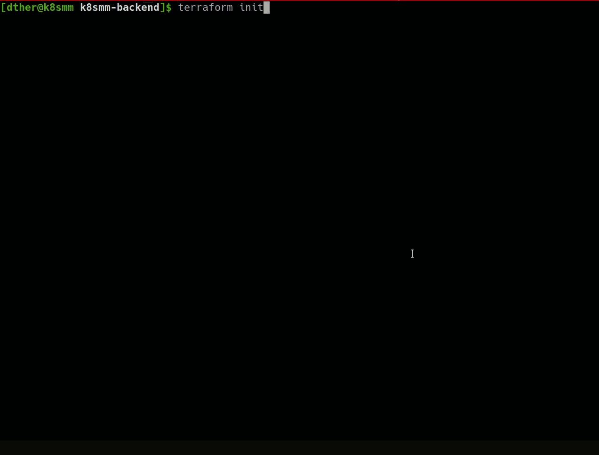
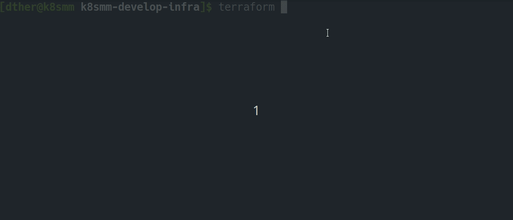
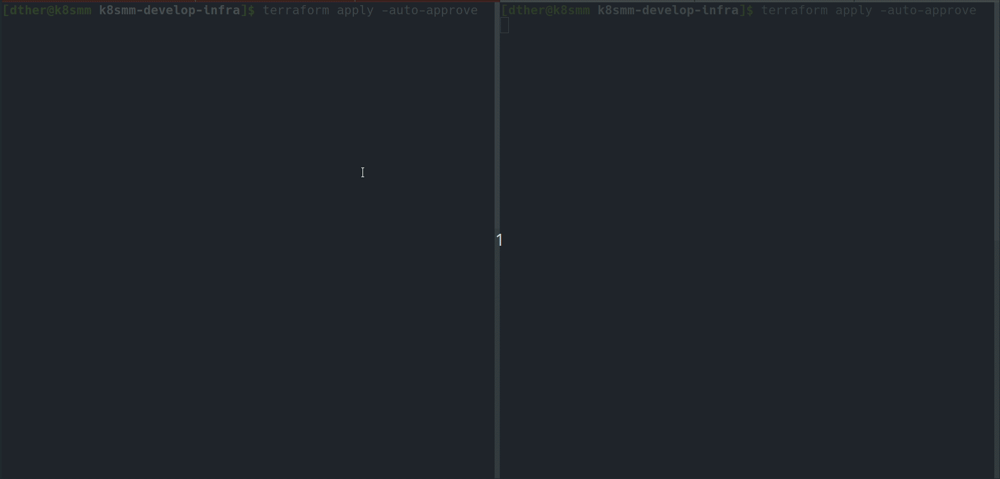

# Teamwork with Terraform

Terraform သည် ရှေ့ [Terraform First Step](https://blog.k8smm.org/k8s-related-articles/terraform-1st-step) တွင် ပြောခဲ့သည့် အတိုင်း HCL language အသုံး ပြု၍ code များ ရေးကာ infrastructure ကို provision ပြုလုပ်ပေးနိုင်သော Tools တစ်ခု ဖြစ်ပါတယ်။ ဒါပေမဲ့ VM သုံး၊ လေး လုံး တည်ဆောက် ရုံနဲ့ တော့ IAC\(infrastructure as code\) လို့ သတ်မှတ်လို့ မရပါဘူး။ Software တွေ၊ applications တွေကို development ပြု လုပ်တဲ့ခါ အမြဲတမ်း အဆုံးမရှိ လိုအပ် ချက်များ အပေါ် feature အသစ်များ ထည့်သွင်းခြင်း၊ မလိုအပ်သည့် feature များကို ပြန်ဖြုတ်ခြင်း၊ ပိုမိုကောင်းမွန်အောင် ပြုပြင် ပြောင်းလဲခြင်း၊ Bug Fix စတာတွေကို developer များ၊ QA များ အစုလိုက် အဖွဲ့လိုက် team အနေနဲ့ version control system များ အသုံးပြုကာ develop ပြုလုပ်ကြပါတယ်။ အဲလို Software များ၊ product များကို ပြုလုပ်သလိုမျိုး infrastructure တစ်ခုလုံး ကို လိုအပ်ချက် အပေါ်မူတည်ပြီး အဆုံးမရှိ လိုအပ်ရင် လိုအပ်သလို administrator များ၊ ops များက team အလိုက် versioning ပြုလုပ်ကာ ဖြုတ်၊ တပ် ပြုလုပ်ပြီး infrastructure ကို developing လုပ်တာကို Infrastructure As Code လို ခေါ်ဆို နိုင်ပါတယ်။ ယခု အခါတွင် infrastructure ကို code များဖြင့် developing လုပ်ခြင်းသာမက test case များ ရေးသားပြီး testing များပါ ပြုလုပ် နိုင်ကြပါပြီ။ ဆန္ဒရှိရင် infrastructure code များကို automated testing များပါ ပြုလုပ်နိုင်ပါတယ်။ infrastructure test ပြုလုပ်တာကတော့ ကောင်းမွန်တဲ့ အလေ့အထ ဖြစ်ပြီး အမှားအယွင်းနည်းပါစေပါတယ်၊ နောက်ပိုင်းတွင် သီးသန့် topic အနေနဲ့ ထပ်ရေးပေးပါ့မယ်။

   အခု တကယ် ပြောချင်တာကတော့ Organizations အကြီးကြီးတွေ မှာ ဖြစ်စေ၊ infrastructure အကြီးကြီးတွေ မှာ ဖြစ်စေ terraform အသုံးပြုပြီးတော့ ကိုယ် အလုပ်ထဲမှာ ရှိတဲ့ coworker တွေ၊ colleagues တွေနဲ့ ဒါမှာ မဟုတ် team အနေနဲ့ ဝိုင်းပြီးတော့ infrastructure ကို terraform code ရေးပြီးတော့ developing လုပ်မဲ့ အကြောင်းဖြစ်ပါတယ်။ ဒီနေရာမှာ ပုံမှန် terraform ကို အသုံးပြုပြီး infrastructure ကို တည်ဆောက်တဲ့ အခါ local စက်ရဲ့ terraform apply ပြုလုပ်ခဲ့သည့် directory ထဲမှာ state file ကို သိမ်းပါတယ်။ အဲ့လို state file ကို local စက် ထဲမှာ သိမ်းတာက တစ်ဦး တစ်ယောက်ချင်းစ အတွက် အဆင်ပြေပါတယ်။ တကယ်လို့ ကိုယ် တစ်ယောက်ထဲ မဟုတ်တော့ဘဲ team အလိုက် infrastructure ကို develop လုပ်တော့မယ် ဆိုရင် အဆင် ပြေတော့မှာ မဟုတ်ပါဘူး။ နောက်ထပ် team ထဲက develop လုပ်တဲ့ သူကို state file ကို share ပေးမှ ရမှာပါ။ အဲတော့ team ထဲကလူတွေကို version control repo တွေကတဆင့် share ပေးလို့ ရနိုင်ပါတယ်။ ဒါပေမဲ့ terraform code တွေကို version control repo တွေမှ တဆင့် share ပေးလို့ အဆင်ပြေပေမယ့် state file တွေကို အဲ့လို share သုံးဖို့ကျတော့ ထင်သလောက် အဆင်မပြေပါဘူး။ဘာလို့လဲ ဆိုတော့ တကယ်လို့ တစ်ချိန် ထဲမှာ လူ နှစ်ယောက် တစ် ပြိုင်နက်ထဲ terrafrom apply လုပ်မိမယ်ဆိုရင် [race condition](https://stackoverflow.com/a/19190984/11829817) လိုမျိုး မလိုလား အပ်တဲ့ ပြသနာ တွေ ရှိလာနိုင်ပါတယ်။ race condition ကြောင့် state file တွေ corrupted ဖြစ်နိုင်ပါတယ်။ file corrupt ဖြစ်သွား ရင် ကျွန်တော်တို့ infrastructure ရဲ့ အခြေအနေတွေ ကို ဆုံးရှုံးလိုက်ရတာပါဘဲ။ ဆက်ပြီးတော့လည်း develop လုပ်ဖို့ မဖြစ်တော့သလို ရှိနေပြီးသား resource တွေကိုလည်း manual တစ်ခုချင်းစီ လိုက်ဖျက်မှဘဲ ရမှာပါ။ အဲတော့ state file ကို ဒီ အတိုင်း share သုံးဖို့ ဆိုတာ ကောင်းတဲ့ နည်းလမ်းတော့ မဟုတ်ပါဘူး။ အန္တာရယ် များပါတယ်။

   အခု ဖြစ်တဲ့ state file ကို share သုံးတဲ့ ပြသနာကို ဖြေရှင်းဖို့ နည်းလမ်း နှစ်ခုကတော့ enhance backend နဲ့ standard backend ကို အသုံးပြုခြင်းပါပဲ။ enhance backend ကတော့ cli operation ကို remote machine မှာ run ပြီး output result ကိုတော့ steam လုပ်ပြီး local machine ကို ပြန်ပို့ပေးပါတယ်။ နောက်ထက် ထူးခြားတဲ့ အချက်ကတော့ variables တွေနဲ့ credentials တွေလို sensitive ဖြစ်တဲ့ ဟာတွေကို remote machine မှာဘဲ store လုပ်ပါတယ်။ အဲဒီ enhance backend ရဲ့ features တွေကိုတော့ [Terraform Enterprise](https://www.hashicorp.com/products/terraform/) Cloud မှာ ရရှိနိုင်ပါတယ်။



Popular ဖြစ်ပြီး လူအသုံး များတာ ကတော့ standard backend ဖြစ်ပါတယ်။ standard backend ကတော့ state file ကို AWS မှာ ဆိုရင် remote S3 မှာ backend အနေနဲ့ ထားပြီး အသုံးပြုတဲ့ နည်းဖြစ်ပါတယ်။ KMS ကို အသုံး ပြုပြီး encrypt လုပ်ကာ S3 မှာ state file ကို သိမ်းပါတယ်။ IAM role နဲ့ policy ကို configure ပြုလုပ် ပြီးတော့ DynamoDB နဲ့ S3 ကို access ပြုလုပ်မှာ ဖြစ်ပါတယ်။ ဒီနေရာမှာ DynamoDB ကို သုံးရတဲ့ အကြောင်းအရင်းကတော့ Locking mechanism ပြုလုပ်ပေးဖို့ပါပဲ။ ဒါမှ terraform ကို ဝိုင်းပြီး apply ပြုလုပ်တဲ့ အခါ တစ်ယောက် ပြုလုပ်နေတဲ့ အချိန် မှာ နောက် တယောက် က state file ကို access မရအောင် lock ချ ပေးထားမှာ ဖြစ်ပါတယ်။ ဒီ [s3backend](https://registry.terraform.io/modules/DTherHtun/s3backend/aws/0.1.0) ကို သုံးဖို့ terraform module ကတော့ အဆင့်သင့် ရေးပြီးသား ရှိပါတယ်။



ဒီ [s3backend](https://registry.terraform.io/modules/DTherHtun/s3backend/aws/0.1.0) ကို အသုံးပြုဖို့ inputs သုံးခုနဲ့ output တစ်ခု လိုအပ်ပါတယ်။ inputs သုံးခု ကတော့ `principal_arn` \(principal arn ကတော့ ကျွန်တော်တို့ user ရဲ့ iam arn ဖြစ်ပါတယ်\) ၊ `namespace` နဲ့ `force_destroy_state` \(force destroy state ကတော့ မထည့်လည်း ရပါတယ်။ default value true ပါ\) ဖြစ်ပါတယ်။ output ကတော့ config ပါ။ ကျွန်တော်တို့ infra ကို develop လုပ်တဲ့ အခါ ကျရင် သုံးရ မယ့် backend config ထွက်လာမှာ ဖြစ်ပါတယ်။ ဒါဆို ကျွန်တော် တို့ [s3backend](https://registry.terraform.io/modules/DTherHtun/s3backend/aws/0.1.0) ကို တည်ဆောက်ဖို့ terraform code ရေးဖို့ အဆင့်သင့်ဖြစ်ပါပြီ။


```text
provider "aws" {
  region = "us-east-2"
}

module "s3backend" {
  source        = "DTherHtun/s3backend/aws"
  version       = "0.1.0"
  namespace     = "k8smm"
  principal_arn = "arn:aws:iam::************:user/dtherhtun"
}

output "s3backend_config" {
  value = module.s3backend.config
}
```


ဒီ အပေါ်က terraform code ကို `terrraform init` နဲ့ လိုအပ်တဲ့ providers နဲ့ modules တွေကို download ဆွဲပေးသွားမှာ ဖြစ်ပါတယ်။ `terraform apply` လုပ်တာနဲ့ s3 အသုံးပြုထားတဲ့ standard backend ကို provision ပြုလုပ်သွားမှာ ဖြစ်ပါတယ်။



ဒါဆိုရင်တော့ output က ထွက်လာတဲ့ s3backend config တွေကို အသုံးပြုပြီး Team အလိုက် infra ကို develop ပြုလုပ်လို့ရပါပြီ။ backend အနေနဲ့ အသုံး ပြုဖို့ team member တစ်ယောက် ချင်းစီ configure အနည်းငယ် ပြုလုပ်ဖို့ လိုအပ်ပါတယ်။


```text
terraform {
  backend "s3" {
    bucket  = "k8smm-t5zowrlr3d8lqtf8vu-state-bucket"
    key     = "k8smm/infra"
    region  = "us-east-2"
    encrypt = true
    role_arn = "arn:aws:iam::344475516279:role/k8smm-t5zowrlr3d8lqtf8vu-tf-assume-role"
    dynamodb_table = "k8smm-t5zowrlr3d8lqtf8vu-state-lock"
  }
  required_version = "~> 0.12"
}
```


ခုနက output က ထွက်လာတဲ့ ရလဒ် တွေကို အသုံးပြုပြီး terraform backend ကို အပေါ် မှာ ပြထားတဲ့ အတိုင်း `backend.tf` ထဲမှာ configure ပြုလုပ်ရပါမယ်။ configure ပြုလုပ်ပြီးပြီ ဆိုရင်တော့ team member ကိုယ်တိုင် infra develop လုပ်မယ့် folder အောက်မှာ `backend.tf` ကို save ပြီး `terraform init` လုပ်လိုက်ရုံဖြင့် s3 backend ကို setup ပြုလုပ်ပေးသွားမှာ ဖြစ်ပါတယ်။



အခုဆိုရင် infrastructure ကို team နဲ့ စ တည်ဆောက်လို့ ရပါပြီ။ တည်ဆောက်မဲ့ infra resource တိုင်း အတွက် ရေးထားတဲ့ terraform code တွေကို ဒီ `backend.tf` configure လုပ်ထားတဲ့ directory ထဲမှာ run ရမှာ ဖြစ်ပါတယ်။ အရင်ဆုံး EC2 တစ်ခု စမ်း ဆောက်ကြည့်ပါ မယ်။ အောက်မှာ ပေးထားတဲ့ terraform code တွေနဲ့၊ အရင် post က code နဲ့ အတူတူ ပါပဲ။


```text
provider "aws" {
  profile = "default"
  region  = "us-east-2"
}
 
resource "aws_instance" "k8smm" {
  ami           = "ami-0520e698dd500b1d1"
  instance_type = "t2.micro"
  tags = {
    Name = terraform.workspace
  }
}
```


အပေါ်က terraform code ကို `backend.tf` file ရှိတဲ့ directory ထဲမှာ တချိန်ထဲ တပြိုင်နက်ထဲ run တဲ့ အခါ ပထမဆုံး run တဲ့ သူ တယောက်တည်း အသုံး ပြုနိုင်ဖို့ state file ကို lock ပြုလုပ် ပေးထားပါတယ်။ connection မကောင်းလို့ ဖြစ်စေ၊အကြောင်း အမျိုးမျိုး ကြောင့် ဒုတိယ ဖြစ်သွားတဲ့ သူကတော့ state file lock ဖြစ်နေတယ်ဆိုပြီး တော့ error တက်မှာ ဖြစ်ပါတယ်။ ဒါဆို ရင်တော့ အပေါ်မှာ ပြောခဲ့တဲ့ infra ကို share ပြီးတော့ develop လုပ်တဲ့ အခါ ဖြစ်လာနိုင်တဲ့ race conditions လို ပြသနာမျိုးကို ကြုံရတော့မှာ မဟုတ်ပါဘူး။ 



နောက်ထပ် team အနေနဲ့ ရော Remote backend နဲ့ ပါ အသုံးပြုဖို့ အလွန် အသုံး ဝင်တဲ့ အရာကတော့ terraform workspace ပါဘဲ။ terraform workspace ကတော့ terraform မှာ built in ပါပြီးသား feature တစ်ခုဖြစ်ပါတယ်။ ကျွန်တော်တို့ infra ကို environment မတူတဲ့ အခါ အသုံးပြုဖို့ ဖြစ်ပါတယ်။ ဥပမာ development, qa, staging, production စတဲ့ environment တွေမှာ repetitive တည်ဆောက် ချင်တဲ့ အခါမျိုးမှာ သုံးပါတယ်။ local machine မှာဆိုရင် အဲလို repetitive အလုပ်တွေ လုပ်ဖို့ state file တွေ ထပ်ခွဲရပါမယ်။ ဒီလို state file တွေ ခွဲဖို့ directory တွေကို ပါ dev, qa, stag, production ဆိုပြီ ထပ်ခွဲရပါမယ်။ တူညီတဲ့ code တွေကိုပါ ပြန်ထည့် ထားရပါမယ်။ အလုပ် နည်းနည်း ရှုပ်ပါတယ်။ terraform backend နဲ့ workspace တွဲသုံးရင်တော့ ဒီလို အလုပ်ရှုပ်စရာ မလိုတော့ပါဘူး။ တကယ်တော့ ကျွန်တော်တို့က terraform workspace ကို အစတည်းက သုံးနေပြီးသာပါ။ သုံးလို့ သုံးနေမှန်းသာ သတိမထားမိတာ ဖြစ်ပါတယ်။ `terraform workspace list` လို့ ရိုက်ထည့်လိုက်ရင် ရှိသမျှ workspace list တွေ ကျလာမှာ ဖြစ်ပါတယ်။ အဲထဲမှာ \* နဲ့ ပြထားတဲ့ workspace ကတော့ ကိုယ် အခုလက်ရှိ သုံးနေတဲ့ workspace ဖြစ်ပါတယ်။ လက်ရှိ အမြဲ သုံးလို့ သုံးမှန်း သတိမထားမိဘဲ သုံးနေတာ ကတော့ `default` workspace ဖြစ်ပါတယ်။ 

```bash
[dther@k8smm k8smm-develop-infra]$ terraform workspace list
* default
[dther@k8smm k8smm-develop-infra]$ terraform workspace new dev
Created and switched to workspace "dev"!

You're now on a new, empty workspace. Workspaces isolate their state,
so if you run "terraform plan" Terraform will not see any existing state
for this configuration.
[dther@k8smm k8smm-develop-infra]$ terraform workspace new prod
Created and switched to workspace "prod"!

You're now on a new, empty workspace. Workspaces isolate their state,
so if you run "terraform plan" Terraform will not see any existing state
for this configuration.
[dther@k8smm k8smm-develop-infra]$ terraform workspace list
  default
  dev
* prod

```

workspace အသစ် တစ်ခု တည်ဆောက်ဖို့ `terraform workspace new`  နဲ့ တည်ဆောက်နိုင်ပြီး workspace တစ်ခုနဲ့ တစ်ခု ချိန်းဖို့ကိုတော့ `terraform workspce select`  ဆိုပြီး ပြောင်း သုံးနိုင်ပါတယ်။ workspace ကို စမ်းဖို့ terraform code ကို repetitive run လို့ ရအောင် အနည်းငယ် ပြန်ပြင် ရပါမယ်။ ကျွန်တော်တို့ environment ၂ခု ခွဲ ပြီး သုံးပါမယ် ။ env ၂ခု ခွဲ run ဖို့ variables file ၂ခုပြင်ရ ပါမယ်။ ပထမဆုံး `main.tf` ကို အနည်းငယ် ပြင်ပါမယ်။


```text
variable "region" {
  description = "AWS Region"
  type        = string
}
 
provider "aws" {
  profile = "default"
  region  = var.region
}
 
resource "aws_instance" "k8smm" {
  ami           = "ami-0520e698dd500b1d1"
  instance_type = "t2.micro"
  tags = {
    Name = terraform.workspace
  }
}
```


`main.tf` file မှာ region အတွက် variable ကို declare လုပ်ခဲ့ပါတယ်။ မတူညီတဲ့ environment အတွက် region ခွဲ ပြီး ec2 instance ဆောက်လို့ ရအောင်လို့ ဖြစ်ပါတယ်။ ဥပမာ dev မှာ region တစ်ခု ၊ production အတွက် သက်သက် region တစ်ခု ပုံစံမျိုး အသုံးပြုလို့ ရအောင် ပါ။ အဲတော့ env နှစ်ခု အတွက် variable files တွေထပ်ရေးရပါမယ်။ variables ဆိုတဲ့ folder အောက်မှာထားပြီး အသုံး ပြုပါမယ်။



```text
region = "us-east-2"
```



```text
region = "us-east-2"
```



ဒါတွေ အာလုံး ပြီးရင်တော့ ကျွန်တော်တို့ `terrafrom workspace select`  နဲ့ ချိန်းပြီး `terraform apply -var-file=./variables/.tfvars` နဲ့ မတူညီတဲ့ environment တွေ ကိုdevelop ပြုလုပ်နိင်ပါပြီ။ EC2 မှာတော့ workspace name တွေ အတိုင်း vm တွေ တည်ဆောက် ပေးသွားမှာ ဖြစ်ပါတယ်။


AWS S3 ကို အဓိက ထားပြီး Standard backend ကို သုံးသွားတာ ဖြစ်ပါတယ်။ တစ်ခြား cloud တွေမှာလဲ S3/DynamoDB လိုမျိုး အလားပုံစံ တူတာတွေနဲ့ backend ကို အသုံးပြုလို့ ရနိုင်ပါတယ်။ ဒါမှ မဟုတ် AWS S3 ကို backend အနေနဲ့ သုံးပြီး တခြား cloud အပေါ်မှာလဲ resource provision ပြုလုပ်လို့ ရပါတယ်။ ဒီလိုမျိုး အသုံး ပြုချင်းဖြင့် team အနေနဲ့ လုပ်ဆောင်ရတာ ပိုမို့ လွယ်ကူ အဆင်ပြေစေပါတယ်။ အမှားအယွင်း နည်းစေပါတယ်။ နောက် တခြား နည်းကတော့ [Terraform Enterprise](https://www.hashicorp.com/products/terraform/) ပါဘဲ။ [Terraform Enterprise](https://www.hashicorp.com/products/terraform/) ကတော့ configure ချရတာ လွယ်ပါတယ်။ သုံးရတာ ပို မိုက်ပါတယ်။ ပိုက်ဆံ ပိုပေးရပါတယ်။


[Terraform Enterprise](https://www.hashicorp.com/products/terraform/) ကို အသုံး ပြုချင်ရင်တော့ ဒီမှာ [http://app.terraform.io/](http://app.terraform.io/) register ပြုလုပ်ရပါတယ်။ Organization တစ်ခု တည်ဆောက်ပြီး token ကို generate ထုတ်ရပါတယ်။ terrafrom Enterprise အတွက် backend configuration ကိုတော့ အောက်မှ ဖော်ပြပေးသွားပါမယ်။


```text
terraform {
  backend "remote" {
    hostname = "app.terraform.io"
    organization = "k8smm"
    token = "Generate ထုတ္လာတဲ့ token ကို ဒီမွာ ထည့္ေပးရပါမယ္။"
    workspaces {
      name = "k8smm"
    }
  }
}
```


 Standard backend ကို setup လုပ်သလိုမျိုး Terraform Enterprise backend ကို `terraform init` ပြုလုပ်ရုံနဲ့ setup ပြုလုပ်လို့ ရပါတယ်။ Terraform Enterprise ကို အသုံး ပြုမယ်ဆိုရင်တော့ variables တွေ credentials တွေကို Terraform Enterprise ထဲမှာ upload ပြီးမှ သာ အသုံးပြု၍ ရမှာ ဖြစ်ပါတယ်။ ဒါဆိုရင်တော့ Terraform ကို Team တွေ Organization တွေ အနေနဲ့ သုံးမယ်ဆိုရင် ဘယ်လို နည်းလမ်းတွေနဲ့ သုံးမယ်၊ ဘယ်လို backend တွေကို ရွေးချယ်မယ်ဆိုတာ ကို နားလည် သဘောပေါက်မယ် ထင်ပါတယ်။

