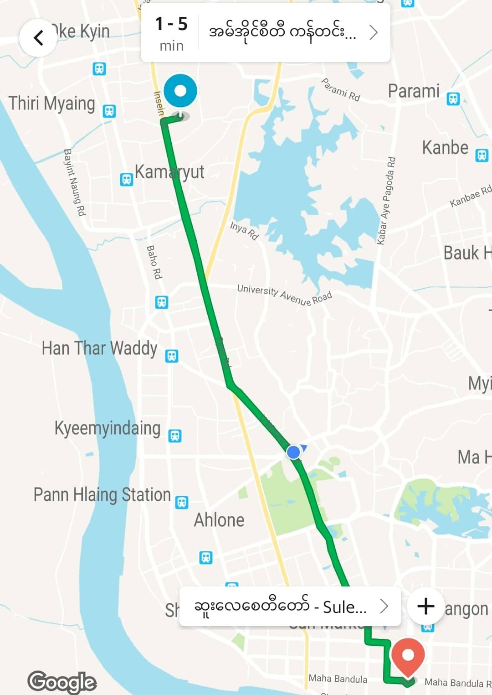

# Terraform First Step

   တချို့ companies များသည် engineers များစွာကို Hired လုပ်ကြပြီး manually infrastructure များကို တည်ဆောက်စေခိုင်းကြပါတယ်။ ဒါကတော့ အမြဲတမ်း လွဲမှားလာတဲ့ လုပ်ထုံးလုပ်နည်းကြီး ဖြစ်ပါတယ်။ ယနေ့အချိန်အခါမှာတော့ infrastructure တွေကို အများစုက cloud အပေါ်မှာ အသုံးပြုကြပြီး on premise များ၊ hybrid များ ပြုလုပ် အသုံးပြုလာကြပါတယ်။ cloud များတွင် ဖြစ်စေ၊ on premise များတွင်ဖြစ်စေ၊ hybrid cloud များတွင် ဖြစ်စေ infrastructure stack တစ်ခုလုံးကို code များ ရေးပြီး infrastructure request များပြုလုပ်ကာ အလိုအလျောက် တည်ဆောက်အသုံးပြုသင့်ပါတယ်။ အဲ့လိုအသုံးပြုခြင်းကြောင့် ခုနကလို engineer များစွာ မလိုအပ်ခြင်း၊ အလွယ်တကူ audit ဖြစ်လုပ်နိုင်ခြင်း၊ အရမ်းကြီးပြီး ရှုပ်ထွေးတဲ့ working environment များတွင် infrastructure ကို Team အနေနဲ့ စီမံခန့်ခွဲနိုင်ခြင်း၊ infrastructure ကို version များ အနေနဲ့ ထိန်းသိမ်းခြင်း အစရှိတာတွေ ပြုလုပ်နိုင်ပါတယ်။ တနည်းအားဖြင့် ဒါကို Infrastructure As Code \(ICA\) ဟုလဲ ခေါ်ကြပါတယ်။ [Terraform](https://www.terraform.io/) သည် Infrastructure ကို code အနေနဲ့ ရေးသားနိုင်တဲ့ tools တစ်ခု ဖြစ်ပါတယ်။ Infrastructure As Code သည် entire infrastructure stack \(network + loadbalancer + dns + zone + rack + bucket + compute + resource pool + etc ....\) တစ်ခုလုံးကို code အနေနဲ့ ရေးသာပြီး automatic တည်ဆောက်ပြုလုပ်သွားခြင်း ဖြစ်ပြီး server တစ်လုံး၊ နှစ်လုံးကို code ရေးပြီး သို့မဟုတ် [Terraform](https://www.terraform.io/) အသုံးပြု ၍ တည်ဆောက်သွားခြင်း မဟုတ်ပါ။

   [Terraform](https://www.terraform.io/) သည် infrastructure ကို လုံခြုံစွာ ထိရောက်စွာ တည်ဆောက်ခြင်း၊ ပြုပြင်ပြောင်းလဲခြင်းနှင့် ထိုပြုပြင်ပြောင်းလဲခြင်းတိုင်းရဲ့ version များကို ထိန်သိမ်းပေးတဲ့ tool တစ်ခုဖြစ်တယ်။ ခလုတ်တစ်ခု၊ command တစ်ကြောင်းရိုက်လိုက်ရုံဖြင့် infrastructure stack တစ်လုံးကို [Terraform](https://www.terraform.io/) ဖြင့် တည်ဆောက်ပေးနိုင်တယ်။ များစွာသော လူသိများတဲ့ cloud service provider များအပြင် ကိုယ်ပိုင် in-house solutions တွေမှာလဲ အသုံးပြုနိုင်တယ်။ ကိုယ်က infrastructure ကို ဘယ်လို လိုချင်တယ်၊ တည်ဆောက်ချင်တယ် စတာတွေကို configuration အနေနဲ့ files ထဲမှာ ချရေးလိုက်ရုံဖြင့် [Terraform](https://www.terraform.io/) က ဘယ်လိုဖြစ်အောင် လုပ်ရမယ်၊ တည်ဆောက်ရမယ် ဆိုတာ တွက်ဆ ပေးသွားပါလိမ့်မယ်။ အဲတော့ [Terraform](https://www.terraform.io/) က infrastructure တည်ဆောက်ခြင်းနှင့် ပတ်သတ်သည့်အရာအားလုံးကို code များချရေးခြင်းအနေနဲ့ ဖြေရှင်းပေးသွားမှာ ဖြစ်ပါတယ်။ သီအိုရီအရတော့ infrastructure တည်ဆောက်ရုံမက stateful process တွေရဲ့ ဘယ်အမျိုးအစားမဆို တည်ဆောက်ခြင်း၊ ပြုပြင်ပြောင်းလဲခြင်းတွေအတွက်ပါ အသုံးပြုလို့ရနိုင်ပါတယ်။ ဥပမာ- စားသောက်ဆိုင် တစ်ခုခုမှ နေ့လည်စာကို အပတ်တိုင်း သောကြာနေ့ နေ့လည် ၁၁ နာရီခွဲတွင် delivery ဖြင့် မိမိရုံးသို့ ပို့ဆောင်ပေးရန် စီစဉ်ပေးရမည်ဆိုပါစို့။ ထိုလုပ်ဆောင်ချက်မျိုးကို စိတ်အားထက်သန်ပါက [Terraform provider](https://www.terraform.io/docs/providers/index.html) တစ်ခု ပြုလုပ်ပြီး စာသောက်ဆိုင်နှင့် သဘောတူညီချက်၊ လုပ်ဆောင်ချက်များကို code အနေဖြင့်ရေး၍ စီမံခန့်ခွဲနိုင်ပါတယ်။ နေ့လည်စာမှာဖို့ လုပ်ဆောင်ချက်တစ်ခုချင်းစီ အတွက် စားသောက်ဆိုင် list တွေ၊ ချက်ပြုတ်နည်းတွေ၊ ဟင်းအမျိုးအမြည်တွေ၊ နောက်ဆုံး လာပို့တဲ့ နေလည်စာရဲ့လက်ဆတ်မှုကအစ [Terraform Provider](https://www.terraform.io/docs/providers/index.html) ပြန်ရေးနိုင်ပါတယ်။

[Terraform](https://www.terraform.io/) ကို great ဖြစ်စေတဲ့၊ မိုက်စေတဲ့ သူရဲ့ဝိသေသန ၆ ခုကတော့ -

* A provisioning tool - infrastructure stack တစ်ခုလုံးကို deploy လုပ်လို့ရတယ်
* Declarative - ကိုယ်ဘာလိုချင်တယ် ဘာဖြစ်ချင်တယ်ဆိုတာ ပြောရုံပဲ
* Free - opensource မို့ free ရတယ် အလကား အသုံးပြုနိုင်တယ်
* Easy to use - အကျွမ်းတဝင်ဖြစ်စရာမလိုဘဲ လူတိုင်း အလွယ်တကူသုံးလို့ရပါတယ်
* Cloud agnostic - ဘယ် cloud မှာဘဲသုံးသုံး tools တစ်ခုထဲနဲ့ အသုံးပြုလို့ရနိုင်တယ်
* Expressive and extendable - အသုံးပြုတဲ့ language ကနေ ကန့်သတ်ချက်တွေ ရှိမနေဘူး ပိုပြီး လုပ်ချင်တာကိုလုပ်နိုင်တယ်

[Terraform](https://www.terraform.io/) ကို Configuration ရေးပြီး အသုံးပြုရပေမဲ့ သူသည် configuration management tool မဟုတ်ပါဘူး။ provisioning tool တစ်ခုသာ ဖြစ်ပါတယ်။ Configuration management \(CM\) tools တွေကတော့ [Chef](https://www.chef.io/), [Puppet](https://puppet.com/), [Ansible](https://www.ansible.com/) and [SaltStack](https://www.saltstack.com/) စတာတွေ ဖြစ်ကြပါတယ်။ ဒီ CM tools တွေကတော့ အသင့်ရှိပြီးသား Servers တွေ ပေါ်မှာ software တွေကို install ပြုလုပ်ဖို့၊ manage ပြုလုပ်ဖို့နဲ့ task တွေကို automation ပြုလုပ်ဖို့ ဒီဇိုင်းထုတ်ထားတာ ဖြစ်ပါတယ်။ CM tools တွေရဲ့ nature အရ server တွေနဲ့ တွဲဖက် အသုံးပြုကြပြီး ထို server တွေကတော့ ရှိနေပြီးသား ဆိုရင်တော့ အဆင်ပြေပါတယ်။ ဒါပေမဲ့ server တွေက အသင့်ရှိနေပြီးသား မဟုတ်ဘူးဆိုရင်၊ ဒါမှမဟုတ် provisioning process တွေကို အစချီဖို့ ဆိုရင် CM tools တွေက အထောက်အကူမပြုပါဘူး။ တခြားသော Provisioning tools တွေကတော့ [vagrant](https://www.vagrantup.com/), [AWS CloudFormation](https://aws.amazon.com/cloudformation/), [Azure Resource Manager](https://azure.microsoft.com/en-us/features/resource-manager/) နဲ့ [Google Cloud Deployment Manager](https://cloud.google.com/deployment-manager/) တို့ ဖြစ်ကြပါတယ်။ [Terraform](https://www.terraform.io/) သည် immutable infrastructure ပုံစံကို အဓိက အလေးထား ပြုလုပ်တယ်။ mutable infrastructure သည် server ပေါ်တွင် application တွေ၊ software တွေကို update ပြုလုပ်တဲ့အခါ၊ \(သို့မဟုတ်\) changes တွေ ပြုလုပ်တဲ့အခါမှာ ပြောင်းလဲမူတွေကို ထပ်ကာ ထပ်ကာ edit ပြုလုပ်သွားခြင်း၊ patch ပြုလုပ်သွားခြင်း ပုံစံမျိုး ဖြစ်တယ်။ Immutable infrastructure ကတော့ mutable infrastructure ရဲ့ ဆန့်ကျင့်ဘက်ဖြစ်တယ်။ ပြုပြင်ပြောင်းလဲသည့်အခါ လက်ရှိ အဟောင်းကို ဖြုတ်ချပြီး အသစ် \(update\) ကို အစကနေ ပြန်တည်ဆောက်တယ်။ လက်ရှိ run နေသည့် infra မှာ server တစ်လုံး ပြုပြင်ပြောင်းလဲမှု ပြုလုပ်သည့်အခါ [Terraform](https://www.terraform.io/) သည် အရင်ဆုံး ပြုပြင်ပြောင်းလဲသည့် server တစ်ခုလုံးကို ဖျက်စီးသည့် operation စတင်ပြီး ဖျက်ဆီးပြီးသွားသည့်အခါ ပြောင်းလဲမှုများ ပါဝင်သည့် အသစ် server ကို အစကနေ deploy ပြန်လုပ်ပါတယ်။ နောက်ထပ် ဥပမာကတော့ mutable infrastructure သည် ကိုယ်မှာရှိသည့် အသုံးဆောင်တစ်ခုကို ပြန်လည်ပြုပြင် မွမ်းမံ အသုံးပြုတာနှင့် တူညီပြီး immutable infrastructure သည် အသုံးအဆောင် ဟောင်းသွားလို့ ဖြစ်စေ၊ မကောင်းတော့လို့ ဖြစ်စေ အသစ် ဝယ်လိုက်ပြီး အဟောင်းကို လွှင့်ပစ်လိုက်တာနဲ့ တူပါတယ်။ immutable infrastructure အားလုံးတိုင်းကို တည်ဆောက်ဖို့ အတွက် [Terraform](https://www.terraform.io/) ကို အသုံးပြုနိုင်ပါတယ်။ immutable  infrastructure တွေ အပေါ်မှာ application တွေကို [Terraform](https://www.terraform.io/) အသုံးပြုပြီး update လုပ်တဲ့အခါ ဘယ်လို ဖြစ်မလဲ ဆိုတာ စဉ်စားစရာ ဖြစ်လာပါတယ်။ လူတွေ အများစုလဲ စိတ်ဝင်စားကြပါတယ်။ ဒါကတော့ application တွေကို update ပြုလုပ်တဲ့ အခါ ကိုယ်လက်ခံနိုင်တဲ့  downtime ဒါမှမဟုတ် ကိုယ်ရဲ့ အသုံးချမှုပုံစံတွေအပေါ်  အများကြီးမူတည်ပါတယ်။ ဒီနေရာမှာ အသုံးပြုမှုပုံစံဆိုတာကတော့ ဥပမာ infra ကို blue/green လိုမျိုး update ပြုလုပ်ဖို့ ဒီဇိုင်း ဆွဲထားသည့်အခါ သို့မဟုတ် Kubernetes, nomad တို့လိုမျိုး application scheduler များကို အသုံးပြုထားသည့်အခါ downtime မရှိဘဲ အဆင်ပြေစေပါတယ်။ တခြားသော strategies များစွာလဲ ရှိပါတယ်။ နောက်ပြီးတော့ အထူးသဖြင့် serverless deployments သို့မဟုတ် containerized ပြုလုပ်ထားတဲ့ application တွေကို ပြုပြင် ပြောင်းလဲမှုတွေ ပြုလုပ်တဲ့ အခြေအနေမျိုးမှာလဲ CM tools များကို သုံးစွဲရန် မသင့်တော်ပါဘူး အဆင်မပြေလှပါဘူး။

| Name | Provisioning tool | Easy to use | Declarative | Free and Opensource | Cloud Agnostic | Expressive and extendable |
| :--- | :---: | :---: | :---: | :---: | :---: | :---: |
| **Ansible** |  | x |  | x | x | x |
| **Chef** |  |  | x | x | x | x |
| **Puppet** |  |  | x | x | x | x |
| **SaltStack** |  | x | x | x | x | x |
| **Terraform** | x | x | x | x | x | x |
| **AWS CloudFormation** | x | x | x |  |  |  |
| **GCP Resource Manager** | x | x | x |  |  |  |
| **Azure Resource Manager** | x |  | x |  |  |  |

Terraform သည် ကျွန်တော်တို့ တည်ဆောက်မယ့် infra ရဲ့ code တွေကို ရေးတဲ့ အခါမှာ [Hashicorp Configuration Language](https://github.com/hashicorp/hcl) လို့ခေါ်တဲ့ custom configuration language နဲ့ ရေးရပါတယ်။ အတိုကောက် [HCL](https://github.com/hashicorp/hcl) လို့ ခေါ်ပါတယ်။ github ပေါ်သို့ push လုပ်တဲ့အခါမှာ [HCL](https://github.com/hashicorp/hcl) လို့ language နေရာမှာ မြင်ရမှာပါ။ [HCL](https://github.com/hashicorp/hcl) ကတော့ [JSON](https://www.json.org/json-en.html), [YAML](https://yaml.org/) နဲ့ [XML](https://www.xml.com/) စတာတွေကို ရေးသားတဲ့အခါ အစားထိုး အသုံးပြုနိုင်တဲ့ language လဲ ဖြစ်ပါတယ်။ [HCL](https://github.com/hashicorp/hcl) သည် [JSON](https://www.json.org/json-en.html) နဲ့ vice-versa converted ပြုလုပ်နိုင်ပါတယ်။ ရေးသားရသည်မှာ လိုက်လျောညီထွေ ဖြစ်ပြီး၊ ကောင်းမွန်စွာ သေချာဒီဇိုင်းထုတ်လုပ်ထားတဲ့ Language တစ်ခု ဖြစ်ပါတယ်။ [YAML](https://yaml.org/) သည် [JSON](https://www.json.org/json-en.html) ထက် ဖတ်ရတာ လွယ်ကူပြီး ရေးသားသည့် အခါ မလွယ်ကူပါ။ သူရဲ့ white space များ၊ indent များသည် တစ်ခါတလေ ဒုက္ခပေးသည်။ [HCL](https://github.com/hashicorp/hcl) ကို နောက်ထပ် ကြိုက်သည့် အချက်မှာ ဖတ်ရတာ မခက်ခဲသည့် အပြင် ရေးသားသည့်အခါ [YAML](https://yaml.org/) ထက်ပိုပြီး လွယ်ကူနေတာ ဖြစ်ပါတယ်။ ဒါပေမဲ့ [Terraform](https://www.terraform.io/) သည် လွယ်ကူစွာ ရေးသားနိုင် အသုံးချနိုင်ပေမဲ့ ရိုးရှင်းတဲ့ technology တစ်ခုတော့ မဟုတ်ပါ။

[Terraform](https://www.terraform.io/) ကို အသုံးပြုတဲ့ အခါမှာ declarative style မျိုး ရေးသားကြပါတယ်။ တစုံတခုကို Declaring ပြုလုပ်တယ်ဆိုတာကတော့ ဒီနေရာမှာ တစ်ခုခုကို ကြေငြာတယ်လို့ သုံးနှုန်းတဲ့ပုံစံ အတိအကျမဟုတ်ပါဘူး။ ကိုယ်ဘာလုပ်ချင်တယ် ဘာဖြစ်ချင်တယ်ဆိုတာကို ထုတ်ဖေါ်ပြောလိုက်တဲ့ သဘောနဲ့ တူတယ်။ ဥပမာ ကိတ်စားချင်တယ် ဒါပေမဲ့ ကိတ်စားရတာဖို့ပဲ အဲ့ကိတ်ကို အိမ်ကနေ ဘယ်လိုထွက် ဘာကားစီး ဘယ်ဆိုင်ကို သွားဆိုတာ မလိုအပ်ဘူး။ declarative programming တွေ မှာ ကိုယ်ဘာလိုချင်လဲ ဆိုတာမျိုးကို ဖေါ်ပြတဲ့ ပုံစံမျိုး code \(ဒီနေရာမှာ code သည် configuration ကဲ့သို့ ဖြစ်ပြီး compiler program တစ်ခု၊ သို့မဟုတ် interactive program တစ်ခု ရေးသားခြင်းကို ပြောနေခြင်းမဟုတ်ပါ\) ကို ရေးကြပြီး တစ်ဆင့်ပြီးတစ်ဆင့် ဘာပြီးရင် ဘာလုပ်ပါ ညာပြီးရင် ညာလုပ်ပါဆိုတာမျိုး မရေးကြဘူး။ imperative သို့မဟုတ် procedural programming တွေမှာတော့ တစ်ခုခု ပြုလုပ်တဲ့ လုပ်ဆောင်ချက်ကို တစ်ချက်ချင်းစီ တစ်ဆင့်ပြီး တစ်ဆင့် instruction များ ရေးသားကြပါတယ်။ CM tools အများစုကတော့ imperative ပုံစံ မျိုး ရေးသားကြရပါတယ်။ ဒီနေရာမှာ declarative နဲ့ imperative ကွာခြား တာကတော့ လှိုင်မြို့နယ်ကနေ ဆူးလေကို သွားတဲ့အခါ grab ငှါးသွားတာနဲ့ ကိုယ်ကိုတိုင် ကားမောင်းသွားသလိုမျိုး ကွာခြားပါတယ်။ Declarative ကတော့ grab ငှားသွားတာနဲ့ တူပြီး ကိုယ်ရဲ့ ဦးတည်ရာ ရောက်ရှိမဲ့ \(ဆူးလေ\) နေရာကိုဘဲ အလေးထားပါတယ်။ grab စငှါးတဲ့ နေရာကနေ ရောက်မဲ့ နေရာမှန်ရဲ့လား၊ သွားနေတဲ့ လမ်းမှားနေလား \(track လုပ်တဲ့ သဘောမျိုး\) စတာတွေလောက်ဘဲ ဦးစားပေး စဉ်စားပါတယ်။ imperative ကတော့ ကိုယ်ကိုတိုင် ကားမောင်းတာနဲ့ တူပြီး ဘယ်ကားနဲ့ သွားမှာလဲ \(အရမ်းချမ်းသာလို့ ကား ၄၊ ၅ စီး ပိုင်တဲ့ အခါ :P\)၊ ကားလိုင်စင်ရှိရဲ့လား၊ ရှိရင်သက်တမ်း ကျန်သေးရဲ့လား၊ \( တချို့ အခြေအနေတွေမှာ condition စစ်တာမျိုး \)၊ ကားအောက်ပိုင်းတွေ ကောင်းရဲ့လား စစ်ဆေး၊ လှိုင်ကနေ ဆူးလေထိ ဆီလောက်ရဲ့လား၊ ဆီမလောက်ဘူးဆို ဘယ်ဆိုင် ဝင်ဖြည့်မှာလဲ၊ ဒီဇယ်လား၊ ဓါတ်ဆီလား၊ ဂတ်စ်လား၊ electric ကားလား၊ ဘယ်လမ်းကြောင်းက သွားမှာလဲ၊ ဘယ်လမ်းကြောင်းက လမ်းပိတ်လဲ၊ ဘယ်လမ်းကြောင်းက လမ်းရှင်းလဲ၊ ဘယ်နေရာမှာ ကားပါကင်ထိုးမှာလဲ စတဲ့အသေးစိတ်အချက်အလက်တွေကို အလေးထားလုပ်ဆောင်ပါတယ်။ အဲတော့ Imperative က Journey ကိုဘဲ အလေးထားပါတယ်၊ Destination ကိုမဟုတ်ပါဘူး။ Declarative ကတော့ Journey ထက် Destination ကိုဘဲ အလေးထား လုပ်ဆောင်ပါတယ်၊ စိတ်ချရဖို့အတွက် track အမြဲလုပ်ပါတယ်။ အဲတော့ ဒီနေရာမှာ ပြောချင်တာက ခုနက ဥပမာ အတိုင်းဆိုရင် ကျွန်တော်တို့ စထွက်တဲ့ လှိုင်မြို့နယ်က initial state ဖြစ်ပြီး ကျွန်တော်တို့ သွားချင်တဲ့ နေရာက desired state ဖြစ်တယ်။ လမ်းတဝက်မှာ ရောက်နေတဲ့ အချိန်ကာလမှာရှိတဲ့ အခြေအနေကတော့ current state ပေါ့။ ဒီလိုမျိုး [Terraform](https://www.terraform.io/) ကို အသုံးပြုပြီး infra တည်ဆောက်တဲ့အခါ သူရဲ့ အခြေအနေတွေ ဖော်ပြတဲ့ stateful information တွေကို terraform.tfstate ဆိုတဲ့ file ထဲမှာ JSON အနေနဲ့ သိမ်းထားပါတယ်။ ကျွန်တော်တို့ infra ကို ပြောင်းလဲမှုတွေ ထပ်လုပ်တဲ့အခါ နောက်ထပ် ဘာတွေကို ဖျက်ရမယ်၊ ဘာတွေ လုပ်ရမယ်၊ လုပ်သင့်တယ်ဆိုတာကို plan ချဖို့ ခုနက state file ကို [Terraform](https://www.terraform.io/) က မတူညီတဲ့ state တွေကို တွက်ချက်ဖို့ အသုံးပြုပါတယ်။

ကျွန်တော်တို့ [Terraform](https://www.terraform.io/) နဲ့ services တွေကို တကယ့် major clouds \(AWS, GCP, AZure, IBM, ....\) တွေအပေါ်မှာ deploy ပြုလုပ်နိုင်ပါတယ်။ လက်ရှိမှာတော့ [Terraform](https://www.terraform.io/) မှာ providers ပေါင်း ၁၀၀ ကျော် ရှိနေပြီ ဖြစ်တယ်။ AWS က Cloud Formation သည် AWS အတွက်သာဖြစ်ပြီး ကျန်တဲ့ cloud provider များတွင် အသုံးပြုလို့ မရနိုင်ပါဘူး။ [Terraform](https://www.terraform.io/) သည် မည်သည့် cloud provider ဖြင့်မဆို အသုံးပြုနိုင်တဲ့ အတွက်ကြောင့် Cloud agnostic ဖြစ်တယ်။ Hybrid cloud သို့မဟုတ် multi-cloud strategy များကိုလဲ အသုံးပြုလို့ရနိုင်တယ်။ Cloud agnostic ဖြစ်ခြင်းရဲ့ အားသာချက် နောက်တစ်ခုကတော့ ကျွန်တော်တို့က multi cloud တွေ သုံးတဲ့အခါ သို့မဟုတ် အလုပ်တစ်ခုမှ နောက်တစ်ခု ပြောင်းတဲ့အခါ မတူညီသော cloud ကို အသုံးပြုရပြီး infra provisioning လုပ်ဖို့ လိုအပ်လာလျှင် သီးသန့် cloud provider မှ provisioning tools ကို ထက် လေ့လာစရာမလိုဘဲ၊ လေ့လာဖို့ အချိန်ပေးရန် မလိုဘဲ၊ [Terraform](https://www.terraform.io/) တစ်မျိုးထဲနဲ့ အလွယ် တကူ အသုံးပြုနိုင်ပါတယ်။ နောက်ထပ် ပြောချင်တာကတော့ [Terraform](https://www.terraform.io/) က ကျန်တဲ့ cloud တွင်ရှိသော provisioning tools များထက် expression တွေ၊ conditional တွေ၊ directive တွေ၊ template files တွေ၊ dynamic block စတာတွေ အများကြီး ကြွယ်ဝပါတယ်။ အဲ့လို ကြွယ်ဝတဲ့အပြင် custom resource တွေအတွက်လဲ extend လုပ်ပြီးသုံးလို့ရပါတယ်။ အချုပ်အားဖြင့် [Terraform](https://www.terraform.io/) သည် သူရဲ့ ကောင်းမွန်တဲ့ characteristics တွေကြောင့် သုံးရအဆင်ပြေတယ်၊ မိုက်တယ်၊ သူရဲ့ community လဲ ကြီးထွားလာတယ်၊ system သမားများ၊ infra သမားများအနေနဲ့လဲ သုံးသင့်တဲ့Tools တစ်ခု ဖြစ်လာပါတယ်။

