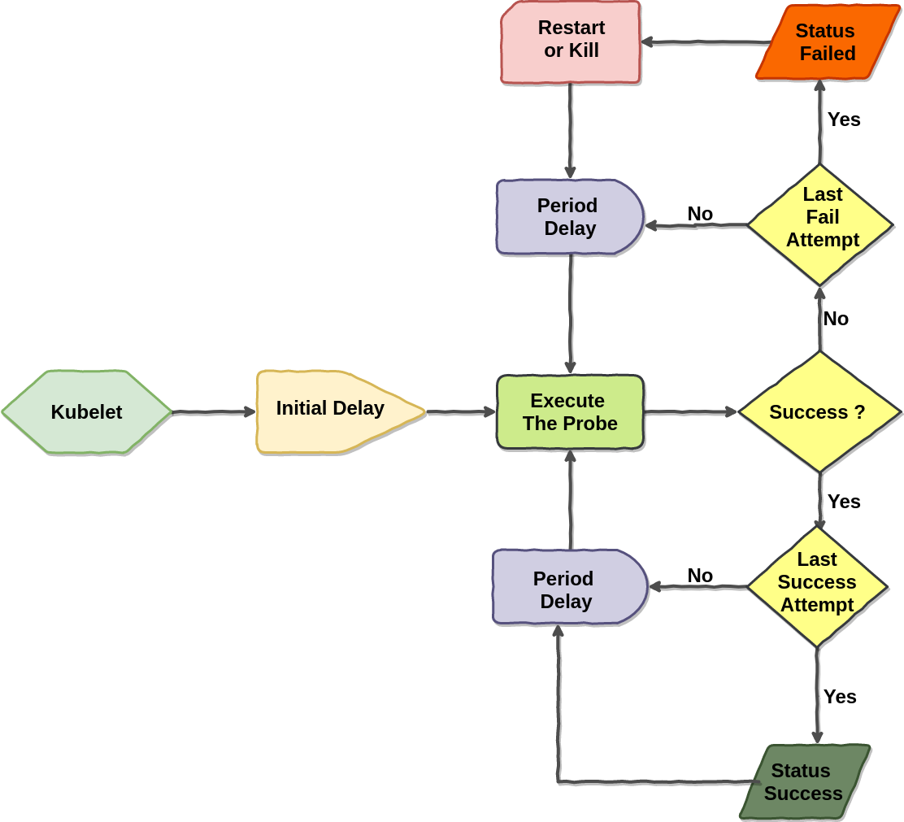

# Kubernetes Probes

scheduler ကနေ pod ကို worker node တစ်ခု အပေါ်သို့ schedule ပြုလုပ်ပြီးသွားတဲ့အခါ၊ အဲဒီ worker node အပေါ်မှ kubelet သည် containers ကို စတင် run ပါတယ်။ cluster ထဲတွင် အဲဒီ pod တည်ရှိ နေသ၍ kubelet က running ဖြစ်ရန် တာဝန် ယူထားရပါတယ်။ container ရဲ့ အဓိက process crashes ဖြစ်လာတဲ့ အခါမှာ kubelet က အဲဒီ container ကို restart ပြုလုပ်ပေးပါတယ်။ အဲတော့ container ထဲမှာ run နေတဲ့ applications မှာ bug ပါတယ်ဆိုရင် kubernetes က အလိုအလျောက် restart ချပေးနေမှာ ဖြစ်ပါတယ်။ အဲဒီလို crash လိုက် restart ချလိုက် လုံးလည်ချာလည် ဖြစ်နေမှာပါ။ အခုလို ဖြစ်ရတာကတော့ kubernetes ရဲ့heal ပြုလုပ်နိုင်တဲ့ ability ကြောင့် ဖြစ်တယ်။ ဒါပေမဲ့ တချို့ အခြေနေတွေမှာ application ရဲ့ process က crash မဖြစ်ဘဲ application က အလုပ်မလုပ်တော့ တာတွေရှိလာနိုင်ပါတယ်။ ဘယ်လို အခြေနေမျိုးတွေလဲ ဆိုတော့ ဥပမာ များသော အားဖြင့် java application တွေမှာ memory leak ဖြစ်ပြီး `OutOfMemorryError` လိုမျိုး ဖြစ်ပေမဲ့ `JVM` process ကတော့ ဆက်လက် running ဖြစ်နေတဲ့ အခြေနေမျိုး ဖြစ်ပါတယ်။ infinite loop ကြောင့်ဖြစ်စေ၊ deadlock ကြောင့်ဖြစ်စေ စတဲ့ အခြေနေမျိုး ၂ ခုကြောင့် application က response မလုပ်တော့ဘူးဆိုရင် ကျွန်တော် တို့ ဒီ application ရဲ့ health ကို container အပြင်ကနေ စစ်ဆေးဖို့ လိုလာပါပြီ။ အဲလို မျိုး စစ်ဆေးတာကို probe လို့ ခေါ်ပါတယ်။ တနည်းအားဖြင့် kubernetes ရဲ့ container တွေကို health check လုပ်ပေးတာ ကို ပြောတာ ဖြစ်ပါတယ်။ probe ကို configure လုပ်ပြီး pod တည်ဆောက် ပြီးတဲ့ အခါမှာ kubernetes ရဲ့ kubelet က နေ အဲဒီ probes တွေကို ပုံမှန် သူ့အချိန်နဲ့ သူ ပို့လွှတ်ပါတယ်။ အဲလို ပို့လွှတ်ပြီး တဲ့ အခါမှာ ဖြစ်နေတဲ့ အခြေအနေပေါ်မူတည်ပြီးတော့ ဘာဆက်လုပ်မယ်ဆိုတာ ကတော့ probe အမျိုးအစား အပေါ် မူတည်ပြီး ကွဲပြား ပါတယ်။ လောလောဆယ် probe ၃ မျိုး ရှိပါတယ်။ ဒါတွေကတော့ -

* [liveness probes](https://blog.k8smm.org/kubernetes-probes/liveness-probes) 
* [readiness probes](https://blog.k8smm.org/kubernetes-probes/readiness-probes) \(coming soon\)
* [startup probes](https://blog.k8smm.org/kubernetes-probes/startup-probes) \(coming soon\) ဘဲ ဖြစ်ပါတယ်။

probes အမျိုးအစားတွေ က probe လုပ်တာ တူညီကြပေမဲ့ ရည်ရွယ် ချက်တွေ၊ အသုံးပြုမှု ပုံစံတွေ၊ ကတော့ ကွဲပြားပါတယ်။

