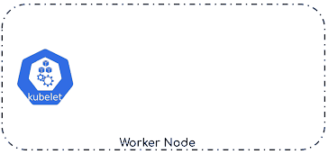

# Liveness Probes



Container က အဆင်ပြေစွာ running ဖြစ်နေလား၊ \(alive\) ဖြစ်နေလား၊ ဆိုတာကို သိရှိဖို့၊ action ယူဖို့၊ liveness probes ကို အသုံးပြုနိုင်ပါတယ်။ အဲလို စစ်ဆေးနိုင်ဖို့ liveness probe ကို container တစ်ခုချင်းစီ အတွက် pod definition မှာ ထည့်ပြီး configure ပြုလုပ်ရပါတယ်။ configure ပြုလုပ်ပြီး pod တည်ဆောက်ပြီးတဲ့အခါ kubelet က configure ပြုလုပ်တဲ့ပုံစံ အပေါ်မူတည်ပြီးတော့ liveness probe ကို အချိန်မှန်ပို့ပါတယ်။ liveness probe က Give up မလုပ်ခင် အချိန်ထိ Probe ဘယ်နှစ်ကြိမ် fail၊ fail ပြသနာ မရှိပေမဲ့ liveness probe က give up လုပ်တဲ့ အချိန်မှာတော့ container ကို restart ချပါတယ်။ အဲ့တော့ liveness probe give up မလုပ်ခင်မှာ probe success ဖြစ်မှသာ pass ဖြစ်မှာပါ။ liveness probe ကို method သုံးမျိုးဖြင့် check နိုင်တယ်။ ဒါတွေကတော့ -

* **An HTTP GET probe** - HTTP probe က container ရဲ့ IP၊ Port နဲ့ Path ကို Get Request ပေးပို့ပြီးတော့ application မှ ပြန်လာတဲ့ HTTP response code `2xx` နဲ့ `3xx` ကလွဲပြီး အခြားသော error code များ ဒါမှ မဟုတ် လုံး၀ response မပြန်တဲ့အခါ probe fail တယ်လို့ ယူဆပါတယ်။
* **A TCP Socket probe** - TCP probe ကတော့ container ကို TCP connection နဲ့ သတ်မှတ်ထားတဲ့ Port ကို ကြိုးစားပြီး connect လုပ်ပါတယ်။ အဲ့အချိန်မှာ connection က established ဖြစ်သွားရင် probe success ဖြစ်ပြီး အဲလိုမှ မဟုတ်ရင်တော့ fail တယ်လို့ ယူဆပါတယ်။
* **An Exec probe** -  ဒီ probe ကတော့ container အထဲမှာ command ကို executes လုပ်ပြီးတော့ အသုံးပြုပါတယ်။ တကယ်လို့ command ရဲ့ exit status code က `0` မဟုတ်ခဲ့ဘူးဆိုရင် fail ဖြစ်တယ်လို့ ယူဆပါတယ်။


```yaml
apiVersion: v1
kind: Pod
metadata:
  name: hola-liveness
spec:
  containers:
  - image: quay.io/dther/hola:unhealthy
    name: hola
    livenessProbe:
      httpGet:
        path: /
        port: 8080
```


ဒါကတော့ liveness probe ကို HTTP GET နည်းလမ်းဖြင့် စမ်း run ကြည့်နိုင်မဲ့ manifest ပါ။ ဒီ pod ကို create လုပ်လိုက်ပြီးတော့ `kubectl get pod -w`\(watch\) ဒီ command ကို run လိုက်လျှင် အောက်ကပုံအတိုင်း အချိန်နဲ့ အလိုက် pod ရဲ့ အခြေအနေနဲ့ restart count တွေကို တွေ့ရမှာပါ။


restart ကျရတဲ့ အကြောင်းအရင်းမှာ `statuscode: 500` နဲ့ liveness probe ရဲ့ HTTP probe failed သွားလို့ ဖြစ်ပါတယ်။ အောက်ကပုံက `Event` ကို ကြည့်ပြီး သိနိုင်ပါတယ်။ ဒါပေမဲ့ HTTP status code 500 ကြောင့် container က အမှန်တကယ် restart ကျသွားတာ မဟုတ်ပါဘူး။


 ပထမ အကြိမ် restart ကျတဲ့ အချိန်မှာ kubectl command ဖြင့် `describe` လုပ်ကြည့်မယ်ဆိုရင် အောက်က ပုံကို မြင်ရမှာပါ။ `Liveness:` ဆိုတဲ့ အကြောင်းမှာ Liveness probe ကို ဘယ်လို configure ချထားလဲဆိုတာနှင့် တခြား properties ကို ဖော်ပြထားပါတယ်။ အဲဒီမှာ `delay=0s` ဆိုတာကတော့ container စပီး start ဖြစ်တာနှင့် ချက်ချင်း probe ကို စပြီး ပို့လွှတ်တာဖြစ်ပါတယ်၊ `timeout=1s` ဆိုတာကတော့ probe လုပ်တဲ့ ကြာချိန်ပါ \(ဥပမာ - probe ကို ၁ စက္ကန့် အတွင်း response မပြန်နိုင်ရင် probe fail တယ်လို့ သတ်မှတ်တာပါ\)၊ `period=10s` ကတော့ ၁၀ စက္ကန့် တိုင်းမှာ probe ကို kubelet ကနေပို့ပြီး စစ်ပါတယ်။ `#failure=3` ကတော့ ခုနက period ၃ခါ \(၁၀ x ၃ = ၃၀ စက္ကန့်\) ပြည့်တဲ့အခါမှာ give up ဖြစ်ပြီး container ကို restart ချသွားတာပါ \(`#success=1` ကတော့ ဒါရဲ့ ဆန့်ကျင့်ဘက်ပါ\)။ အဲ့တော့ အချိန်တစ်ခု ရောက်တဲ့အခါမှာ ပထမဆုံးအကြိမ် probe က HTTP status 500 response ကို ရရှိတဲ့အခါမှာ တစ်ခါ စပြီးတော့ probe fail ပါတယ်။ နောက် ၁၀ စက္ကန့် ကြာတဲ့ အချိန်မှာ 500 response ကိုထပ်ပြီး လက်ခံရရှိတဲ့အခါမှာ probe fail တာ ၂ ကြိမ် ဖြစ်သွားပါပြီ၊ နောက် ၁၀ စက္ကန့်မှာ ထပ် fail ရင် ၃ ကြိမ် ပြည့်လို့ probe က action ယူပြီး container ကို restart ချမှာ ဖြစ်ပါတယ်။


နောက်တခုထပ်ပြောချင်တာကတော့ describe result မှာ `Exit Code: 137` ပါ၊ ဒါကတော့ external signal ပို့လွှတ်ပြီးတော့ process ကို terminated ပြုလုပ်ခဲ့တယ်၊ kill ခဲ့တယ် ဆိုတဲ့ အဓိပ္ပါယ်မျိုးပါ၊ 137 သည် `128 + n` ဖြစ်ပါတယ်။ ဒီနေရာမှာ `n` တန်ဖိုးကတော့ 9 ဖြစ်ပါတယ်။ 9 သည် ကျွန်တော်တို့ process တွေကို Kill တဲ့ အခါ အသုံးပြုတဲ့ `SIGKILL` signal number ဖြစ်ပါတယ်။ ဒါကြောင့်မို့လို့ process က force လုပ်ပြီးတော့ kill ခံရတာဖြစ်ပါတယ်။ ဒါသည် probe က ၃ ကြိမ် fail လို့ give up လုပ်သွားတဲ့အခါမှာ container ကို kill လိုက်တာ ဖြစ်ပါတယ်။ Container ကို kill လိုက်တယ်ဆိုတာက လုံး၀အသစ်တစ်ခု ပြန်တည်ဆောက်လိုက်ခြင်းဖြစ်ပါတယ်။ ဒါဟာ ကျွန်တော်တို့ အလွယ်ပြောပြောနေတဲ့ probe fail တဲ့ အခါမှာ container restart ချသွားခြင်းဖြစ်ပါတယ်။

| Exit Code Number | Meaning | Example | Comments |
| :---: | :---: | :---: | :---: |
| 128 | Invalid argument to exit | exit 3.14159 | exit takes only integer args in the range 0 - 255 \(see first footnote\) |
| 128+n | Fatal error signal "n" | kill -9 $PPID of script | $? returns 137 \(128 + 9\) |

တစ်ချို့ application အမျိုးအစားတွေက application startup time ကြာကြပါတယ်။ များသောအားဖြင့် java application တွေမှာ တွေ့ရတတ်ပါတယ်။ ဒီလို အခြေအနေမျိုးမှာ container create လုပ်လုပ်ခြင်း \(`delay=0s`\) probe ကို စလုပ်တာ အဆင်မပြေနိုင်ပါဘူး၊ ဒီလိုအခြေနေမျိုးအတွက် application startup time ကို စောင့်ဖို့ probe ရဲ့ properties တစ်ခုဖြစ်တဲ့ `initialDelaySeconds: 30s` ဖြင့် probe စလုပ်မဲ့ အခြေနေကို ထိန်းထားနိုင်ပါတယ်။ ဒီ properties သာ pod manifest ထဲ ထည့်ပြီး pod ကို create လုပ်ခဲ့မယ်ဆိုရင် kubelet က container တည်ဆောက်ပြီး ၃၀ စက္ကန့်ကြာမှ ပထမဆုံး probe ကို စတင်ပို့လွှတ်မှာ ဖြစ်ပါတယ်။ ဒါကတော့ kubernetes ကနေ kubelet မှတဆင့် container တစ်ခု ကောင်းမွန်စွာ အသက်ရှိမရှိ၊ health check နိုင်တဲ့ liveness probe ရဲ့ အကြမ်းဖျင်း ဖြစ်ပါတယ်။

