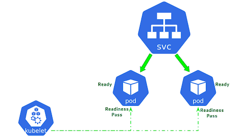
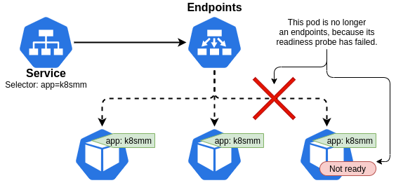

# Readiness Probes



Pod တွေကို စတင်တည်ဆောက်တဲ့အချိန်မှာ တချို့ application တွေ အတွက် warm-up procedure တွေ ပြုလုပ်ဖို့ \( ဥပမာ configuration တွေ၊ data တွေကို load လုပ်ဖို့ \) အချိန်လိုအပ်ပါတယ်။ အဲဒီလို အဆင်သင့် မဖြစ်သေးတဲ့အချိန်မှာ service ကနေတဆင့် client request တွေ pod ရှိတဲ့ဆီကို ရုတ်တရက် ရောက်လာမှာကို တားဆီးဖို့အတွက် readiness probe ကို အသုံးပြုခြင်း ဖြစ်ပါတယ်။ ဒါကြောင့်မို့လို့ Readiness ဆိုတာ Pod တွေက traffic ကို လက်ခံဖို့ Ready ဖြစ်မဖြစ်ကို probe check ပြုလုပ်ဖို့ နာမည် ပေးထားတာ ဖြစ်ပါတယ်။ Readiness Probe ကို configure ပြုလုပ်ထားမယ်ဆိုရင် Pod အထဲမှ container စ run ပြီး အချိန်အနည်းငယ်အကြာမှာ readiness probe စပြီး check ပါတယ်။ အဲဒီ container စ run တဲ့ အချိန်ကနေ ပထမဆုံး readiness probe စ check တဲ့ ကြားထဲက အချိန် ပမာဏကိုလဲ configure ပြုလုပ်နိုင်ပါတယ်။ readiness probe ကလဲ [Liveness Probe](https://blog.k8smm.org/kubernetes-probes/liveness-probes) လိုမျိုး periodically probe ပို့လွှတ်ပြီး check ပါတယ်။ Readiness Probe က Pod ထဲက container ကို probe ပို့လွှတ်ပြီး health check ပြုလုပ်ပေးမယ့် Pod health အတွက် အသုံးပြုတာ မဟုတ်ပါဘူး။ Pod တွေကို Deployment တွေ၊ replicaSet၊ replication controller တွေ၊ statefulSet အစရှိတဲ့ resource တွေက label တွေနဲ့ ချိတ်ဆက် \(အလွယ်ပြောရရင်\) အသုံးပြုကြတယ်။ replication controller တို့၊ replicaSet တို့အကြောင်းမှာ ပြန်ဖတ်ကြည့်လို့ရပါတယ်။ အဲ့လိုပဲ service ကလည်း ဘယ် label ရှိတဲ့ pod တွေကို expose လုပ်ပြီး ချိတ်ဆက် အသုံးပြုကြတယ်။ Readiness Probe က အချိန်နဲ့အမျှ check တယ်။ probe check လို့ ရလာတဲ့ result အပေါ် action ယူဖို့ ဆုံးဖြတ်တယ်။ ဒါကြောင့်မို့လို့ readiness probe check တဲ့အခါ success ဖြစ်ရင် container က သူရှိလာတဲ့ request တွေကို လက်ခံဖို့ အသင့်ဖြစ်နေပြီလို့ သတ်မှတ်ပါတယ်။ Probe check fail သွားတဲ့အခါမှာတော့ service ရဲ့ pod selector ထဲကနေ ဖယ်ထုတ်လိုက်ပြီး၊ ဒီ probe fail တဲ့ container ရှိတဲ့ pod က client တွေဆီကလာတဲ့ request တွေကို လက်ခံဖို့ အဆင်သင့် မဖြစ်သေးဖူးလို့ သတ်မှတ်တယ်။



Readiness success ဖြစ်မဖြစ် သိရှိနိင်ဖို့ အမျိုးအစားသုံးမျိုးဖြင့် probe check ပြုလုပ်နိုင်ပါတယ်။ Liveness Probe လိုပါပဲ။ ပထမတစ်ခုက HTTP GET method probe ဖြစ်ပါတယ်။ HTTP GET ကို container အထဲက application ဆီသို့ request ပြုလုပ်ပြီး response ပြန်လာတဲ့ HTTP status code အပေါ်မူတည်ပြီးတော့ container က ready ဖြစ်မဖြစ် ဆုံးဖြတ်ပါတယ်။ ဒုတိယကတော့ TCP Socket Probe ပါ။ telnet နဲ့ port ပွင့်မပွင့် စမ်းသလိုမျိုး container ရဲ့ specific port တစ်ခုကို TCP protocol အပေါ်မှ port ကိုလှမ်းပြီး Open ပါတယ်။ connection established ဖြစ်သွားရင် ready လို့ ဆုံးဖြတ်ပြီး၊ အဲလိုမှ မဟုတ်ဘူးဆိုရင်တော့ not ready ပါ။ နောက်ဆုံးနည်းကတော့ Exec Probe ပါ။ ဒါကတော့ Probe ကနေ process တစ်ခုကို execute လုပ်ပါတယ်။ process ပြီးသွားတဲ့အခါမှာ ထွက်လာတဲ့ Exit code အပေါ်မူတည်ပြီး ready ဖြစ်မဖြစ် ဆုံးဖြတ်ပါတယ်။

Readiness Probe နဲ့ Liveness Probe က pod တို့၊ service တို့လို kubernetes ရဲ့ top level resources တွေ မဟုတ်ပါဘူး၊ container/application တွေရဲ့ health နဲ့ availability ကို kubernetes ရဲ့ kubelet မှ စစ်ဆေးပေးနိုင်တဲ့ Pod ထဲက container တွေရဲ့ အစိတ်အပိုင်းတွေသာ ဖြစ်ကြပါတယ်။ Readiness နဲ့ Liveness က probe လုပ်တာချင်း တူပေမဲ့ action ယူတာခြင်း မတူညီကြပါဘူး။ ဒါကြောင့်မို့ မရောယှက်ဘဲ ကွဲပြားစွာ နားလည်သိရှိဖို့ လိုအပ်ပါတယ်။ liveness က Probe fail တဲ့အခါမှာ container ကို kill အသစ်တစ်ခု ပြန်တည်ဆောက်ပေးပါတယ် \( မသိရင် restart တဲ့ သဘောလိုမျိုးပေါ့ \)၊ ဟိုရှေ့တစ်ပတ်က liveness Probe Post မှာ ပြောခဲ့ပြီးသားဖြစ်ပါတယ်။ ဒီအချိန်မှာ readiness က probe fail တဲ့အခါမှာ liveness လို container ကို မ kill ဘဲ \( restart မချဘဲ \)၊ Endpoint Objects ကနေပြီးတော့ pod ကဖယ်ရှားခြင်းခံရပါတယ်။ သဘောကတော့ readiness fail ရင် pod က endpoints ထွက်လာတော့မှာ မဟုတ်ပါဘူး။ Service က logically label နဲ့ pod selector ကိုအသုံးပြုပြီး traffic တွေကို pod တွေဆီပေးပို့ပါတယ်။ တကယ်တမ်း physically ကတော့ Service ကို traffic တွေ ရောက်လာတဲ့အခါမှာ service proxy က Endpoint Resource ထဲမှာရှိတဲ့ IP နဲ့ Port pairs ကို ရွေးချယ်ပြီး pod တွေဆီသို့ ပေးပို့ပါတယ်။ Endpoint အသေးစိတ်ကိုတော့ Service Episode 2 မှာ အသေးစိတ် ရေးပေးထားမှာ ဖြစ်ပါတယ်။ ဒါကြောင့်မို့လို့ readiness fail ရင် pod က client ဆီမှလာတဲ့ request ကို လက်ခံရရှိတော့မှာ မဟုတ်ပါဘူး။ ဒီလို readiness probe အသုံးပြုခြင်းဖြင့် ကိုယ်ရဲ့အဆင်သင့် မဖြစ်သေးတဲ့ application ဆီသို့ client traffic များ ရောက်မလာအောင် တားဆီးပေးနိုင်ပါတယ်။  
ဒါ့အပြင် မထင်မှတ်ထားတဲ့ bug ဖြစ်နေတဲ့ application version တွေကို application update ပြုလုပ်တဲ့အခါမှာ production လို environment မျိုးသို့ မတော်တဆ deploy မဖြစ်စေရန် slow down ပြုလုပ်သည့်ပုံစံ usage များဖြင့်လည်း Readiness Probe ကို သုံးကြပါသည်။

```yaml
apiVersion: v1
kind: Pod
metadata:
  name: k8smm-readiness
  labels:
    app: goproxy
spec:
  containers:
  - name: goproxy
    image: k8s.gcr.io/goproxy:0.1
    ports:
    - containerPort: 8080
    readinessProbe:
      tcpSocket:
        port: 8080
      initialDelaySeconds: 5
      periodSeconds: 10
```

Readiness ကို implement ပြုလုပ်ရတဲ့ ပုံစံကတော့ Liveness နဲ့ အရမ်းကြီး မခြားနားပါဘူး။ အပေါ်မှာတော့ TCP Socket ကို အသုံးပြုပြီး configure ပြုလုပ်ထားတာ ဖြစ်ပါတယ်။

