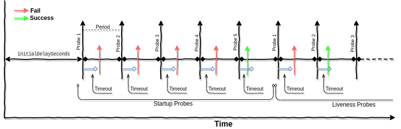

# Startup Probes



တချို့ Application တွေကို ပထမအကြိမ်စ run တဲ့အခါမှာ application up and run ဖြစ်ဖို့ initialization ပြုလုပ်ရတဲ့ အခြေအနေမျိုးတွေ ရှိနိုင်ပါတယ်။ အဲလိုအခြေအနေမျိုးမှာ Startup probe ကို setup ပြုလုပ်ထားမယ်ဆိုရင် initialization ပြုလုပ်နေတဲ့ state ကို hold လုပ်ထားပေးမှာ ဖြစ်ပါတယ်။ နောက်ပြီးတော့ Startup Probe က Liveness Probe နဲ့ ဆင်တူပါတယ်။ ဒါကြောင့်မို့လို့ probe fail တဲ့အခါမှာ container ကို restart ချတဲ့ action ကို ပြုလုပ်ပါတယ်။ Probe succeed ဖြစ်သွားတဲ့အခါမှာတော့ Startup probe က probe ကိုထပ်ပြီးတော့ မ check တော့ပါဘူး။ Liveness probe ကို အစားထိုးလိုက်ပါတယ်။ Liveness Probe ကဘဲ တောက်လျောက် သူ့အလုပ်သူစပြီးတော့ ဆက်လုပ်ပါတယ်။ ဒါကြောင့်မို့လို့ Startup probe ဆိုသည့်အတိုင်း Startup ပြုလုပ်တဲ့အချိန်မှာပဲ အလုပ်လုပ်ပါတယ်။ [Startup Probe](https://github.com/kubernetes/enhancements/issues/950) ကတော့ kubernetes 1.16 မှာ အသစ်ပါလာတဲ့ Probe type အသစ်ဖြစ်ပါတယ်။

```yaml
.....
startupProbe:
   httpGet:
     path: /healthz
     initialDelaySeconds: 5
     periodSeconds: 10
     timeoutSeconds: 4
     failureThreshold: 6
livenessProbe:
   httpGet:
     path: /healthz
     periodSeconds: 5
     timeoutSeconds: 3
     failureThreshold: 3
.....
```

ဒါကတော့ Startup Probe နဲ့ Liveness Probe ကိုတွဲပြီး အသုံးပြုထားတဲ့ နမူနာ manifest ပါ။ ဒီ manifest အရဆိုရင် manifest ကို create လုပ်ပြီး ၅ စက္ကန့် အကြာမှ Startup Probe စအလုပ်လုပ်မှာ ဖြစ်ပါတယ်။ Startup Probe စပို့လွှတ်ပြီး ၄ စက္ကန့် အထိ စောင့်ဆိုင်းပါမယ်။ Startup Probe စ check တာကနေ နောက်တစ်ခါထပ် check ဖို့ကို periodSeconds မှာ configure ပြုလုပ်နိုင်ပါတယ်။ manifest အရဆိုရင် အဲ့ဒီ အချိန်ကို ၁၀ စက္ကန့် ခွာထားတာ ဖြစ်ပါတယ်။ failureThreshold ကတော့ Probes fail တာကို လက်ခံနိုင်တဲ့ အရေအတွက်ပါ။ manifest အရဆို ၆ခါထိ fail လို့ ရတယ်။ အဲတော့ Probe စစ်တာ ၆ ကြိမ်ပြည့်သည့်တိုင် fail နေမယ်ဆိုရင် Startup Probe က container ကို restart ချပါမယ်။ kill ပါမယ်။ ဒါတွေကတော့ [Liveness probes](https://blog.k8smm.org/kubernetes-probes/liveness-probes) မှာ ပြောခဲ့ပြီးသားဖြစ်ပါတယ်။ နောက်တစ်ခုက သတ်မှတ်ထားတဲ့ ၆ ကြိမ်မတိုင်ခင် success ဖြစ်ခွင့်ရှိပါတယ်။ အပေါ်မှာ configure ပြုလုပ်ထားတဲ့ manifest ရဲ့အဓိပ္ပါယ်ကို ခြုံကြည့်မယ်ဆိုရင် Startup Probe က Application ကိုnစတင် initialization \(startup\) ပြုလုပ်နိုင်ဖို့ ၆၀စက္ကန့်  \(၁မိနစ်\) စောင့်မှာ ဖြစ်ပါတယ်။ ဘာလို့ တစ်မိနစ်စောင့်တာလဲဆိုတော့ ၁ခါ fail ဖြစ်တိုင်းမှာ နောက်တစ်ခါ fail သို့မဟုတ် success ဖြစ်ဖို့ ၁၀ ခွာထားတဲ့ period စက္ကန့်ကြောင့်ဖြစ်ပါတယ်။ ၆ ခါ fail တော့ ၆၀ စက္ကန့် ဖြစ်ပါတယ်။ **periodSeconds** **×** **failureThreshold** \(၁၀ x ၆ = ၆၀\) ကို မြှောက်တဲ့သဘောပါ။ Liveness Probe မ check ခင်အထိ စုစုပေါင်းအချိန်ဆိုရင်တော့ **initialDelaySeconds** **+** \( **failureThreshold** **×** **periodSeconds** \) ကြာမှာ ဖြစ်ပါတယ်။ ဒါတွေကတော့ နမူနာ ဖြစ်ပါတယ်။ ကိုယ့်ရဲ့ application နဲ့ ကိုက်ညီတဲ့ Probes တွေအတွက် configure ကို ကိုယ့်ဘာသာ စိတ်ကြိုက် သတ်မှတ်နိုင်ပါတယ်။ နမူနာ configure ချထားတဲ့အတိုင်း စက္ကန့် ၆၀ မတိုင်ခင် success ဖြစ်သွားတယ်ဆိုရင် Liveness Probe ကို ဆက်ပြီးတော့ ပြုလုပ်သွားမှာ ဖြစ်ပါတယ်။ Startup Probe က Liveness တို့ Readiness တို့လို အချိန်တိုင်း check မနေပါဘူး။ container ကို စ run တဲ့အချိန်ကနေ သူ့ကို configure ပြုလုပ်ထားတဲ့အချိန်ထိပဲ check ပါတယ်။ ဒါကတော့ တခြား Probe တွေနဲ့မတူတဲ့ ကွာခြားချက် တစ်ခုဖြစ်ပါတယ်။ အခုချိန်မှာတော့ ဒီ Startup Probes feature ရဲ့ state ကတော့ အသစ်ဖြစ်နေသေးတဲ့အတွက် alpha ပဲ ရှိပါသေးတယ်။

