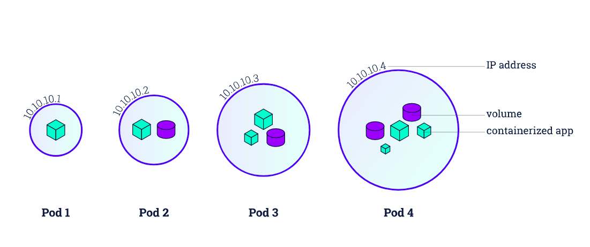
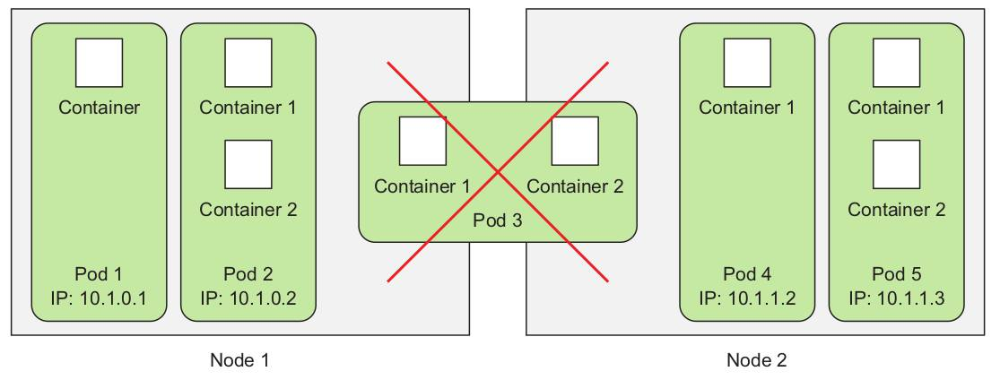

# Pods




Pod ဆိုသည်မှာ kubernetes cluster တွင် အသေးငယ်ဆုံးသော deployable units ဖြစ်ပါတယ်။ kubernetes မှာ container တစ်ခုချင်းစီ deploy မလုပ်ဘဲ pod အနေနဲ့သာလျှင် operate လုပ်တယ် deploy လုပ်ကြပါတယ်။ ပြီတော့ pod သည် တစ်ခု၊ တစ်ခုထက် ပိုတဲ့ containers တွေ တနေရာထဲမှာ စုပေါင်းထားတဲ့ အုပ်စု\(co-located group လိုမျိုး\) တခု ဖြစ်ပြီး kuberntes ရဲ့ basic အကျဆုံး object လဲ ဖြစ်တယ်။ pod တစ်ခုထဲမှာ တစ်ခု သို့မဟုတ် တခုထက် ပိုတဲ့ containers တွေ ပါဝင်နိုင်ပါတယ်။ container တခု ထက် ပိုပါဝင်တဲ့ pod တွေကတော့ kubernetes cluster ရဲ့ နှစ်ခု သို့မဟုတ် နှစ်ခုထက်ပိုတဲ့ node တွေ အပေါ်မှာ ဘယ်တော့မှ မတည်ဆောက်ကြပါဘူး။ pod တွေ ဟာ သီးသန့် ip, hostname, processes အစ ရှိတာတွေ ပါဝင်တဲ့ သီခြား logical machine တွေလို ဖြစ်ပါတယ်။



pod တစ်ခုထဲမှာ ရှိတဲ့ တစ်ခု ထက်ပိုတဲ့ container \(multiple container\) တွေ ကတော့ ခုနက ပြောခဲ့တဲ့ တူညီတဲ့ logical machine တစ်ခု ထဲမှာ running လုပ်နေတဲ့ ပုံစံ နဲ့ တူပါတယ်။ ပြောချင်တာကတော့ pod တွေဆိုတာ ကျွန်တော်တို့ သုံးနေတဲ့ vm လိုဘဲ ဒါပေမဲ့ သူက kubernetes cluster ထဲမှာ အသေးဆုံး units တွေဘဲ။ pod တွေ တစ်ခု တစ်ခုထက် ပိုတဲ့ container တွေ ပါဝင်နိုင်ပြီး network/storage စတာတွေကို တော့ share သုံးကြပါတယ်။ ဒီနေ ရာ မှာ စဉ်စားစရာ မေးခွန်းတွေ ရှိပါတယ်။ ဘာကြောင့် ကျွန်တော် တို့က pod တွေကို သုံးဖို့ လိုအပ်တာလဲ ? ဘာကြောင့် containers တွေကို တိုက်ရိုက် အသုံး မပြုနိုင်တာလဲ ? ဘာဖြစ်လို့ ကျွန်တော်တို့က multiple containers တွေကို အတူတကွ run ဖို့ လိုအပ်တာလဲ ? ပြီတော့ process တွေ အာလုံးကို single container ထဲမှာ ထည့် run လို့ရနိုင်ပါသလား ? ဟုတ်ကဲ့ ရနိုင်ပါတယ်။ တချို့ multiple processes ပါဝင်တဲ့ application တစ်ခုက IPC\(Inter-Process Communication\) မှ တဆင့် သို့မဟုတ် local stored file တွေက နေ တဆင့် processes တွေက ဆက်သွယ်ကြပါတယ်။ အဲလို application မျိုးကို vm ထဲမှာ run ထား အဆင်ပြေနိုင်ပါတယ်။ ဒါပေမဲ့ kubernetes က processes တွေကို containers တွေ ထဲမှာဘဲ run ခိုင်ပြီး container တခုက isolated machine တခုလို ပါဘဲ။ ဒါကြောင့် multiple processes တွေကို single container ထဲမှာ run ဖို့ makes sense ဖြစ်ပါတယ်။ ဒါပေမဲ့ အဲလို run တာဟာ မလုပ်သင့်ပါဘူး။ process တစ်ခု အတွက် container တစ်ခု သာလျှင် အသုံးပြုဖို့ containers တွေက Design လုပ်ထားတာ ဖြစ်ပါတယ်။ multiple processes တွေကို single container တစ်ခုထဲမှာ run ခဲ့မယ်ဆိုရင် အဲဒီ processes တွေ အကုန်လုံး ကောင်းမွန်းစွာ running ဖြစ်နေဖို့ ပိုပြီး တာဝန်ယူရပါမယ် ပြီတော့ ပိုပြီး manage လုပ်ရတာ၊ processes တွေရဲ့ logs တွေ ကြည့်ရတာ၊ single process ကို restart လုပ်ချင်တာမျိုး၊ အစရှိတာတွေ ပိုပြီး ခက်သွားပါမယ်။ ဒါကြောင့် မလို multiple process တွေကို single container ထဲ run တာ အားမပေးပါဘူး။ ဒါဆိုရင် ကျွန်တော်တို့က အခုလို multiple process တွေကို containers တွေထဲမှာ ခွဲ သုံးမယ်ဆိုရင် containers တွေကို bind ဖို့၊ အတူတကွ single unit အနေနဲ့ manage လုပ်ဖို့ ဒီထက် ကောင်းမွန်းတဲ့ higher-level ပုံစံ တခု လိုအပ်လာပါဘီ။ ဒါကတော့ Pod ပါဘဲ၊ Pod ကို လိုအပ်လာရတဲ့ အကြောင်းပါဘဲ။ Pod တစ်ခုရဲ့ containers တွေကတော့ သက်ဆိုင် ဆက်နွယ်တဲ့ processes တွေကို အနီးကပ် အတူတကွ run ဖို့ရယ် running ဖြစ်နေတဲ့ container တခုချင်းစီး အတွက် မတူညီတဲ့ environment မျိုးကို ထောက်ပံ ပေးပြီး တချို့ အရာတွေကိုတော့ isolate လုပ်ပေးထားပါတယ်။ Pod တစ်ခုထဲမှာ ရှိတဲ့ containers အာလုံးက တူညီတဲ့ Network, UTS namespaces နဲ့ IPC တွေပေါ်မှာ run ကြပါတယ်။ IPC အပေါ်ကနေလဲ တစ်ခုနဲ့ တခု communicate လုပ်နိုင်ပါတယ်။ ပြီတော့ အဲ pod တခု ထဲမှာ ရှိတဲ့ container အားလုံးက တူညီတဲ့ hostname နဲ့ network interfaces တွေကိုလဲ share သုံးကြပါတယ်။ PID တွေတောင် မှ share ပြီး အသုံးပြုနိုင်ကြပါတယ် ဒါပေမဲ့ ဒီ feature ကတော့ cluster ရဲ့ default မှာ မပါဝင်ပါဘူး သီးသန့် enable လုပ်ပေးရမှာ ဖြစ်ပါတယ်။ Pod တစ်ခု ရဲ့ containers တွေရဲ့ filesystem တွေကတော့ container တခုနဲ့ တခု fully isolate ဖြစ်ပါတယ် ဘာလို့လဲ ဆိုတော့ containers တွေရဲ့ filesystem တွေက container images တွေဆီက လာတာမို့ပါ။ ဒါပေမဲ့ တချို့ file တွေ directory တွေကို container တစ်ခုနဲ့ တစ်ခု အထဲမှာ တူညီအောင် သို့မဟုတ် share ဖို့အတွက် ဖြစ်စေ kubernetes ရဲ့ volume ကို အသုံးပြုပြီး mount နိုင်ပါတယ်။ volume အကြောင်းက တော့ နောက်ပိုင် အားရင် ဆက်ရေးပေးပါ့မယ်။ pod တစ်ခုထဲမှာ ရှိတဲ့ containers အားလုံးကတော့ တူညီတဲ့ network namespace အပေါ်မှာ run ကြပြီး တူညီတဲ့ IP address and port space တွေကို share သုံးကြပါတယ်။ ဒါကြောင့် မလို့ တူညီတဲ့ pod တခုထဲမှာ ရှိတဲ့ containers တွေက port conflict မဖြစ်စေရန် တစ်ခုနဲ့ တစ်ခု တူညီတဲ့ port ကို binding မလုပ်ဖို့ သတိထားဖို့လိုအပ်ပါတယ်။ မတူညီတဲ့ pod တွေကတော့ ဘယ်တော့မှ port conflict မဖြစ်နိုင်ပါဘူး။ ဘာကြောင့်လဲ ဆိုတော့ pod တခုချင်းစီးက သီးသန့် port space ရှိနေလို့ပါဘဲ။ နောက်ပြီး Pod တစ်ခုထဲမှာ ရှိတဲ့ containers အားလုံးမှာ တူညီတဲ့ loopback network interface ရှိပြီး container တစ်ခုကနေ တခြား container တစ်ခုကို localhost ကနေ တဆင့် communicate ပြုလုပ်နိုင်ပါတယ်။ ဒါကတော့ kubernetes ကို အခုမှ စ လေ့ လာဖို့ အတွက် Pod အကြောင်း သိသင့် သလောက် အကျဉ်းချုပ် ဖြစ်ပါတယ်။

```text
Reference: - https://kubernetes.io/docs/concepts/workloads/pods/pod/
           - kubernetes in action book
```

