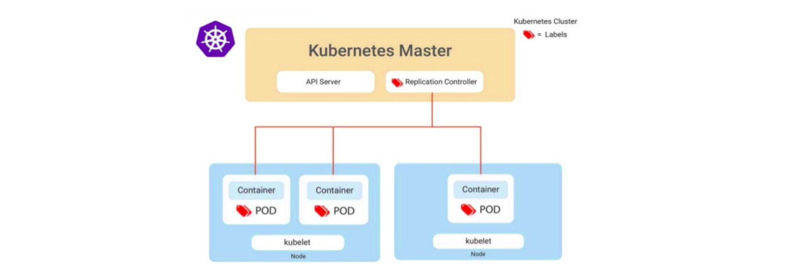
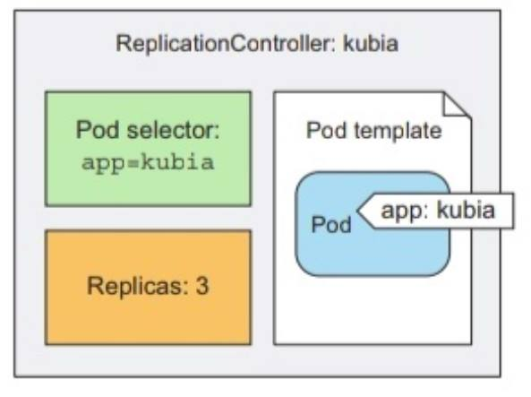
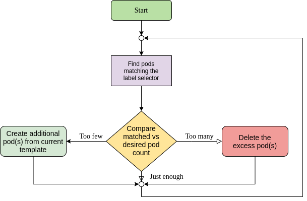
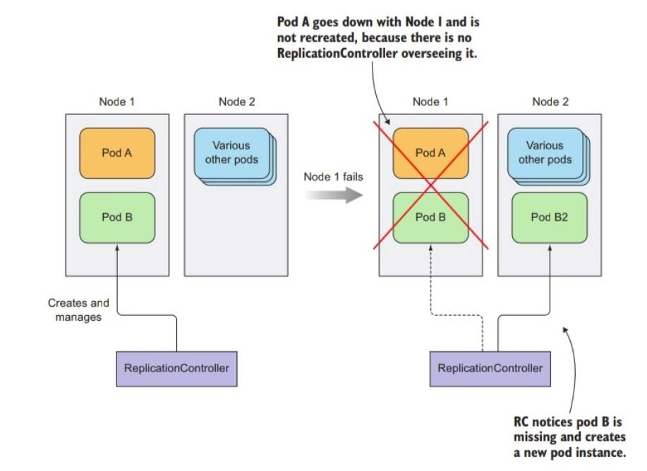

# Replication Controller



## Replication Controller

Replication Controller ဆိုသည်မှာ Kubernetes ရဲ့ basic ကျတဲ့၊ ရှေးကျတဲ့ resource \(top-level resource\) တစ်ခုပါ။ ဟိုနေ့က ပြောခဲ့တဲ့ K8s Cluster architecture ထဲက Master Node မှာ ရှိတဲ့ Controller Manager ထဲမှာ ပါဝင်တဲ့ Controller တစ်ခု ဖြစ်ပါတယ်။ လက်ရှိမှာ သူရဲ့ API version ကတော့ v1 ဖြစ်ပြီး kubernetes မှာ လူတွေ သိပ်မသုံးကျတော့ပါဘူး။ ReplicationController ရဲ့ rolling update \(the process of updating an application\) ပြု လုပ်ခြင်း အပိုင်းနဲ့ တချို့ အပိုင်းတွေမှာ လိုအပ်ချက် တချို့ ရှိသည့် အတွက် အနာဂတ်မှာ deprecated ဖြစ်ဖို့ အနေထားမှာ ရှိပါတယ်။ ReplicationController ထက် higher level ဖြစ်တဲ့ Deployment လို့ ခေါ်တဲ့ resource အသစ် တစ်ခုကို kubernetes ရဲ့ version 1.2 မှာ beta အနေနဲ့ release လုပ် ပြီး ယခု အချိန်မှာ stable အနေနဲ့ အသုံးပြုနေကြပြီး ဖြစ်တယ်။ သို့ သော်လည်း openshift ရဲ့ deployment config\(dc\) resource ကတော့ ReplicationController ကို အသုံးပြုနေဆဲ ဖြစ်ပါတယ်။ ReplicationController ရဲ့ အဓိက အလုပ်ကတော့ pod object တွေကို ReplicationController resource မှ တစ်ဆင့် အသုံးပြုပြီ တည်ဆောက်သည့် အခါ အမြဲတမ်း မဖျက်မခြင်း up and run လုပ်ပေးနေဖို့ ဖြစ်ပါတယ်။ pod တစ်ခု running ဖြစ်နေတဲ့ worker node down သွားခြင်း၊ အကြောင်းတစုံတရာ ကြောင့် node fails ဖြစ်ခြင်း၊ \(သို့\) မည်သည့် အကြောင့်နှင့် မဆို pod ပျက်သွားလျှင့် ReplicationController မှ ထို ပျက်သွားသော pod များ ကို ပြန်လည်ဆောက် တည်ပေးခြင်း သို့ မဟုတ် တစ်ခြား worker node တစ်လုံး ပေါ်တွင် ပြန်လည် တည်ဆောက် ပေးသည့် အလုပ်ကို လုပ်ပါသည်။

ReplicationController ရဲ့ spec \(ဝိသေသန/Characteristic\) ထဲတွင် replicas၊ selector နဲ့ template ဆိုပြီး essential parts ၃ ခု ပါ၀င်ပါတယ်။

* **replicas \(replica count\)** run ချင် သည့် pod အရေအတွက် \(desired number of pods\)
* **selector \(label selector\)** ဘယ် pod တွေက ReplicationController ရဲ့ manage အောက်တွင် \(သို့\) scope ထဲတွင်  ရှိတယ် ဆိုတာ ဆုံးဖြတ်ပေးတယ်။
* **template \(pod template\)** ဒီထဲမှာတော့ pod ရဲ့ manifest တွေရှိတယ် \(ကိုယ်လုပ်ချင်တဲ့ pod ပုံစံ\)



အပေါ်က ပုံမှာ kubia ကတော့ ReplicationController ရဲ့ object name ဖြစ်ပြီ app: kubia ကတော့ pod အတွက် pod template ထဲမှာ တပ်ပေးထားတဲ့ label ဖြစ်ပါတယ်။

ReplicationController က replication ကို ဘယ်လို အလုပ်လုပ်သလဲ? ပျက်သွားသော pod ကို ဘယ်လို ပြန်လည် တည်ဆောက်လဲ? cluster ထဲမှာ ReplicationController က pod တိုင်းကို တာဝန် မယူပါဘူး ပျက်သွားတိုင်းလည်း အသစ် ပြန် မတည်ဆောက်ပေးပါဘူး။ သူ manage လုပ်တဲ့ pod၊ သူ scope ထဲမှာ ရှိတဲ့ pod တွေ အတွက်ဘဲ သူ တာဝန် ယူပါတယ် ပျက်သွားသည့် အခါ ပြန် တည် ဆောက် ပေးပါတယ်။ ဘယ်လို ReplicationController က pod တွေကို manage လုပ်သလဲ ? ဒါကတော့ ရှင်းပါတယ် ReplicationController က Pod တွေကို label နဲ့ လုပ်ပါတယ်။ ReplicationController က သူရဲ့ spec ထဲမှာ ပါဝင်တဲ့ selector ကနေ သက်ဆိုင်ရာ label တွေ တပ်ထားတဲ့ pod တွေကို select လုပ်ပြီ manage လုပ်ပါတယ် စောင့်ကြည့်ပါတယ်။ အပေါ်က spec ထဲမှာ ပါဝင်တဲ့ replicas keyword ကတော့ replica count ပါ။ replicas ကတော့ pod အရေအတွက် ဘယ်နှစ်ခု တည်ဆောက် မည်\(သို့\) ဘယ်နှစ်ခု ပွားချင်းသည် \(သို့\) ဘယ်နှစ်ခု လိုချင်းသည်ကို သတ်မှတ် ပေးရပါတယ်။ template ကတော့ ကျွန်တော်တို့ တည်ဆောက်ချင်းတဲ့ pod ရဲ့ အသေးစိပ် အချက်အလက်တွေ ပါဝင်ပြီး ဒီ template မှ တစ်ဆင့် ပွားသုံးရန် \(replica လုပ်ရန်\) အတွက် ဖြစ်ပါတယ်။ vmware တို့ \(သို့\) တခြား virtualization တစ်ခုခု အသုံး ပြုဖူးခဲ့ရင် အဲက vm ကို template ပြုလုပ်ပြီ လိုအပ်သည့် အချိန်တိုင်း ပြန်လည် အသုံးပြုသည့် ပုံစံမျိုးနဲ့ တူပါတယ်။ အဲတော့ ReplicationController object တစ်ခုကို တည်ဆောက်ရင် ReplicationController မှ template အတိုင် pod ကို တည်ဆောက်ပေးပြီး pod အရေအတွက်ကို တော့ replicas မှာ သတ်မှတ်ထား သည့် အတိုင်း တည်ဆောက်သွား ပါတယ်။ replica count အလိုက် template မှ pod တွေ တည်ဆောက် ပြီသွားရင်တော့ ReplicationController က သူရဲ့ reconciliation\(ဟိုဘက်ဒီဘက်အဆင်ပြေအောင် ထိန်းညှိ\) loop အလုပ်ကို လုပ်ပါတယ်။ ဒါကတော့ replica count မှာ ပါတဲ့ pod အရေအတွက်နဲ့ လက်ရှိ run ဖြစ်နေတဲ့ pod အရေအတွက် ကို အမြဲ စောင့် ကြည့် တိုက် စစ်ပါတယ်။ အကြောင်းအမျိုးမျိုး ကြောင့် pod ပျက်သွားတဲ့ အခါမှာ replica count ထဲက အရေ အတွက် အတိုင်း တူညီတဲ့ worker node \(သို့\) cluster ရဲ့ အခြားသော worker node ပေါ်မှာ လက်ရှိ template ထဲက အတိုင်း ပြန်လည် တည်ဆောက်ပေးပါတယ်။



ReplicationController မှ တည်ဆောက်ထားတဲ့ pod က ပျက်မသွားဘဲ label ကို ဖျက်လိုက်မယ် \(သို့\) label ကို ပြင်လိုက်မယ် ဆိုပါက ReplicationController သည် သူ၏ selector မှ သိသည့် label မဟုတ်တော့ သည့် အတွက် ပြောင်လဲသွားသော pod ကို ဂရုစိုက်တော့မည် မဟုတ်ဘဲ pod အသစ်ကို template ထဲက အတိုင်း replica count မှ label ဖျက်လိုက်/ပြင်လိုက် သည့် အရေအတွက် အတိုင်း ပြန်ဆောက် ပေးသွားမှာ ဖြစ်ပါတယ်။ ReplicationController ရဲ့ ကောင်းကျိုတွေကတော့ ကိုယ် တည်ဆောက်ထားတဲ့ pod တစ်ခုခုဖြစ်ပြီး down သွားမှာ တို့ကို အမြဲ လိုက် ကြည့်နေစရာ မလိုခြင်း၊ node တစ်ခုခု fail ဖြစ်သွားသည့်တိုင် အသစ် ပြန်လည်တည်ဆောက် ပေးခြင်း၊ pod scaling လုပ်ရာတွေ manual နဲ့ automatic အလွယ်တကူ ပြုလုပ်နိုင်ခြင်း ဖြစ်ကြပါတယ်။ ဒါတွေကတော့ ReplicationController နဲ့ ပတ်သတ်လို့ သိသင့်သိထိုက်တဲ့ အကြောင်းအရာတွေ ဖြစ်ပါတယ်။



```text
Reference: - https://kubernetes.io/docs/home/
           - kubernetes in action book
```

