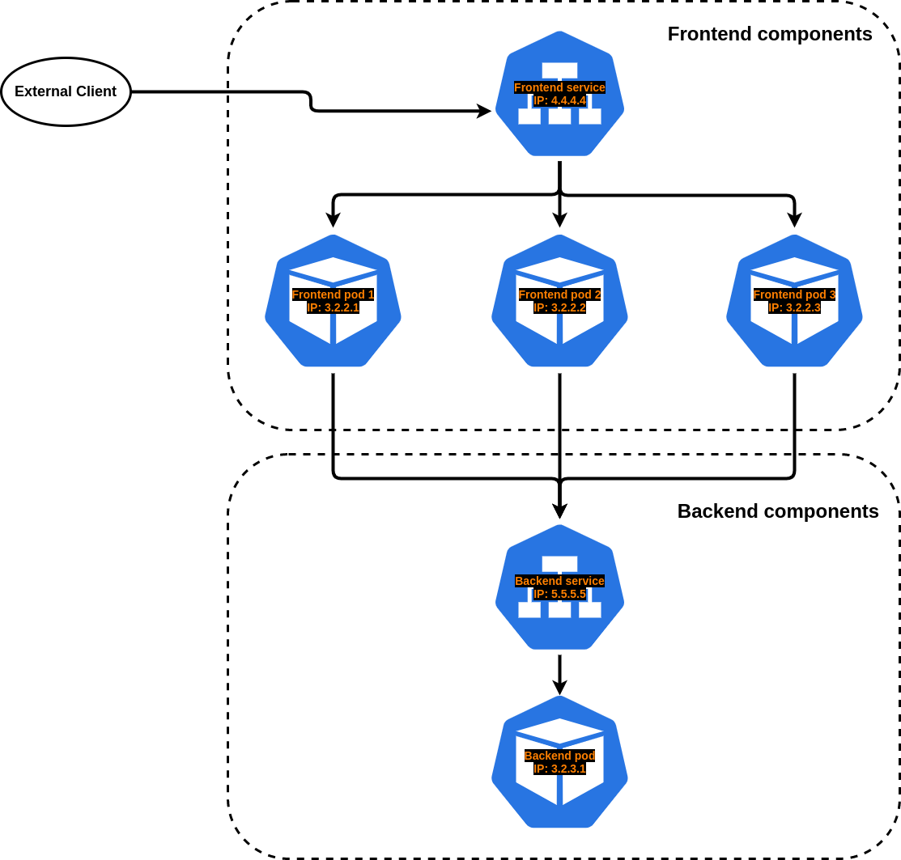

# Service

## Kubernetes Service

Kubernetes ရဲ့ Service အကြောင်းမပြောခင်မှာ Kubernetes ရဲ့ resource တွေထဲကမှ အသေးဆုံး Unit ဖြစ်တဲ့ Pod တွေရဲ့ သက်တမ်းအကြောင်းလေးနည်းနည်းအစချီလိုက်မယ်။ Replication Controller \(သို့\) ReplicaSet တစ်ခုက create လုပ်လိုက်တဲ့ Podတွေဟာ replica count အရ K8S cluster အတွင်းမှာ တည်ဆောက်သွားမယ်။ ကျွန်တော်တို့က Replica Count ကိုထပ်တိုးလိုက်တယ်ဆိုရင် လက်ရှိ Pod ၃လုံးကနေ ကိုယ်တိုးလိုက်တဲ့ အရေအတွက် အလိုက်ပြောင်းသွားမယ် နောက်ပြီးပြန်လျော့လိုက်တယ်ဆိုရင် လက်ရှိ Podအရေအတွက်ကနေလျော့သွားမယ် Pod တစ်လုံးပဲကျန်တော့တာမျိုးဖြစ်နိုင်သလို Pod တစ်လုံးမှမကျန်တဲ့အထိလည်းဖြစ်သွားနိုင်တယ်။ နောက်ထပ်တစ်ခုက လက်ရှိ Pod runနေတဲ့ Node Down သွားတဲ့ case တွေမှာ Node နဲ့အတူ Kubernetes Cluster မှာ runနေတဲ့ Pod ကပါအတူတူလိုက် Down သွားပါတယ်။ ဆိုလိုချင်တာက Pod‌တွေရဲ့သက်တမ်းကကြာကြာမခံဘူး။ Pod တစ်ခု IP Address တစ်ခုဆိုပေမယ့် Podတွေကစောစောကပြောသလိုကြာကြာမခံတဲ့ အတွက် IP Address ကအမြဲအပြောင်းအလဲရှိတယ်။ ဘယ်လိုနေရာမျိုးမှာလည်းဆိုရင် အရင်က Non-Kubernetes ခေတ်မှာကျွန်တော်တို့က Web Server ကနေ Database Serverကို connect မယ်ဆိုရင် Web Server ရဲ့ Configuration မှာ DBHost ကဘယ် IP Address ပါဆိုပြီးထည့်ထားပေးရတယ် Kubernetes မှာကြတော့ ကျွန်တော်တို့ Web Server Pod ကနေ Database Pod ကိုဘယ် IP Address ပါဆိုပြီးချိတ်ထားမယ်ဆိုပါစို့ အပေါ်မှာကျွန်တော်ပြောပြခဲ့သလို Podတွေက IP Addressတွေအမြဲပြောင်းနေတဲ့အတွက် IP Address တစ်ခါပြောင်းတိုင်း Configuration တစ်ခါလိုက်ပြောင်းပေးရမယ်ဆိုရင် အဆင်မပြေတော့ဘူး။ အဲ့တော့ကျွန်တော်တို့မှာ IP Address အတည်တကျဖြစ်ဖို့လိုလာတယ်။ အဲ့ဒါကိုဖြေရှင်းဖို့ Kubernetes မှာ Service ဆိုတဲ့ Resource လိုအပ်လာပါတယ်။

Kubernetes ရဲ့ **Service** ဆိုတာကတော့ Cluster ထဲမှာရှိတဲ့ များစွာသော Node တွေပေါ်မှာ Runနေတဲ့ Pod တွေကို LabelSelector တူရာတစ်စုတစ်စည်းတည်း စုပေးထားတယ်။ အလွယ်ပြောရင် Label တူ Pod Group လေးတွေပေါ့ဗျာ။ အဲ့ဒီ Label တူ Pod Group တွေကို internally ဖြစ်ဖြစ် externally ဖြစ်ဖြစ် အလွယ်တစ်ကူ access လုပ်လို့ရအောင်ပြုလုပ်ပေးတဲ့ Kubernetes resource တစ်ခုဖြစ်ပါတယ်။ နောက်ပြီး Kubernetes Service က Kubernetes ရဲ့ Network Service တစ်ခုအနေနဲ့လည်းလုပ်ဆောင်ပါတယ်။ Kubernetes Service က LabelSelector တူရာ Podတွေကို အဲသည်လိုစုပေးထားတဲ့အတွက် ဒီ Serviceရဲ့အနောက်မှာ Pod အရေအတွက်ဘယ်လောက်ပဲရှိရှိ ကျွန်တော်တို့ကဂရုစိုက်စရာမလိုတော့ဘူး။ ဥပမာ ကျွန်တော်တို့မှာ Frontend Pod Group တစ်ခုရှိမယ် အဲဒီ Frontend Pod Group ထဲမှာ Pod ၃လုံးရှိမယ်ဆိုရင် Service က ထို Pod Group ကိုကိုယ်စားပြုပြီး IP Address တစ်ခုထွက်မယ် အဲ့သည်နောက် External Client က Frontend Service ကိုလာခေါ်ရင် Frontend Service ကသူအောက်မှာရှိတဲ့ Podတွေဆီကို Traffic LoadBalance လုပ်ပေးမယ်။ Frontend Service ရဲ့ IP address က သူကိုမဖြတ်မချင်း ဒီအတိုင်းရှိနေမှာဖြစ်လို့ Podတွေလို ခဏခဏ IP ပြောင်းတာမျိုးလည်းမဖြစ်တော့ဘူး။ နောက်တစ်ခုက 2 Tier architecture လို Frontend Web Service ကနေ Backend Database Service ကို လှမ်းပြီး connect လုပ်တဲ့နေရာမှာလည်း Service ရဲ့ stable IP address ရှိတဲအတွက်အဆင်ပြေသွားတာပေါ့။

#### Fronted Service to Backend Service



ဒီပုံမှာဆိုရင် Client က Frontend Service ကိုခေါ်ရင် Frontend Podတွေကို LoadBalance လုပ်ပေးမယ် အဲဒီကမှတစ်ဆင့် Backend Service ကိုလည်း Frontend Service ရဲ့ Podတွေကတစ်ဆင့် အလွယ်တကူ access လုပ်နိုင်သွားမယ်ပေါ့ဗျာ။ ဒါကတော့ Kubernetes Service ရဲ့ High Level View အလုပ်လုပ်ပုံပဲဖြစ်တယ်။ ဒီအတိုင်းပဲ Web, App, DB ဘာညာ အကုန်လုံး Cluster အတွင်းမှာအလုပ်လုပ်နိုင်တယ်။

ဟုတ်ပြီ ဒီတော့ ‌မေးစရာလေးတွေဖြစ်လာပြီ Kubernetes Service က LabelSelector တူရာ Pod တွေကိုဘယ်လိုစုလာလဲဆိုတော့ \( Labels and Selectorsတွေအကြောင်းကိုတော့ [ဒီမှာ](https://myanmar-kubernetes.gitbook.io/kubernetes-myanmar/labels-and-selectors) ‌လေ့လာနိုင်ပါတယ် \)

#### LabelSelectors


ကျွန်တော်တို့ Podတွေမှာ Labelsတွေဘာပါတတ်ကြပါတယ်။ တစ်ခု\(သို့\)တစ်ခုထပ်ပိုတဲ့ Label လည်းပါနိုင်ပါတယ်။ပုံထဲမှာတော့ **Pod ရဲ့ Label က app=kubia** အနေနဲ့ပါပါတယ်။ Pod ရဲ့ဘက်ကကြည့်မယ်ဆိုရင်တော့ Label က app=kubia ပါ။ Service ဘက်ကနေကြည့်မယ်ဆိုရင်တော့ **Selector က app=kubia** ပါ။ ဆိုလိုတာက Service ရဲ့ selector မှာက app=kubia label နဲ့ podတွေဆိုရင်တော့ သူ့ထိန်းချုပ်မှုအောက်ကလို့သက်မှတ်လိုက်ပါတယ်။ အဲ့တော့ Client က Service Kubia ကိုခေါ်လိုက်ရင် Service ကသူအောက်မှာရှိတဲ့ label app=kubia ပါတဲ့ Pod မှန်သမျှဆီက Traffic LoadBalance လုပ်ပေးမှာဖြစ်ပါတယ်။

#### Extra Labels


ဒီမှာဆိုရင်တော့ Service ရဲ့ Selectorတွေက app=webapp, role=frontend ပါ။ အဲ့တော့ Selector နဲ့ matchဖြစ်တဲ့ Pod labelတွေ app=webapp, role=frontend ပါသမျှကို select လုပ်ပါတယ်။ ဒီပုံမှာ အပိုထပ်ပါနေတာက Pod Label version=1.0.0,2.0.0 ပါ။ ဒါပေမယ့် Service ကသူသိတာက Label app=webapp နဲ့ role=frontend ပါတဲ့ Podတွေကိုပါ။ ဆိုလိုတာက Service က သူမသိတဲ့ Selector version=1.0.0 Blahblahblah label အပိုပါနေလည်း သူသိတဲ့ Label ၂ ခုပါနေတဲ့ အတွက် Select လုပ်ပါတယ်။

#### Mismatch Label


ဒီပုံမှာကရှင်းပါတယ် Service ရဲ့ Selector က app=nginx ပါ။ အဲ့တော့ သူနဲ့သက်ဆိုင်တဲ့ Pod Label app=nginx ဖြစ်တဲ့ဟာတွေကိုပဲ select လုပ်ပါမယ်။ Pod Label app=apache ‌ဖြစ်တဲ့ Pod ကို Select မလုပ်ပါဘူး တနည်းအားဖြင့် Service 1 ကို Client ကခေါ်ရင် Pod 1 နဲ့ Pod 2 ဆီပဲ Loadbalance ပေးမယ် Pod 3 ဆီတော့လုပ်ပေးမှာမဟုတ်ပါဘူး။ Pod 3 ကတော့ သူဘာသာသူ သီးသန့်ရှိနေမှာပါ။

ဆိုတော့ Kubernetes Service ရဲ့ YAML တည်ဆောက်ပုံလေးကိုကြည့်လိုက်ရအောင်

#### Service Manifest

```text
apiVersion: v1
kind: Service
metadata:
  name: nginx-service
spec:
  ports:
  - port: 80
    targetPort: 80
  selector:
    app: nginx
```

K8S manifestတွေရဲ့ ထုံးစံအတိုင်း apiVersion , kind, metadata, spec ပါမယ်။ Service IP ရဲ့ Port နံပါတ်ဘယ်လောက်က Pod ရဲ့ Port နံပါတ်ဘယ်လောက်ကို Listen လုပ်မယ် ဘာညာပါမယ်။ အဓိကကတော့ selector ပါ။ စကားမစပ်ကြေငြာဝင်ချင်တာက Kubernetes မှာ Label က အသက်ပါ။ Service ကတော့ selector မှာ app=kubia ပါမယ်။ ‌ပုံမှာမြင်တဲ့ အတိုင်း **app=kubia** label ပါတဲ့ Pod တိုင်း ဒီ Service က SELECT လုပ်မှာဖြစ်ပါတယ်။

### **Kubernetes Service Types**

Service ကို Expose လုပ်တဲ့နေရာမှာ Kubernetes Service Types အနေနဲ့ကတော့ ၄ မျိုးရှိပါတယ်။

1. ClusterIP
2. NodePort
3. LoadBalancer
4. ExternalName

ဒီကတော့ Kubernetes Service ရဲ့ အကြမ်းဖျင်း နဲ့ Basic အကြောင်းအရာနဲ့ အလုပ်လုပ်ပုံလေးတွေပဲဖြစ်ပါတယ်။ Kubernetes Service Types အကြောင်း နဲ့ တစ်ချို့ ကိုတော့ ‌နောက်ထပ် article တစ်ခုအနေနဲ့ ဆက်လက်ရေးသားသွားပါဦးမယ်။

> `Reference -` [`https://kubernetes.io/docs/concepts/services-networking/service`](https://kubernetes.io/docs/concepts/services-networking/service/)\`\`
>
> * `Kubernetes in action book`
> * `Photo Ref: Google`

