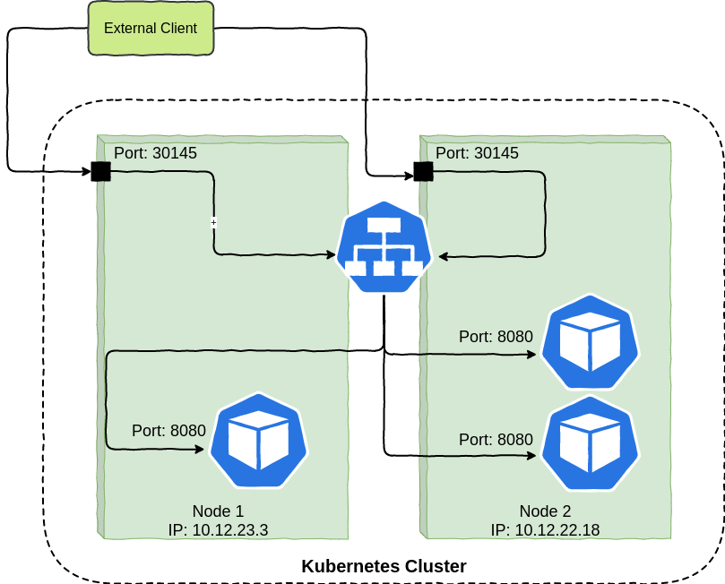
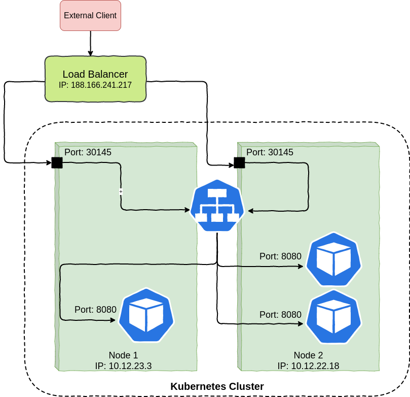

# Service Episode II

ကျွန်တော်တို့ ရှေ့မှာ [Service](https://blog.k8smm.org/service) အကြောင်းကို အနည်းငယ်ရှင်းပြပြီးဆိုတော့ နောက်ထပ် episode တစ်ခုအနေနဲ့ Service အထဲမှာဘာတွေ ဘယ်လို အလုပ်လုပ်သွားလဲဆိုတာကို ဆက်လက်လေ့လာဆွေးနွေးကြရအောင်ဗျာ။

ဟုတ်ပြီ ဒီတော့ Service တစ်ခု create လုပ်လိုက်ပြီဆိုရင် သူ့ရဲ့ Labels and Selectors ကတူရာတူရာ Pod တွေနဲ့ ချိတ်ပေးမယ်။ ဒါပြီးတော့ Service ကို access လုပ်ဖို့အတွက် Stable IP address တစ်ခုကိုထုတ်ပေးမယ်။ Service ကိုမဖျက်မခြင်း ထို Service IP ကပြောင်းမှာမဟုတ်ပါဘူး။ အဲ့သည် Service ကထွက်လာတဲ့ IP ကို Kubernetes Cluster ထဲက Pod တွေကနေ Service ကို access လုပ်ရတာအဆင်ပြေသွားမှာပါ။ ကျွန်တော်တို့အနေနဲ့ Service ကို Internal အတွင်းမှာပဲ အသုံးပြုနေမှာတော့ မဟုတ်ပါဘူး။ Service ကို External ကနေလည်း access လုပ်လို့ရအောင် အသုံးပြုကြမှာပဲဖြစ်ပါတယ်။   


ကျွန်တော်တို့ Service ကို Pod ထဲက‌နေပြီး curl command နဲ့ Service IP ကို access လုပ်တယ်ဆိုရင် ဘယ်လိုအလုပ်လုပ်သွားလဲ ဆိုတော့ 


Pod တစ်ခုထဲကို Execute လုပ်ပြီး curl command နဲ့ Service ကိုခေါ်ကြည့်လိုက်ရင် Service ကသူ့အောက်မှာ ရှိတဲ့ Pod တွေကို randomly select လုပ်ပြီး curl နဲ့ ခေါ်တဲ့ သူဆီကို response ပြန်လိုက်ပါတယ်။ ဒါကတော့ Cluster ထဲက Pod ကနေ Service ကို curl command နဲ့ request လုပ်တဲ့ scenario တစ်ခုပဲဖြစ်ပါတယ်။ အကယ်လို့ User က Cluster အပြင်ဘက်နေ Access လုပ်မယ်ဆိုရင်လည်း Ingress Controller ကနေတစ်ဆင့် Service ကို ရောက်မယ် အဲ့သည်မှတစ်ဆင့် သူ့အောက်မှာရှိတဲ့ Pod တွေဆီကို randomly probability select လုပ်သွားမှာဖြစ်ပါတယ်။ 

ဒီနေရာမှာ Pod တွေကို random probability နဲ့ select လုပ်မယ်လို့ပြောပေမယ့် တကယ်တမ်းက Service နဲ့ အမြဲအတူရှိနေတဲ့ **Endpoints** တွေဆီကိုပဲဖြစ်ပါတယ်။ ဆိုတော့ကာ Endpoint ဆိုတာဘာလဲ ၊ ဘယ်လဲ ? 

### Endpoints

တကယ်တမ်းတော့ Services တွေက Pods တွေနဲ့ တိုက်ရိုက်ကြီး ဆက်သွယ်နေတာမဟုတ်ပါဘူး ။ Services တွေနဲ့ Pods တွေကြားမှာ Endpoints ဆိုတဲ့ resource တစ်ခုရှိနေပါသေးတယ်။ Endpoints ဆိုတာကတော့ labels and selectors တူရာတူရာ စုပြီး ရလာတဲ့ Pods ရဲ့ IP addresses နဲ့ ports တွေပဲဖြစ်ပါတယ်။ လွယ်လွယ်ပြောရရင်တော့ Endpoints က Service နဲ့ Pod ကြားမှာ အလုပ်လုပ်ပေးတဲ့ Resource တစ်ခုပေါ့ဗျာ။  Pod တွေအနေနဲ့ start လုပ်ပြီးတာနဲ့  liveness probe နဲ့ readiness probe check လုပ်ပါတယ်။ health check  သဘောပေါ့၊ Readiness Probe pass ဖြစ်သွားတာနဲ့ endpoint လေးတွေထွက်လာမှာပါ။ Endpoints ကို manual လည်း create လုပ်လို့ရနိုင်ပါသေးတယ်။ Service Endpoints တွေကိုသိနိုင်ဖို့  **kubectl get endpoints** နဲ့ကြည့်လို့ရသလို **kubectl describes svc &lt;service name&gt;**  နဲ့လည်းကြည့်လို့ရနိုင်ပါတယ်။ 

```text
[waiyanmin@k8smm ~] $ kubectl get endpoints 
NAME              ENDPOINTS                                  AGE
hopper            10.0.2.126:80,10.0.2.177:80,10.0.6.90:80   36d
kubernetes        10.0.2.117:443,10.0.6.38:443               55d
```

```text
[waiyanmin@k8smm ~] $ kubectl describe svc kubernetes
Name:              kubernetes
Namespace:         default
Labels:            component=apiserver
                   provider=kubernetes
Annotations:       <none>
Selector:          <none>
Type:              ClusterIP
IP:                172.20.0.1
Port:              https  443/TCP
TargetPort:        443/TCP
Endpoints:         10.0.2.117:443,10.0.6.38:443
Session Affinity:  None
Events:            <none>
```


## Kubernetes Service Types

### ClusterIP

သူကတော့ Kubernetes Service Types တွေထဲကမှ Default Service type ဆိုလည်း မမှားဘူးပေါ့ဗျာ။ ClusterIP Service ကိုတော့ ClusterIP ဆိုတဲအတိုင်း Cluster အတွင်းမှာ အသုံးပြုဖို့ အတွက် Internal Virtual IP တစ်ခုကို ထုတ် ပေးပါတယ်။ ClusterIP Service ကိုတော့ External ကနေတိုက်ရိုက်အသုံးပြုလို့တော့ ရမှာမဟုတ်ပါဘူး။ 

```text
[waiyanmin@k8smm ~] $ kubectl get service
NAME              TYPE        CLUSTER-IP       EXTERNAL-IP   PORT(S)        AGE
hopper            ClusterIP   172.20.227.124   <none>        80/TCP         35d
kubernetes        ClusterIP   172.20.0.1       <none>        443/TCP        55d
```

### Node Port

Service Types ထဲကမှ တစ်ခုဖြစ်တဲ့ Node Port ကတော့ Cluster ထဲမှာရှိတဲ့ Node တိုင်းမှာ Port Range \( 30000-32767 \) အတွင်းမှာရှိတဲ့ Port တစ်ခုကိုအသုံးပြုပြီး External Traffic တွေကိုတာဝန်ယူပေးပါတယ်။ ကျွန်တော်တို့အနေနဲ့ Service Type ကို Node Port အနေနဲ့ expose လုပ်မယ်ဆိုရင် အရင်ဆုံး ClusterIP တစ်ခုကိုသူ့အနေနဲ့ auto create လုပ်သွားမယ်။ သူ့ရဲ့အလုပ်လုပ်ပုံက ကျွန်တော်တို့ External Clients တွေက cluster အတွင်းမှာရှိတဲ့ Node ရဲ့ Port တွေကိုတိုက်ရိုက်ခေါ်ပြီး access လုပ်မယ်ဆိုရင် သူ့ရဲ့ request traffic တွေက NodePort ကမှတစ်ဆင့် auto create လုပ်သွားတဲ့ ClusterIP Service ဆီကိုရောက်မယ်။ ClusterIP ကနေ kube-proxy မှတစ်ဆင့် iptables rules  random probability နဲ့ select လုပ်ပြီး Endpoints တွေဆီကိုပို့ပေးမှာဖြစ်ပါတယ်။



```text
[waiyanmin@k8smm ~] $ kubectl  get service
NAME              TYPE        CLUSTER-IP       EXTERNAL-IP   PORT(S)        AGE
hopper-nodeport   NodePort    172.20.23.220    <none>        80:30772/TCP   35d
```

### LoadBalancer 



LoadBalancer Service Type ကတော့ ကိုယ်ရဲ့ Kubernetes Cluster က Cloud Provider တစ်ခုခု မှာတည်ဆောက်ထားတာဆိုရင် cloud provider ရဲ့ loadbalancer ကိုအသုံးပြုပြီး service ကို External ကို expose လုပ်ပေးမှာဖြစ်ပါတယ်။ External ကနေ access ရနိုင်ဖို့ Cloud LoadBalancer ရဲ့ IP ဒါမှမဟုတ် DNS name တစ်ခုကို ထုတ်ပေးမှာပါ။ 

```text
[waiyanmin@k8smm ~] $ kubectl  get service
NAME                  TYPE           CLUSTER-IP       EXTERNAL-IP                                                                   PORT(S)        AGE
hopper-loadbalancer   LoadBalancer   172.20.197.93    a30b2efd25ec311ea852e06d3624d39a-464378756.ap-southeast-1.elb.amazonaws.com   80:30820/TCP   2m8s                                                                     443/TCP        55d
```

LoadBalancer ရဲ့ အလုပ်လုပ်ပုံကလည်းရှင်းပါတယ်။ LoadBalancer Service Type က အပေါ်မှာပြောခဲ့တဲ့ ClusterIP နဲ့ Node Port Service Type တို့ကို ငုံပြီး modify လုပ်ထားတာမျိုးပါပဲ။ Cloud Provider ရဲ့ External LoadBalancer ကဝင်လာတဲ့ Traffic တွေကို [NodePort](https://blog.k8smm.org/service/service-part-2#node-port) မှတစ်ဆင့် [ClusterIP](https://blog.k8smm.org/service/service-part-2#clusterip) ကိုရောက်မယ် ClusterIP ကနေ kube-proxy မှတစ်ဆင့် iptables rules  random probability နဲ့ select လုပ်ပြီး [Endpoints ](https://blog.k8smm.org/service/service-part-2#endpoints)တွေဆီကိုပို့ပေးမှာဖြစ်ပါတယ်။ 

### ExternalName

Service Type \( ExternalName \) ကတော့ Service Type တွေထဲမှာ အထူးခြားဆုံး Service Type တစ်ခုပါ။ ပုံမှန် Service Type တွေကတော့ Labels and Selectors တွေနဲ့ အလုပ်လုပ်ကြပေမယ့် ExternalName ကတော့ Labels တွေ Selectors တွေမလိုပါဘူး။ ExternalName ကတော့ Labels and Selectors တွေနဲ့အစား DNS name \( CNAME Record \) နဲ့ IPs တွေနဲ့အလုပ်လုပ်ပါတယ်။ ဆိုလိုတာက Service Name **k8smm** ကိုခေါ်လိုက်ရင် google ကို external name အနေနဲ့ ထည့်ထားတာမျိုးပါ။ 

```text
[waiyanmin@k8smm ~] $ kubectl get svc
k8smm    ExternalName   <none>           google.com   80/TCP    3h4m
```

YAML အနေနဲ့ဆိုရင်တော့ ဒီလိုလေး တွေ့ရမှာပါ။ 

```text
apiVersion: v1
kind: Service
metadata:
  name: k8smm
  namespace: default
spec:
  externalName: google.com
  ports:
  - name: default
    port: 80
    protocol: TCP
    targetPort: 80
  type: ExternalName
```


Service Type \( ExternameName \) အကိုအသုံးပြုဖို့အတွက် kube-dns version 1.7 ဒါမှမဟုတ် CoreDNS version 0.0.8 နှင့်အထက်လိုအပ်ပါတယ်။ 


အခုလောက်ဆိုရင်တော့ Endpoints နဲ့ Service Types တွေအကြောင်းကို အနည်းနဲ့အများနားလည် သဘောပေါက်ကြမယ်လို့ ယုံကြည်မျှော်လင့်ပါတယ်။ Kubernetes Service အနေနဲ့ ဆက်လက်ဆွေးနွေးစရာတွေရှိသေးတာမို့ နောက်ထပ် episode တစ်ခုမှာပြန်လည်ဆုံတွေကြပါစို့ ခင်ဗျာ။ 

အစဉ်လေးစားလျက်

\*\*\*\*[**Kubernetes User Group Myanmar**](https://www.facebook.com/k8smm/)\*\*\*\*

> `Reference -` [`https://kubernetes.io/docs/concepts/services-networking/service`](https://kubernetes.io/docs/concepts/services-networking/service/)\`\`

> * Kubernetes in action book

