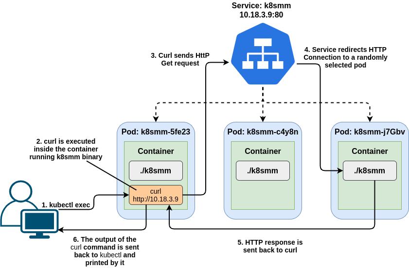

# Service Episode II

ကျွန်တော်တို့ ရှေ့မှာ Service အကြောင်းကို အနည်းငယ်ရှင်းပြပြီးဆိုတော့ နောက်ထပ် episode တစ်ခုအနေနဲ့ Service 

ဟုတ်ပြီ ဒီတော့ Service တစ်ခု create လုပ်လိုက်ပြီဆိုရင် သူ့ရဲ့ Labels and Selectors ကတူရာတူရာ Pod တွေနဲ့ ချိတ်ပေးမယ်။ ဒါပြီးတော့ Service ကို access လုပ်ဖို့အတွက် Stable IP address တစ်ခုကိုထုတ်ပေးမယ်။ Service ကိုမဖျက်မခြင်း ထို Service IP ကပြောင်းမှာမဟုတ်ပါဘူး။ အဲ့သည် Service IP ကို Kubernetes Cluster ထဲက Pod တွေကနေ Service ကို access လုပ်ရတာအဆင်ပြေသွားမှာပါ။   


ကျွန်တော်တို့ Service ကို Pod ထဲက‌နေပြီး curl command နဲ့ Service IP ကို access လုပ်တယ်ဆိုရင် ဘယ်လိုအလုပ်လုပ်သွားလဲ ဆိုတော့ 




Pod တစ်ခုထဲကို Execute လုပ်ပြီး curl command နဲ့ Service ကိုခေါ်ကြည့်လိုက်ရင် Service ကသူ့အောက်မှာ ရှိတဲ့ Pod တွေကို Randomly select လုပ်ပြီး Curl နဲ့ ခေါ်တဲ့ သူဆီကို response ပြန်လိုက်ပါတယ်။ ဒါကတော့ Cluster ထဲက Pod ကနေ Service ကို Curl command နဲ့ Request လုပ်တဲ့ Scenario တစ်ခုပဲဖြစ်ပါတယ်။ အကယ်လို့ User က Cluster အပြင်ဘက်နေ Access လုပ်မယ်ဆိုရင်လည်း Ingress Controller ကနေတစ်ဆင့် Service ကို ရောက်မယ် အဲ့သည်မှတစ်ဆင့် သူ့အောက်မှာရှိတဲ့ Pod တွေဆီကို Randomly select လုပ်သွားမှာဖြစ်ပါတယ်။ 

## Kubernetes Service Types

### ClusterIP

သူကတော့ Kubernetes Service Types တွေထဲကမှ Default Service type ဆိုလည်း မမှားဘူးပေါ့ဗျာ။ ClusterIP Service ကိုတော့ ClusterIP ဆိုတဲအတိုင်း Cluster အတွင်းမှာ အသုံးပြုဖို့ အတွက် Internal logical IP တစ်ခုကို ထုပေးပါတယ်။ ClusterIP Service ကိုတော့ External ကနေတိုက်ရိုက်အသုံးပြုလို့တော့ ရမှာမဟုတ်ပါဘူး။ 

```text
[waiyanmin@k8smm ~] $ kubectl get service
NAME              TYPE        CLUSTER-IP       EXTERNAL-IP   PORT(S)        AGE
hopper            ClusterIP   172.20.227.124   <none>        80/TCP         35d
kubernetes        ClusterIP   172.20.0.1       <none>        443/TCP        55d
```

### Node Port

Service Types ထဲကမှ တစ်ခုဖြစ်တဲ့ Node Port ကတော့ Cluster ထဲမှာရှိတဲ့ Node တိုင်းမှာ Port Range \( 30000-32767 \) အတွင်းမှာရှိတဲ့ Port တစ်ခုကိုအသုံးပြုပြီး External Traffic တွေကိုတာဝန်ယူပေးပါတယ်။ ကျွန်တော်တို့အနေနဲ့ Service Type ကို Node Port အနေနဲ့ expose လုပ်မယ်ဆိုရင် အရင်ဆုံး ClusterIP တစ်ခုကိုသူ့အနေနဲ့ auto create လုပ်သွားမယ်။ သူ့ရဲ့အလုပ်လုပ်ပုံက ကျွန်တော်တို့ External Clients တွေက cluster အတွင်းမှာရှိတဲ့ Node ရဲ့ Port တွေကိုတိုက်ရိုက်ခေါ်ပြီး access လုပ်မယ်ဆိုရင် သူ့ရဲ့ request traffic တွေက NodePort ကမှတစ်ဆင့် auto create လုပ်သွားတဲ့ ClusterIP Service ဆီကိုရောက်မယ်။ ClusterIP ကနေ Kube-Proxy မှတစ်ဆင့် IPtables rules နဲ့ randomly select လုပ်ပြီး Service နဲ့ ချိတ်ဆက်နေတဲ့ Pods တွေဆီကိုပို့ပေးမှာဖြစ်ပါတယ်။

```text
[waiyanmin@k8smm ~] $ kubectl  get service
NAME              TYPE        CLUSTER-IP       EXTERNAL-IP   PORT(S)        AGE
hopper-nodeport   NodePort    172.20.23.220    <none>        80:30772/TCP   35d

```

