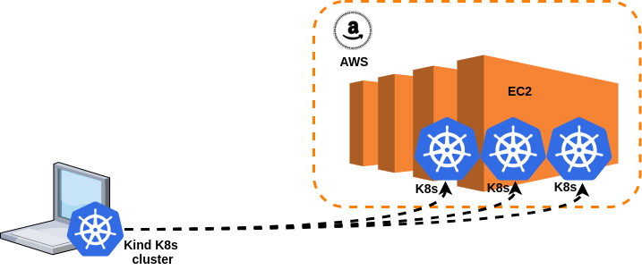
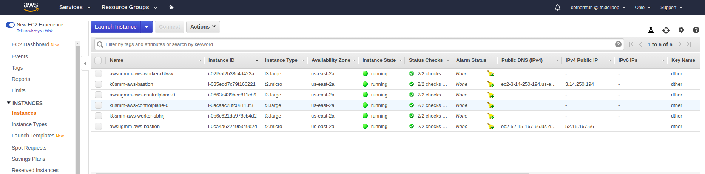

# Clusters as Cattle


Clusters as Cattle ဆိုသည်မှာ kubernetes cluster တစ်ခုမှ တစ်ခြားသော kubernetes clusters များကို kubernetes ၏ အသေးဆုံး unit ဖြစ်သော pod များ ကဲ့သို့ လိုအပ်ရင် လိုအပ်သလို create, scale, upgrade, destroy အလွယ်တကူ ပြုလုပ်ခြင်းဖြစ်သည်။


Kubernetes project တစ်ခုဖြစ်သည့် Cluster API သည် declarative ပုံစံ Kubernetes style APIs ဖြင့် kubernetes မှ တစ်ခြားသော kubernetes cluster များကို သက်ဆိုင်ရာ provider များတွင် creation, configuration, and management စသည်တို့ကို ပြုလုပ်ပေးသည်။



ဒီ Scenario တွင် Local \( laptop သို့မဟုတ် Desktop \) ထဲမှ Kind ဖြင့် kubernetes cluster တစ်ခုတည်ဆောက်ပြီး Cluster API ကို အသုံးပြု၍ AWS cloud provider နှင့် integration ပြုလုပ်မည်ဖြစ်သည်။ ထို့နောက် local k8s cluster မှ နောက်ထပ် kubernetes clusters များကို AWS EC2 ပေါ်တွင် လိုချင်သလောက် တည်ဆောက်သွားမှာ ဖြစ်သည်။

#### Workshop Prerequisite

* [base64](https://linux.die.net/man/1/base64)
* [jq](https://stedolan.github.io/jq/)
* [kubectl](https://github.com/kubernetes/kubectl)
* [awscli](https://aws.amazon.com/cli/)
* [kind](https://github.com/kubernetes-sigs/kind)
* [cluster-api-provider-aws](https://github.com/kubernetes-sigs/cluster-api-provider-aws)



Install aws cli in Linux

```bash
$ sudo pip install awscli
$ aws configure
```



Install aws cli in Mac

```bash
$ brew install awscli
$ chmod 755 /usr/local/lib/pkgconfig
$ brew link awscli
```





```bash
$ sudo pacman -Sy jq
```



```bash
$ sudo dnf install jq
```



```bash
$ sudo zypper install jq
```



```bash
$ sudo apt-get install jq
```



```bash
$ brew install jq
```





Install clusterawsadm in Linux

```bash
$ curl -Lo ./clusterawsadm https://github.com/kubernetes-sigs/cluster-api-provider-aws/releases/download/v0.4.9/clusterawsadm-linux-amd64
$ chmod +x ./clusterawsadm
$ sudo mv ./clusterawsadm /usr/local/bin/
```



Install clusterawsadm in Mac

```bash
$ curl -Lo ./clusterawsadm https://github.com/kubernetes-sigs/cluster-api-provider-aws/releases/download/v0.4.9/clusterawsadm-darwin-amd64
$ chmod +x ./clusterawsadm
$ sudo mv ./clusterawsadm /bin/
```



ပထမဆုံး  clusterawsadm ကိုအသုံးပြုပြီး AWS  IAM ထဲတွင်  policy များ role များ စသည့် လိုအပ်ချက်များကို  bootstrap လုပ်ပေးရမှာ ဖြစ်ပါသည်။ clusterawsadm သည် အလွယ်ပြောရရင် aws cloud provider API များကိုအသုံးပြုပြီး cluster တည်ဆောက်ရန်အတွက် automation ပြုလုပ်ပေးထားသည့် golang ဖြင့် ရေးထားသည့် client binary tool တစ်ခု ဖြစ်သည်။ clusterawsadm နှင့် လုပ်ပေးနိုင်သည့် feature များကို ဖေါ် ပြပေးပါမည်။

### Kubernetes Cluster API Provider AWS

**Feature**

* Native Kubernetes manifests and API
* Manages the bootstrapping of VPCs, gateways, security groups and instances.
* Choice of Linux distribution between Amazon Linux 2, CentOS 7 and Ubuntu 18.04, using [pre-baked AMIs](https://github.com/kubernetes-sigs/cluster-api-provider-aws/blob/master/docs/amis.md).
* Deploys Kubernetes control planes into private subnets with a separate bastion server.
* Doesn't use SSH for bootstrapping nodes.
* Installs only the minimal components to bootstrap a control plane and workers.
* Currently supports control planes on EC2 instances.

```bash
$ clusterawsadm alpha bootstrap create-stack
```

AWS ကို access လုပ်ရန် လိုအပ်သည့် environment variables များကို ကြေညာရမည်။

```bash
$ export AWS_CREDENTIALS=$(aws iam create-access-key --user-name bootstrapper.cluster-api-provider-aws.sigs.k8s.io)
$ export AWS_ACCESS_KEY_ID=$(echo $AWS_CREDENTIALS | jq .AccessKey.AccessKeyId -r)
$ export AWS_SECRET_ACCESS_KEY=$(echo $AWS_CREDENTIALS | jq .AccessKey.SecretAccessKey -r)
$ export AWS_REGION=us-east-2
$ export AWS_B64ENCODED_CREDENTIALS=$(clusterawsadm alpha bootstrap encode-aws-credentials)
```

AWS EC2 instance အတွက် local user ၏ ssh key pair မှ public key ကို upload လုပ်ပေးရမည်။

```bash
$ aws ec2 import-key-pair \
  --key-name k8smm \
  --public-key-material "$(cat ~/.ssh/id_rsa.pub)"
```


Workshop part-1 တွင် kind ဖြင့် cluster တည်ဆောက်ပြီးပါက ထပ်မံတည်ဆောက်ရန် မလိုအပ်ပါ။


```bash
$ kind create cluster --name=k8smm
$ kind get nodes
$ kubectl cluster-info
```

လိုအပ်သည့် manifest များကို [Kubernetes User Group Myanmar git repo](https://github.com/mm-k8s-ug) မှ clone ရပါမည်။

```bash
$ git clone https://github.com/mm-k8s-ug/Workshop-01.git
$ cd Workshop-01/part-2/
```

Cluster API ကို အောက်ဖော်ပြပါ command ဖြင့် install ပြုလုပ်ရပါမယ်။

```bash
$ kubectl create -f cluster-api-components.yaml 
```

AWS ပေါ်တွင် အသစ်ပြုလုပ်မည့် kubernetes-cluster ကို bootstrap ပြုလုပ်ရန် လိုအပ်သည့် cloud init script များကို generate ထုတ်ရန် Cluster API ရဲ့ component တစ်ခုဖြစ်တဲ့ bootstrap-components ကို ထည့်သွင်းပေးရပါမယ်။

```bash
$ kubectl create -f bootstrap-components.yaml
```

infrastructure provision ပြုလုပ်ရန်လိုအပ်သည့် AWS resources များကို ယူသုံးရန် infrastructure-components များကိုလည်း ထည့်သွင်းပေးရပါမည်။

```bash
$ cat infrastructure-components.yaml |envsubst |kubectl create -f -
```

local k8s cluster တွင် အပေါ်မှ ထည့်သွင်းခဲ့သည့် components ၃ ခု running ဖြစ်သွားလျှင် local k8s cluster နှင့် aws ကို integration ပြုလုပ်ပြီး ဖြစ်ပါသည်။

```bash
$ kubectl get ns
$ kubectl get pod -A 
# --------
# cabpk-system         cabpk-controller-manager-c58d8596f-ss8cf      2/2     Running   0          60s
# capa-system          capa-controller-manager-87cc657dc-rmp69       1/1     Running   6          7m16s
# capi-system          capi-controller-manager-6c64c695bb-vm6t5      1/1     Running   0          2m55s
# --------
```

AWS အပေါ်တွင် cluster တည်ဆောက်မည်ဖြစ်သဖြင့် CRD ဖြစ်တဲ့ AWSCluster resource နှင့် Cluster resource ၂ မျိုးကို တည်ဆောက်ပေးရပါမည်။ name တွင် ကိုယ်လိုချင်သည့် နာမည်ပေးနိုင်သည်။ region တွင် အပေါ်တွင် export လုပ်ခဲ့သော Env variable မှ **AWS\_REGION** တန်ဖိုးကို ပြောင်းလဲထားပေးရပါမည်။ sshKeyName တွင် ရှေ့တွင် aws အပေါ်သို့ upload လုပ်ပေးခဲ့သော key pair name ဖြစ်ရပါမည်။


```yaml
apiVersion: cluster.x-k8s.io/v1alpha2
kind: Cluster
metadata:
  name: k8smm-aws
spec:
  clusterNetwork:
    pods:
      cidrBlocks: ["192.168.0.0/16"]
  infrastructureRef:
    apiVersion: infrastructure.cluster.x-k8s.io/v1alpha2
    kind: AWSCluster
    name: k8smm-aws
---
apiVersion: infrastructure.cluster.x-k8s.io/v1alpha2
kind: AWSCluster
metadata:
  name: k8smm-aws
spec:
  region: us-east-2
  sshKeyName: k8smm
```


တည်ဆောက်ခဲ့သော kubernetes cluster များကို kubectl get clusters ဖြင့် တွေ့ရပါလိမ့်မယ်။ PHASE section တွင် provisioning  ဖြစ်နေပါလိမ့်မည်။ AWS အပေါ်တွင်  create လုပ်သော cluster မရောက်သေးပါ။

```bash
$ kubectl create -f k8smm-cluster.yaml
$ kubectl get clusters
```

ပုံမှန် cluster setup လုပ်သည့်အတိုင်း control-plane နှင့် worker node များကို setup လုပ်ရန် ကျန်ရှိသေးသည်။ kubernetes ၏ Machine resource နှင့် AWSMachine resource ကိုအသုံးပြုကာ Cluster ၏ control-plane object ကို တည်ဆောက်ရမည်။ ရှေ့ကအတိုင်း sshKeyName များကို ပြန်ထည့်ရန်လိုအပ်ပါသည်။


```yaml
apiVersion: cluster.x-k8s.io/v1alpha2
kind: Machine
metadata:
  name: k8smm-aws-controlplane-0
  labels:
    cluster.x-k8s.io/control-plane: "true"
    cluster.x-k8s.io/cluster-name: "k8smm-aws"
spec:
  version: v1.15.3
  bootstrap:
    configRef:
      apiVersion: bootstrap.cluster.x-k8s.io/v1alpha2
      kind: KubeadmConfig
      name: k8smm-aws-controlplane-0
  infrastructureRef:
    apiVersion: infrastructure.cluster.x-k8s.io/v1alpha2
    kind: AWSMachine
    name: k8smm-aws-controlplane-0
---
apiVersion: infrastructure.cluster.x-k8s.io/v1alpha2
kind: AWSMachine
metadata:
  name: k8smm-aws-controlplane-0
spec:
  instanceType: t3.large
  # This IAM profile is part of the pre-requisites.
  iamInstanceProfile: "control-plane.cluster-api-provider-aws.sigs.k8s.io"
  # Change this value to a valid SSH Key Pair present in your AWS Account.
  sshKeyName: k8smm
---
apiVersion: bootstrap.cluster.x-k8s.io/v1alpha2
kind: KubeadmConfig
metadata:
  name: k8smm-aws-controlplane-0
spec:
  # For more information about these values,
  # refer to the Kubeadm Bootstrap Provider documentation.
  initConfiguration:
    nodeRegistration:
      name: '{{ ds.meta_data.hostname }}'
      kubeletExtraArgs:
        cloud-provider: aws
  clusterConfiguration:
    apiServer:
      extraArgs:
        cloud-provider: aws
    controllerManager:
      extraArgs:
        cloud-provider: aws
```


control-plane object ကို တည်ဆောက်ပြီးသည့်အခါ မတော်တဆ တတ်လာနိုင်သည့် error များကို သိရှိရန် events များကို စောင့်ကြည့်နိုင်ပါသည်။ kubectl get machines ဖြင့် control-plane ၏ အခြေနေကိုလည်း သိရှိနိုင်ပါသည်။

```bash
$ kubectl create -f k8smm-control-plane.yaml 
$ kubectl get event -w  # SuccessfulSetNodeRef
$ kubectl get machines  
```

control-plane တည်ဆောက်ပြီးစီးသွားသည့်အခါတွင်  AWS အပေါ်၌ တည်ဆောက်ခဲ့သည့် k8s cluster ၏ control-plane အား access ပြုလုပ်နိုင်သည့် kubeconfig file ကို local k8s cluster ၏ default namespace မှ secrets ထဲတွင် တွေ့မြင်မှာဖြစ်ပါသည်။  
အောက်ဖေါ်ပြပါ command များဖြင့် kubconfig file ကို ဆွဲထုတ်ပြီး aws အပေါ်တွင် တည်ဆောက်ခဲ့သည့် cluster ကို access လုပ်နိုင်မှာ ဖြစ်ပါသည်။

```bash
$ kubectl get secrets
$ kubectl get secret k8smm-aws-kubeconfig -o yaml
$ kubectl --namespace=default get secret/k8smm-aws-kubeconfig -o json \
  | jq -r .data.value \
  | base64 --decode \
  > ./k8smm-aws.kubeconfig
$ kubectl --kubeconfig=./k8smm-aws.kubeconfig get nodes
NAME                                       STATUS     ROLES    AGE     VERSION
ip-10-0-0-242.us-east-2.compute.internal   NotReady   master   9m50s   v1.15.3
```

git clone ထားသည့် workshop part-2 file ထဲမှ calico manifest ကို အသုံးပြုပြီး network plugin ကို AWS အပေါ်တွင်ရှိသော kubernetes cluster ၏ control-plane တွင် ထည့်သွင်းရမှာဖြစ်ပါသည်။ ထည့်သွင်းပြီးသည့်အခါ nodes status တွင် Ready ဖြစ်သွားပါမည်။

```bash
$ kubectl --kubeconfig=./k8smm-aws.kubeconfig create -f calico.yaml
$ kubectl --kubeconfig=./k8smm-aws.kubeconfig get nodes
```

control-plane တည်ဆောက်ပြီးနောက် worker node တည်ဆောက်ရန် MachineDeployment resource နှင့် AWSMachineTemplate ကို အသုံးပြုပြီး တည်ဆောက်သွားရမှာ ဖြစ်ပါသည််။ ရှေ့တွင် ပြုလုပ်ခဲ့သည့်အတိုင်း sshKeyName ကို ထားပေးရမှာ ဖြစ်ပါသည်။



```yaml
apiVersion: cluster.x-k8s.io/v1alpha2
kind: MachineDeployment
metadata:
  name: k8smm-aws-worker
  labels:
    cluster.x-k8s.io/cluster-name: k8smm-aws
    nodepool: nodepool-0
spec:
  replicas: 1
  selector:
    matchLabels:
      cluster.x-k8s.io/cluster-name: k8smm-aws
      nodepool: nodepool-0
  template:
    metadata:
      labels:
        cluster.x-k8s.io/cluster-name: k8smm-aws
        nodepool: nodepool-0
    spec:
      version: v1.15.3
      bootstrap:
        configRef:
          name: k8smm-aws-worker
          apiVersion: bootstrap.cluster.x-k8s.io/v1alpha2
          kind: KubeadmConfigTemplate
      infrastructureRef:
        name: k8smm-aws-worker
        apiVersion: infrastructure.cluster.x-k8s.io/v1alpha2
        kind: AWSMachineTemplate
---
apiVersion: infrastructure.cluster.x-k8s.io/v1alpha2
kind: AWSMachineTemplate
metadata:
  name: k8smm-aws-worker
spec:
  template:
    spec:
      instanceType: t3.large
      # This IAM profile is part of the pre-requisites.
      iamInstanceProfile: "nodes.cluster-api-provider-aws.sigs.k8s.io"
      # Change this value to a valid SSH Key Pair present in your AWS Account.
      sshKeyName: k8smm
---
apiVersion: bootstrap.cluster.x-k8s.io/v1alpha2
kind: KubeadmConfigTemplate
metadata:
  name: k8smm-aws-worker
spec:
  template:
    spec:
      joinConfiguration:
        nodeRegistration:
          name: '{{ ds.meta_data.hostname }}'
          kubeletExtraArgs:
            cloud-provider: aws
```


worker ကို တည်ဆောက်ပြီးသည့်အခါ အောက်ပါ command များဖြင့် သိနိုင်၊ ကြည့်နိုင်ပါသည်။ kubectl get cluster တွင်လဲ k8s cluster တစ်ခုလုံးကို provisioned ပြီးစီးသည့် အခြေအနေကို မြင်ရမှာဖြစ်ပါသည်။

```bash
$ kubectl create -f k8smm-worker.yaml
$ kubectl get event -w #
$ kubectl get machinedeployment
$ kubectl get ms
$ kubectl get machines
NAME                                PROVIDERID                    PHASE
k8smm-aws-controlplane-0            aws:////i-0acaac28fc08113f3   running
k8smm-aws-worker-85d474df85-hcwwv   aws:////i-0b6c621da978cb4d2   running
$ kubectl --kubeconfig=./k8smm-aws.kubeconfig get nodes
NAME                                       STATUS   ROLES    AGE     VERSION
ip-10-0-0-218.us-east-2.compute.internal   Ready    <none>   2m30s   v1.15.3
ip-10-0-0-242.us-east-2.compute.internal   Ready    master   31m     v1.15.3
$ kubectl get clusters
NAME        PHASE
k8smm-aws   provisioned
```

ယခုအခါတွင် local kubernetes cluster မှ AWS အပေါ်တွင် Kubernetes cluster ကို တည်ဆောက်ပြီးစီးပြီဖြစ်သည်။ နောက်ထပ်လဲ လိုချင်သလောက် cluster များကို ဒီပုံစံ အတိုင်း တည်ဆောက်သွားနိုင်မှာဖြစ်သည်။

### Another Next k8s clusters


```yaml
apiVersion: cluster.x-k8s.io/v1alpha2
kind: Cluster
metadata:
  name: awsugmm-aws
spec:
  clusterNetwork:
    pods:
      cidrBlocks: ["192.168.0.0/16"]
  infrastructureRef:
    apiVersion: infrastructure.cluster.x-k8s.io/v1alpha2
    kind: AWSCluster
    name: awsugmm-aws
---
apiVersion: infrastructure.cluster.x-k8s.io/v1alpha2
kind: AWSCluster
metadata:
  name: awsugmm-aws
spec:
  region: us-east-2
  sshKeyName: k8smm
```



name များကို vim သို့မဟုတ် sed အသုံးပြု၍ အလွယ်တကူ manifest များကို ပြောင်းလဲအသုံးပြုနိုင်သည်။ 

:%s/k8smm-aws/awsugmm-aws/g


```bash
$ kubectl create -f awsugmm-cluster.yaml 
$ kubectl get clusters
NAME          PHASE
awsugmm-aws   provisioning
k8smm-aws     provisioned
```


```yaml
apiVersion: cluster.x-k8s.io/v1alpha2
kind: Machine
metadata:
  name: awsugmm-aws-controlplane-0
  labels:
    cluster.x-k8s.io/control-plane: "true"
    cluster.x-k8s.io/cluster-name: "awsugmm-aws"
spec:
  version: v1.15.3
  bootstrap:
    configRef:
      apiVersion: bootstrap.cluster.x-k8s.io/v1alpha2
      kind: KubeadmConfig
      name: awsugmm-aws-controlplane-0
  infrastructureRef:
    apiVersion: infrastructure.cluster.x-k8s.io/v1alpha2
    kind: AWSMachine
    name: awsugmm-aws-controlplane-0
---
apiVersion: infrastructure.cluster.x-k8s.io/v1alpha2
kind: AWSMachine
metadata:
  name: awsugmm-aws-controlplane-0
spec:
  instanceType: t3.large
  # This IAM profile is part of the pre-requisites.
  iamInstanceProfile: "control-plane.cluster-api-provider-aws.sigs.k8s.io"
  # Change this value to a valid SSH Key Pair present in your AWS Account.
  sshKeyName: k8smm
---
apiVersion: bootstrap.cluster.x-k8s.io/v1alpha2
kind: KubeadmConfig
metadata:
  name: awsugmm-aws-controlplane-0
spec:
  # For more information about these values,
  # refer to the Kubeadm Bootstrap Provider documentation.
  initConfiguration:
    nodeRegistration:
      name: '{{ ds.meta_data.hostname }}'
      kubeletExtraArgs:
        cloud-provider: aws
  clusterConfiguration:
    apiServer:
      extraArgs:
        cloud-provider: aws
    controllerManager:
      extraArgs:
        cloud-provider: aws
```


```bash
$ kubectl create -f awsugmm-control-plane.yam
$ kubectl get events -w  # SuccessfulSetNodeRef
$ kubectl get machines
NAME                                PROVIDERID                    PHASE
awsugmm-aws-controlplane-0          aws:////i-0663a439bce811cb9   running
k8smm-aws-controlplane-0            aws:////i-0acaac28fc08113f3   running
k8smm-aws-worker-85d474df85-hcwwv   aws:////i-0b6c621da978cb4d2   running
```

```bash
$ kubectl get secret
$ kubectl --namespace=default get secret/awsugmm-aws-kubeconfig -o json \
  | jq -r .data.value \
  | base64 --decode \
  > ./awsugmm-aws.kubeconfig
$ kubectl --kubeconfig=./awsugmm-aws.kubeconfig get nodes
NAME                                      STATUS     ROLES    AGE     VERSION
ip-10-0-0-97.us-east-2.compute.internal   NotReady   master   6m57s   v1.15.3
```

```bash
$ kubectl --kubeconfig=./awsugmm-aws.kubeconfig create -f calico.yaml
$ kubectl --kubeconfig=./awsugmm-aws.kubeconfig get nodes    
NAME                                      STATUS   ROLES    AGE     VERSION
ip-10-0-0-97.us-east-2.compute.internal   Ready    master   8m14s   v1.15.3
```


```yaml
apiVersion: cluster.x-k8s.io/v1alpha2
kind: MachineDeployment
metadata:
  name: awsugmm-aws-worker
  labels:
    cluster.x-k8s.io/cluster-name: awsugmm-aws
    nodepool: nodepool-0
spec:
  replicas: 1
  selector:
    matchLabels:
      cluster.x-k8s.io/cluster-name: awsugmm-aws
      nodepool: nodepool-0
  template:
    metadata:
      labels:
        cluster.x-k8s.io/cluster-name: awsugmm-aws
        nodepool: nodepool-0
    spec:
      version: v1.15.3
      bootstrap:
        configRef:
          name: awsugmm-aws-worker
          apiVersion: bootstrap.cluster.x-k8s.io/v1alpha2
          kind: KubeadmConfigTemplate
      infrastructureRef:
        name: awsugmm-aws-worker
        apiVersion: infrastructure.cluster.x-k8s.io/v1alpha2
        kind: AWSMachineTemplate
---
apiVersion: infrastructure.cluster.x-k8s.io/v1alpha2
kind: AWSMachineTemplate
metadata:
  name: awsugmm-aws-worker
spec:
  template:
    spec:
      instanceType: t3.large
      # This IAM profile is part of the pre-requisites.
      iamInstanceProfile: "nodes.cluster-api-provider-aws.sigs.k8s.io"
      # Change this value to a valid SSH Key Pair present in your AWS Account.
      sshKeyName: k8smm
---
apiVersion: bootstrap.cluster.x-k8s.io/v1alpha2
kind: KubeadmConfigTemplate
metadata:
  name: awsugmm-aws-worker
spec:
  template:
    spec:
      joinConfiguration:
        nodeRegistration:
          name: '{{ ds.meta_data.hostname }}'
          kubeletExtraArgs:
            cloud-provider: aws
```


```bash
$ kubectl create -f awsugmm-worker.yaml
$ kubectl get events -w # SuccessfulSetNodeRef
$ kubectl get machines
NAME                                  PROVIDERID                    PHASE
awsugmm-aws-controlplane-0            aws:////i-0663a439bce811cb9   running
awsugmm-aws-worker-644cb8787b-nmt9r   aws:////i-02f55f2b38c4d422a   running
k8smm-aws-controlplane-0              aws:////i-0acaac28fc08113f3   running
k8smm-aws-worker-85d474df85-hcwwv     aws:////i-0b6c621da978cb4d2   running
$ kubectl --kubeconfig=./awsugmm-aws.kubeconfig  get nodes
NAME                                       STATUS   ROLES    AGE   VERSION
ip-10-0-0-188.us-east-2.compute.internal   Ready    <none>   99s   v1.15.3
ip-10-0-0-97.us-east-2.compute.internal    Ready    master   12m   v1.15.3
```

ယခု အခြေအနေတွင် စုစုပေါင်း cluster ၂လုံး တည်ဆောက်ပြီးဖြစ်ပါသည်။

```bash
$ kubectl get clusters
NAME          PHASE
awsugmm-aws   provisioned
k8smm-aws     provisioned
```

AWS EC2 dashboard တွင်လဲ local kubernetes cluster မှ တည်ဆောက်ထားသော တခြား cluster များ၏ instance များကို တွေ့ရမှာဖြစ်ပါသည်။



