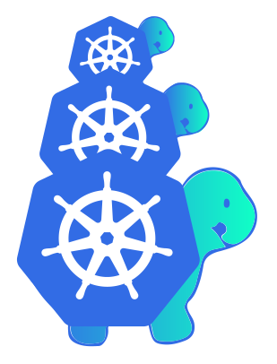

# Workshop Part-2 \( Clusters as Cattle \)


Clusters as Cattle ဆိုသည္မွာ kubernetes cluster တစ္ခုမွ တစ္ျခားေသာ kubernetes clusters မ်ားကို kubernetes ၏ အေသးဆံုး unit  ျဖစ္ေသာ pod မ်ား က့ဲသို႔ လိုအပ္ရင္ လိုအပ္ သလို create, scale, upgrade, destroy အလြယ္ တကူ ျပဳလုပ္ျခင္း ျဖစ္သည္။




Kubernetes project တစ္ခု ျဖစ္သည့္ Cluster API သည္  declarative ပံုစံ Kubernetes style APIs ျဖင့္ kubernetes မွ တစ္ျခားေသာ kubernetes cluster မ်ားကို သက္ဆိုင္ရာ provider မ်ားတြင္ creation, configuration, and management စသည့္ တို႔ကို ျပဳလုပ္ေပး ပါသည္။


ဒီ Scenario တြင္ Local \(laptop သို႔မဟုတ္ Desktop \) ထဲမွ Kind ျဖင့္ kubernetes cluster  တစ္ခု တည္ေဆာက္ျပီး Cluster API ကို အသံုးျပဳကာ AWS cloud provider နွင့္ integration ျပုလုပ္ျပီး local k8s cluster မွာ     ေနာက္ ထပ္ kubernetes clusters မ်ားကို AWS EC2 ေပၚတြင္ လုိခ်င္ သေလာက္ တည္ေဆာက္ သြားမွာ ျဖစ္ပါတယ္။

#### Workshop Prerequisite

* base64
* jq
* kubectl
* awscli
* kind
* cluster-api-provider-aws



Install aws cli in Linux

```bash
$ sudo pip install awscli
$ aws configure
```



Install aws cli in Mac

```bash
$ brew install awscli
$ chmod 755 /usr/local/lib/pkgconfig
$ brew link awscli
```





```bash
$ sudo pacman -Sy jq
```



```bash
$ sudo dnf install jq
```



```bash
sudo zypper install jq
```



```bash
$ sudo apt-get install jq
```



```bash
$ brew install jq
```





Install clusterawsadm in Linux

```bash
$ curl -Lo ./clusterawsadm https://github.com/kubernetes-sigs/cluster-api-provider-aws/releases/download/v0.4.9/clusterawsadm-linux-amd64
$ chmod +x ./clusterawsadm
$ sudo mv ./clusterawsadm /usr/local/bin/
```



install clusterawsadm in Mac

```bash
$ curl -Lo ./clusterawsadm https://github.com/kubernetes-sigs/cluster-api-provider-aws/releases/download/v0.4.9/clusterawsadm-darwin-amd64
$ chmod +x ./clusterawsadm
$ sudo mv ./clusterawsadm /bin/
```



ပထမဆံုး ကြ်န္ေတာ္တို႔ clusterawsadm ကို အသံုးျပဳျပီး AWS  အေပၚ bootstrap ျပဳလုပ္ရာ၌ IAM ထဲတြင္ လိုအပ္သည္ policy မ်ား role မ်ားကို တည္ ေဆာက္ေပးရန္ aws cli ကို configure လုပ္ထားရမွာ ျဖစ္ပါတယ္။   aws cli ကို configure  လုပ္ျပီးသြားလွ်င္ clusterawsadm ျဖင့္ bootstrap စလုပ္ ရမွာ ျဖစ္ပါတယ္။clusterawsadm သည္ အလြယ္ေျပာရရင္ aws cloud provider API မ်ားကို အသံုးျပဳျပီး cluster တည္ေဆာက္ရန္ အတြက္ automation ျပဳလုပ္ေပးထားသည့္ golang ျဖင့္ ေရးထားသည့္ client binary tool တစ္ခု ျဖစ္သည္။ clusterawsadm နဲ႔ က လုပ္ေပးနိုင္သည့္ feature မ်ား ကို ေဖၚ ျပေပးပါမယ္။

### Kubernetes Cluster API Provider AWS

**Feature**

* Native Kubernetes manifests and API
* Manages the bootstrapping of VPCs, gateways, security groups and instances.
* Choice of Linux distribution between Amazon Linux 2, CentOS 7 and Ubuntu 18.04, using [pre-baked AMIs](https://github.com/kubernetes-sigs/cluster-api-provider-aws/blob/master/docs/amis.md).
* Deploys Kubernetes control planes into private subnets with a separate bastion server.
* Doesn't use SSH for bootstrapping nodes.
* Installs only the minimal components to bootstrap a control plane and workers.
* Currently supports control planes on EC2 instances.

```bash
$ clusterawsadm alpha bootstrap create-stack
```

AWS ကို access လုပ္ရန္ လုိအပ္သည့္ environment variables မ်ားကို ေၾက ညာရမည္။

```bash
$ export AWS_CREDENTIALS=$(aws iam create-access-key --user-name bootstrapper.cluster-api-provider-aws.sigs.k8s.io)
$ export AWS_ACCESS_KEY_ID=$(echo $AWS_CREDENTIALS | jq .AccessKey.AccessKeyId -r)
$ export AWS_SECRET_ACCESS_KEY=$(echo $AWS_CREDENTIALS | jq .AccessKey.SecretAccessKey -r)
$ export AWS_REGION=us-east-2
$ export AWS_B64ENCODED_CREDENTIALS=$(clusterawsadm alpha bootstrap encode-aws-credentials)
```

AWS EC2 instance အတြက္ local မွ  key pair မွ public key ကို upload လုပ္ေပးရမည္။

```bash
$ aws ec2 import-key-pair \
  --key-name k8smm \
  --public-key-material "$(cat ~/.ssh/id_rsa.pub)"
```


Work shop part-1 တြင္ kind ျဖင့္ cluster တည္ေဆာက္ျပီး ပါက ထပ္ေဆာက္ရန္ မလိုအပ္ပါ။


```bash
$ kind create cluster --name=k8smm
$ kind get nodes
$ kubectl cluster-info
```

လိုအပ္သည့္ manifest မ်ားကို Kubernetes User Group Myanmar git repo မွ clone ရပါမည္။

```bash
$ git clone https://github.com/mm-k8s-ug/Workshop-01.git
$ cd Workshop-01/part-2/
```

Cluster API ကို kind မွ create လုပ္ထားေသာ kubernetes cluster တြင္  ေအာက္ ေဖၚျပပါ command ျဖင့္ install ျပဳလုပ္ရပါမယ္။

```bash
$ kubectl create -f cluster-api-components.yaml 
```

Kubernetes ကို bootstrap ျပဳလုပ္ရန္ လုိ အပ္သည့္ cloud init script မ်ားကို generate ထုတ္ရန္ Cluster API ရဲ႕ component တစ္ခုျဖစ္တဲ့ bootstrap-components ကို ထည့္သြင္းေပးရပါမယ္။

```bash
$ kubectl create -f bootstrap-components.yaml
```

infrastructure provision ျပုလုပ္ရန္လုိအပ္သည့္ AWS resources မ်ားကို ယူသံုးရန္ infrastructure-components မ်ားကို လည္း ထည့္သြင္းေပးရပါမယ္။

```bash
$ cat infrastructure-components.yaml |envsubst |kubectl create -f -
```

local k8s cluster တြင္ အေပၚမွ ထည့္သြင္းခဲ့သည့္ components ၃ ခု running ျဖစ္သြားလွ်င္ local k8s cluster နွင့္ aws ကို integration ျပဳလုပ္   ျပီး ျဖစ္ပါတယ္။

```bash
$ kubectl get ns
$ kubectl get pod -A 
# --------
# cabpk-system         cabpk-controller-manager-c58d8596f-ss8cf      2/2     Running   0          60s
# capa-system          capa-controller-manager-87cc657dc-rmp69       1/1     Running   6          7m16s
# capi-system          capi-controller-manager-6c64c695bb-vm6t5      1/1     Running   0          2m55s
# --------
```

AWS အေပၚတြင္ Cluster တည္ေဆာက္မည္ ျဖစ္သျဖင့္ CRD ျဖစ္တဲ့ AWSCluster resource ႏွင့္ Cluster resource ၂ မ်ိဳးကို တည္ေဆာက္ေပးရပါမယ္။ name တြင္ ကိုယ္လုိခ်င္သည့္ နာမည္ ေပးနိုင္ပါတယ္။ region တြင္ အေပၚတြင္ export လုပ္ခဲ့ေသာ Env variable မွ တန္ဖိုးကို ေျပာင္းလဲ ထားေပးရပါမယ္၊ sshKeyName တြင္ ေရွ႕တြင္ aws အေပၚသို႔ upload လုပ္ေပးခဲ့ ေသာ key pair name ျဖစ္ရပါမယ္။


```yaml
apiVersion: cluster.x-k8s.io/v1alpha2
kind: Cluster
metadata:
  name: k8smm-aws
spec:
  clusterNetwork:
    pods:
      cidrBlocks: ["192.168.0.0/16"]
  infrastructureRef:
    apiVersion: infrastructure.cluster.x-k8s.io/v1alpha2
    kind: AWSCluster
    name: k8smm-aws
---
apiVersion: infrastructure.cluster.x-k8s.io/v1alpha2
kind: AWSCluster
metadata:
  name: k8smm-aws
spec:
  region: us-east-2
  sshKeyName: k8smm
```


kubectl get clusters ျဖင့္ တည္ေဆာက္ခဲ့ ေသာ kubernetes cluster မ်ားကို တည္ေဆာက္ခဲ့သည့္ နာမည္နွင့္ ေတြ႕ရပါလိမ့္မယ္။ PHASE  section တြင္ provisioning အေျခေန ျဖစ္ေနပါလိမ့္မယ္။ AWS အေပၚတြင္ ကြ်န္ေတာ္တို႔ create လုပ္ေသာ cluster မေရာက္ေသးပါ။ 

```bash
$ kubectl create -f k8smm-cluster.yaml
$ kubectl get clusters
```

ကြ်န္ေတာ္တို႔ ပံုမွန္ cluster setup လုပ္သည့္အတုိင္း control-plane နွင့္ worker node မ်ားကို setup လုပ္ရန္ က်န္ ရွိေသးသည္။ kubernetes ၏  Machine resource နွင့္ AWSMachine resource ကို အသံုးျပဳကာ Cluster ရဲ႕ control-plane object ကို တည္ေဆာက္ရပါမယ္။ ေရွ႕ က အတုိင္း sshKeyName မ်ားကို ျပန္ထည့္ရန္လုိအပ္တယ္။ 


```yaml
apiVersion: cluster.x-k8s.io/v1alpha2
kind: Machine
metadata:
  name: k8smm-aws-controlplane-0
  labels:
    cluster.x-k8s.io/control-plane: "true"
    cluster.x-k8s.io/cluster-name: "k8smm-aws"
spec:
  version: v1.15.3
  bootstrap:
    configRef:
      apiVersion: bootstrap.cluster.x-k8s.io/v1alpha2
      kind: KubeadmConfig
      name: k8smm-aws-controlplane-0
  infrastructureRef:
    apiVersion: infrastructure.cluster.x-k8s.io/v1alpha2
    kind: AWSMachine
    name: k8smm-aws-controlplane-0
---
apiVersion: infrastructure.cluster.x-k8s.io/v1alpha2
kind: AWSMachine
metadata:
  name: k8smm-aws-controlplane-0
spec:
  instanceType: t3.large
  # This IAM profile is part of the pre-requisites.
  iamInstanceProfile: "control-plane.cluster-api-provider-aws.sigs.k8s.io"
  # Change this value to a valid SSH Key Pair present in your AWS Account.
  sshKeyName: k8smm
---
apiVersion: bootstrap.cluster.x-k8s.io/v1alpha2
kind: KubeadmConfig
metadata:
  name: k8smm-aws-controlplane-0
spec:
  # For more information about these values,
  # refer to the Kubeadm Bootstrap Provider documentation.
  initConfiguration:
    nodeRegistration:
      name: '{{ ds.meta_data.hostname }}'
      kubeletExtraArgs:
        cloud-provider: aws
  clusterConfiguration:
    apiServer:
      extraArgs:
        cloud-provider: aws
    controllerManager:
      extraArgs:
        cloud-provider: aws
```


control-plane object ကို တည္ေဆာက္ျပီးသည့္ ေနာက္မွာေတာ့ မေတာ္တဆ တတ္လာနိုင္သည့္ error မ်ားကို သိရွိရန္ events မ်ားကို ေစာင့္ၾကည့္နုိင္ပါတယ္။ kubectl get machines ျဖင့္ control-plane ရဲ႕ အေျခေနကိုလည္း သိရွိနုိင္ပါတယ္။

```bash
$ kubectl create -f k8smm-control-plane.yaml 
$ kubectl get event -w  # SuccessfulSetNodeRef
$ kubectl get machines  
```

control-plane တည္ေဆာက္ျပီးစီးသြားတဲ့ အခါမွာေတာ့ local kubernetes cluster ၏ လက္ရွိ namespace ရဲ႕ secrets ထဲတြင္ AWS အေပၚ၌ တည္      ေဆာက္ခဲ့သည့္ kubernetes cluster ၏ control-plane ကို access ျပုလုပ္ နိုင္သည့္ kubeconfig file ရွိေနမွာ ျဖစ္ပါတယ္။ ေအာက္ေဖၚျပပါ command မ်ားျဖင့္ kubconfig file ကို ဆြဲထုတ္ျပီး aws အေပၚတြင္ တည္ေဆာက္ ခဲ့သည့္ cluster ကို access လုပ္နုိင္မွာ ျဖစ္ပါတယ္။

```bash
$ kubectl get secrets
$ kubectl get secret k8smm-aws-kubeconfig -o yaml
$ kubectl --namespace=default get secret/k8smm-aws-kubeconfig -o json \
  | jq -r .data.value \
  | base64 --decode \
  > ./k8smm-aws.kubeconfig
$ kubectl --kubeconfig=./k8smm-aws.kubeconfig get nodes
NAME                                       STATUS     ROLES    AGE     VERSION
ip-10-0-0-242.us-east-2.compute.internal   NotReady   master   9m50s   v1.15.3
```

git မွ clone ထားသည့္ workshop part-2 file ထဲတြင္ calico manifest ကို အသံုး ျပဳျပီး network plugin ကို AWS အေပၚတြင္ ရွိေသာ kubernetes cluster ၏ control-plane တြင္ ထည့္သြင္းရမွာ ျဖစ္ပါတယ္။ ထည့္သြင္းျပီး ရင္ nodes status  မွာ Ready ျဖစ္သြားမွာ ျဖစ္ပါတယ္။

```bash
$ kubectl --kubeconfig=./k8smm-aws.kubeconfig create -f calico.yaml
$ kubectl --kubeconfig=./k8smm-aws.kubeconfig get nodes
```

control-plane တည္ေဆာက္ျပီးေနာက္ worker node တည္ေဆာက္ရန္ MachineDeployment resource ႏွင့္ AWSMachineTemplate ကို အသံုး  ျပဳျပီး တည္ေဆာက္သြားရမွာ ျဖစ္ပါတယ္။ ေရွ႕မွာ ျပဳလုပ္ခဲ့သည့္ အတုိင္း sshKeyName ကို ထားေပးရမွာ ျဖစ္ပါတယ္။



```yaml
apiVersion: cluster.x-k8s.io/v1alpha2
kind: MachineDeployment
metadata:
  name: k8smm-aws-worker
  labels:
    cluster.x-k8s.io/cluster-name: k8smm-aws
    nodepool: nodepool-0
spec:
  replicas: 1
  selector:
    matchLabels:
      cluster.x-k8s.io/cluster-name: k8smm-aws
      nodepool: nodepool-0
  template:
    metadata:
      labels:
        cluster.x-k8s.io/cluster-name: k8smm-aws
        nodepool: nodepool-0
    spec:
      version: v1.15.3
      bootstrap:
        configRef:
          name: k8smm-aws-worker
          apiVersion: bootstrap.cluster.x-k8s.io/v1alpha2
          kind: KubeadmConfigTemplate
      infrastructureRef:
        name: k8smm-aws-worker
        apiVersion: infrastructure.cluster.x-k8s.io/v1alpha2
        kind: AWSMachineTemplate
---
apiVersion: infrastructure.cluster.x-k8s.io/v1alpha2
kind: AWSMachineTemplate
metadata:
  name: k8smm-aws-worker
spec:
  template:
    spec:
      instanceType: t3.large
      # This IAM profile is part of the pre-requisites.
      iamInstanceProfile: "nodes.cluster-api-provider-aws.sigs.k8s.io"
      # Change this value to a valid SSH Key Pair present in your AWS Account.
      sshKeyName: k8smm
---
apiVersion: bootstrap.cluster.x-k8s.io/v1alpha2
kind: KubeadmConfigTemplate
metadata:
  name: k8smm-aws-worker
spec:
  template:
    spec:
      joinConfiguration:
        nodeRegistration:
          name: '{{ ds.meta_data.hostname }}'
          kubeletExtraArgs:
            cloud-provider: aws
```


worker ကို တည္ေဆာက္ျပီးသည့္ အခါမွာ ေအာက္ပါ command မ်ားျဖစ္ သိ    နိုင္၊ ၾကည့္နိုင္ပါသည္။ kubectl get cluster တြင္လဲ k8s cluster တစ္ခုလံုးကို provisioned လုပ္ျပီးစီး သည့္ အေျခေန ကို ျမင္ရမွာ ျဖစ္ပါတယ္။   

```bash
$ kubectl create -f k8smm-worker.yaml
$ kubectl get event -w #
$ kubectl get machinedeployment
$ kubectl get ms
$ kubectl get machines
NAME                                PROVIDERID                    PHASE
k8smm-aws-controlplane-0            aws:////i-0acaac28fc08113f3   running
k8smm-aws-worker-85d474df85-hcwwv   aws:////i-0b6c621da978cb4d2   running
$ kubectl --kubeconfig=./k8smm-aws.kubeconfig get nodes
NAME                                       STATUS   ROLES    AGE     VERSION
ip-10-0-0-218.us-east-2.compute.internal   Ready    <none>   2m30s   v1.15.3
ip-10-0-0-242.us-east-2.compute.internal   Ready    master   31m     v1.15.3
$ kubectl get clusters
NAME        PHASE
k8smm-aws   provisioned
```

ယခု အခါတြင္ local kubernetes cluster မွ AWS အေပၚတြင္ Kubernetes cluster ကို တည္ေဆာက္ ျပီးစီးျပီ ျဖစ္သည္။ ေနာက္ထပ္လဲ လိုအပ္ သေလာက္္ လိုခ်င္သေလာက္ cluster မ်ားကို ဒီပံုစံ အတုိင္း တည္ေဆာက္ သြားနုိင္မွာ     ျဖစ္သည္။

### Another Next k8s clusters


```yaml
apiVersion: cluster.x-k8s.io/v1alpha2
kind: Cluster
metadata:
  name: awsugmm-aws
spec:
  clusterNetwork:
    pods:
      cidrBlocks: ["192.168.0.0/16"]
  infrastructureRef:
    apiVersion: infrastructure.cluster.x-k8s.io/v1alpha2
    kind: AWSCluster
    name: awsugmm-aws
---
apiVersion: infrastructure.cluster.x-k8s.io/v1alpha2
kind: AWSCluster
metadata:
  name: awsugmm-aws
spec:
  region: us-east-2
  sshKeyName: k8smm
```



`name မ်ားကို vim သုိ႔မဟုတ္ sed အသံုး ျပဳ၍ အလြယ္ တကူ  manifest မ်ားကို ေျပာင္းလဲ အသံုးျပဳ နုိင္သည္။       :%s/k8smm-aws/awsugmm-aws/g`


```bash
$ kubectl create -f awsugmm-cluster.yaml 
$ kubectl get clusters
NAME          PHASE
awsugmm-aws   provisioning
k8smm-aws     provisioned
```


```yaml
apiVersion: cluster.x-k8s.io/v1alpha2
kind: Machine
metadata:
  name: awsugmm-aws-controlplane-0
  labels:
    cluster.x-k8s.io/control-plane: "true"
    cluster.x-k8s.io/cluster-name: "awsugmm-aws"
spec:
  version: v1.15.3
  bootstrap:
    configRef:
      apiVersion: bootstrap.cluster.x-k8s.io/v1alpha2
      kind: KubeadmConfig
      name: awsugmm-aws-controlplane-0
  infrastructureRef:
    apiVersion: infrastructure.cluster.x-k8s.io/v1alpha2
    kind: AWSMachine
    name: awsugmm-aws-controlplane-0
---
apiVersion: infrastructure.cluster.x-k8s.io/v1alpha2
kind: AWSMachine
metadata:
  name: awsugmm-aws-controlplane-0
spec:
  instanceType: t3.large
  # This IAM profile is part of the pre-requisites.
  iamInstanceProfile: "control-plane.cluster-api-provider-aws.sigs.k8s.io"
  # Change this value to a valid SSH Key Pair present in your AWS Account.
  sshKeyName: k8smm
---
apiVersion: bootstrap.cluster.x-k8s.io/v1alpha2
kind: KubeadmConfig
metadata:
  name: awsugmm-aws-controlplane-0
spec:
  # For more information about these values,
  # refer to the Kubeadm Bootstrap Provider documentation.
  initConfiguration:
    nodeRegistration:
      name: '{{ ds.meta_data.hostname }}'
      kubeletExtraArgs:
        cloud-provider: aws
  clusterConfiguration:
    apiServer:
      extraArgs:
        cloud-provider: aws
    controllerManager:
      extraArgs:
        cloud-provider: aws
```


```bash
$ kubectl create -f awsugmm-control-plane.yam
$ kubectl get events -w  # SuccessfulSetNodeRef
$ kubectl get machines
NAME                                PROVIDERID                    PHASE
awsugmm-aws-controlplane-0          aws:////i-0663a439bce811cb9   running
k8smm-aws-controlplane-0            aws:////i-0acaac28fc08113f3   running
k8smm-aws-worker-85d474df85-hcwwv   aws:////i-0b6c621da978cb4d2   running
```

```bash
$ kubectl get secret
$ kubectl --namespace=default get secret/awsugmm-aws-kubeconfig -o json \
  | jq -r .data.value \
  | base64 --decode \
  > ./awsugmm-aws.kubeconfig
$ kubectl --kubeconfig=./awsugmm-aws.kubeconfig get nodes
NAME                                      STATUS     ROLES    AGE     VERSION
ip-10-0-0-97.us-east-2.compute.internal   NotReady   master   6m57s   v1.15.3
```

```bash
$ kubectl --kubeconfig=./awsugmm-aws.kubeconfig create -f calico.yaml
$ kubectl --kubeconfig=./awsugmm-aws.kubeconfig get nodes    
NAME                                      STATUS   ROLES    AGE     VERSION
ip-10-0-0-97.us-east-2.compute.internal   Ready    master   8m14s   v1.15.3
```


```yaml
apiVersion: cluster.x-k8s.io/v1alpha2
kind: MachineDeployment
metadata:
  name: awsugmm-aws-worker
  labels:
    cluster.x-k8s.io/cluster-name: awsugmm-aws
    nodepool: nodepool-0
spec:
  replicas: 1
  selector:
    matchLabels:
      cluster.x-k8s.io/cluster-name: awsugmm-aws
      nodepool: nodepool-0
  template:
    metadata:
      labels:
        cluster.x-k8s.io/cluster-name: awsugmm-aws
        nodepool: nodepool-0
    spec:
      version: v1.15.3
      bootstrap:
        configRef:
          name: awsugmm-aws-worker
          apiVersion: bootstrap.cluster.x-k8s.io/v1alpha2
          kind: KubeadmConfigTemplate
      infrastructureRef:
        name: awsugmm-aws-worker
        apiVersion: infrastructure.cluster.x-k8s.io/v1alpha2
        kind: AWSMachineTemplate
---
apiVersion: infrastructure.cluster.x-k8s.io/v1alpha2
kind: AWSMachineTemplate
metadata:
  name: awsugmm-aws-worker
spec:
  template:
    spec:
      instanceType: t3.large
      # This IAM profile is part of the pre-requisites.
      iamInstanceProfile: "nodes.cluster-api-provider-aws.sigs.k8s.io"
      # Change this value to a valid SSH Key Pair present in your AWS Account.
      sshKeyName: k8smm
---
apiVersion: bootstrap.cluster.x-k8s.io/v1alpha2
kind: KubeadmConfigTemplate
metadata:
  name: awsugmm-aws-worker
spec:
  template:
    spec:
      joinConfiguration:
        nodeRegistration:
          name: '{{ ds.meta_data.hostname }}'
          kubeletExtraArgs:
            cloud-provider: aws
```


```bash
$ kubectl create -f awsugmm-worker.yaml
$ kubectl get events -w # SuccessfulSetNodeRef
$ kubectl get machines
NAME                                  PROVIDERID                    PHASE
awsugmm-aws-controlplane-0            aws:////i-0663a439bce811cb9   running
awsugmm-aws-worker-644cb8787b-nmt9r   aws:////i-02f55f2b38c4d422a   running
k8smm-aws-controlplane-0              aws:////i-0acaac28fc08113f3   running
k8smm-aws-worker-85d474df85-hcwwv     aws:////i-0b6c621da978cb4d2   running
$ kubectl --kubeconfig=./awsugmm-aws.kubeconfig  get nodes
NAME                                       STATUS   ROLES    AGE   VERSION
ip-10-0-0-188.us-east-2.compute.internal   Ready    <none>   99s   v1.15.3
ip-10-0-0-97.us-east-2.compute.internal    Ready    master   12m   v1.15.3
```

ယခု အေျခေနတြင္ စုစု ေပါင္း cluster ၂ လံုး တည္ေဆာက္ ျပီး ျဖစ္သည္။

```bash
$ kubectl get clusters
NAME          PHASE
awsugmm-aws   provisioned
k8smm-aws     provisioned
```

AWS EC2 dashboard တြင္လဲ local kubernetes cluster မွ တည္ေဆာက္ ထားေသာ တျခား ေသာ cluster မ်ား ၏ instance မ်ားကို ေတြ႕ရမွာ ျဖစ္ပါတယ္


