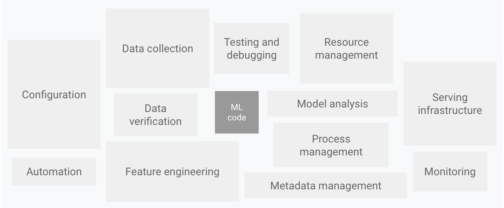
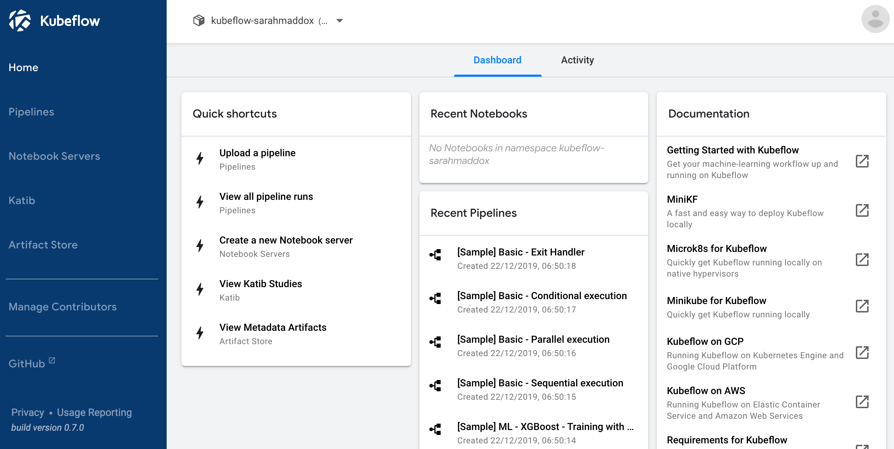
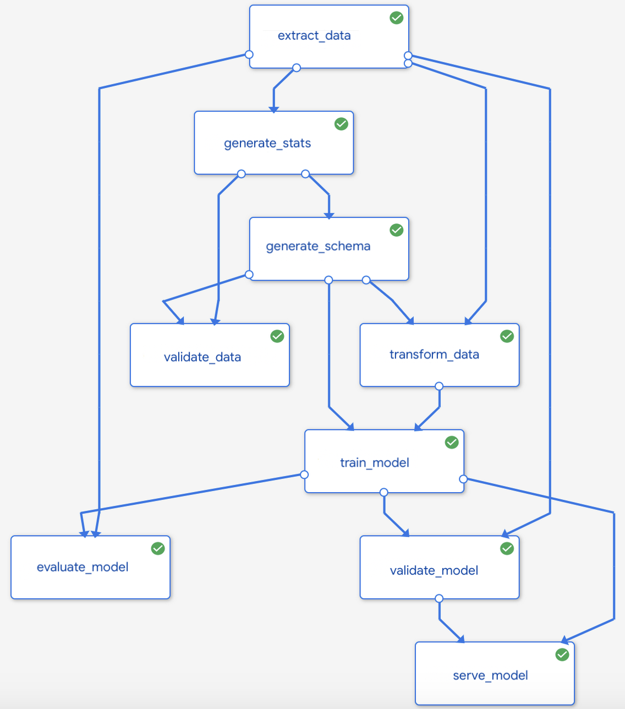

# Kubeflow

#### Kubeflow ဆိုတာဘာလဲ။

Kubeflow project မှာ machine learning\(ML\) workflows တွေကို Kubernetes ပေါ်မှာ simple\(ရိုးရှင်းစွာ\) scalablity\(လိုအပ်သလို တိုးချဲ့နိုင်စွမ်းရှိစွာ\) portablity\(မည်သည့် enviroment မဆို adaptလုပ်နိုင်ရန်\) အတွက် ဖန်တီးထားတာဖြစ်ပါတယ်။

Kubeflow အ​ကြောင်းမပြောခင် MLOps နဲ့ပတ်သတ်ပြီး နည်းနည်းလောက်ပြောပြဖို့လိုပါတယ်။

#### MLOps ဆိုတာ ဘာလဲ။

MLOps ဆိုတာ ML engineering culture and practice တခုဖြစ်ပါတယ်။ ဆိုလိုတာက ML system devlopment\(Dev\) နဲ့ ML system operation\(Ops\) တွေကိုအတူတွဲပြီး ဆောင်ရွက်နိုင်ဖို့ ဖြစ်ပါတယ်။

Data scientist အနေနဲ့ ML model တခုကို သင့်လျော်တဲ့ training data ကိုအသုံးချပြီး train လုပ်နိုင်ပါတယ်။ ဒါပေမဲ့ ခက်ခဲတာက ဒီ model ကို train လုပ်ရတာ မဟုတ်ပါဘူး ရရှိလာတဲ့ model ကို ML system မှာ integrate လုပ်မယ်။ Production အတွက် continuously လုပ်ဆောင်နိုင်ဖို့ အ​ရေးကြီးတာပါ။

အောက်ဖော်ပြပါပုံတွင် ML code ​မှာ System တခုလုံးတွင် နေရာအနည်းငယ်လောက်သာ ယူထားသည်ကို တွေ့ရပါလိမ့်မည်။

ML system တခုမှာ configuration တွေပါမယ်။ automation တွေ၊ data collection၊ data verification တွေ၊ testing နဲ့ debugging တွေ အစရှိသည်တို့ ပါ၀င်ပါတယ်။

ထိုကဲ့သို့ ရှုပ်ထွေးတဲ့ စနစ်တခုကိုတည်ဆောင်မည်ဆိုလျှင် ကျွန်တော်တို့အနေနဲ့ DevOps principle တွေကို ML system တွေမှာ အသုံးချဖို့လိုလာပါတယ်။ ဒါဟာ MLOps ဖြစ်ပါတယ်။

ထူးခြားမှုတခုက MLOps တွင် CI, CD သာမက CT ခေါ် continous training ပါ ပါ၀င်လာပါတယ်။

MLOps မှာကွာခြားတာတွေကတော့

* **CI** မှာ code testing, code validating တွေသာမက data testing, data validating, data schemas နဲ့ models တွေပါ ပါ၀င်လာပါတယ်။
* **CD** မှာဆိုရင် software package နဲ့ service တွေသာမက ML training pipeline ဖြစ်တဲ့ model prediction service တွေကို deploy လုပ်ဖို့ပါ ပါ၀င်လာပါတယ်။
* နောက်ဆုံးအနေနဲ့ ML system ရဲ့ ထူးခြားမှုတခုဖြစ်တဲ့ **CT** မှာ model တွေကို automatically retraing လုပ်မယ် serving လုပ်မယ်။

**Data science steps for ML**

ကျွန်တော်တို့ ML project တခုမှာ model တခုဖန်တီးဖို့က​အစ productionအဆုံး ဘယ်ဆိုအဆင့်ဆင့်လုပ်ဆောင်သွားတယ်ဆိုတာ ကြည့်ကြရအောင်။

1. **Data Extraction:** Data sources အသီးသီးဆီက သင့်လျော်မဲ့ data တွေကို ရွေးချယ် ပေါင်းစပ်မယ်။
2. **Data analysis:** ရရှိလာတဲ့ data တွေကို နားလည်နိုင်ဖို့ exploratory data analysis ခေါ် EDA ကို လုပ်ဆောင်မယ်။ EDA မှာ ပါ၀င်မှာက ​                                                                    _a. Data schema တွေနားလည်ဖို့                                                                                          b. Feature engineering နဲ့ data preparation တွေ စီစဥ်ဖို့_
3. **Data preparation:** Data cleaning လုပ်တာကအစ data တွေကို traingလုပ်ဖို့၊ validationလုပ်ဖို့၊ testလုပ်ဖို့အထိ data ခွဲထုတ်တွေကို ပြင်ဆင်မယ်။
4. **Model training:** Data scientist က algorithms တွေအသုံးချပြီး model တွေကို train လုပ်မယ်။
5. **Model evaluation:** ရလာတဲ့ model ရဲ့ quality ကိုသုံးသပ်မယ်။
6. **Model validation:** model ကို deployment လုပ်ဖို့သင့်လျော်ရင် အတည်ပြုပေးမယ်။
7. **Model serving:** နောက်ဆုံး model ကို deployment လုပ်မယ်။
8. **Model monitoring:** Deploy လုပ်ထားတဲ့ model ရဲ့ performance ကို စောင့်ကြည့်နေမယ်။

ဒါတွေအားလုံးဟာ MLOps မှာပါ၀င်တဲ့ အဆင့်တွေအားလုံးဖြစ်ပါတယ်။

ဒါဆိုရင် Kubeflow အကြောင်းဆက်ကြရအောင်။

လွယ်လွယ်ပြောရရင် Kubeflow ဆိုတာ Kubernetes ပေါ်မှာသုံးဖို့ machine learning toolkit တခုပဲဖြစ်ပါတယ်။ machine learning\(ML\) workflows တွေကို Kubernetes ပေါ်မှာ \(simple\) ရိုးရှင်းစွာနဲ့ \(scalablity\) လိုအပ်သလို တိုးချဲ့နိုင်စွမ်းရှိစွာနဲ့ \(portablity\) မည်သည့် enviroment ပေါ်မဆို adaptလုပ်နိုင်မည် ဖြစ်ပါတယ်။

Datasets တွေ တိုးပွားလာမယ်။ models တွေ ရှုပ်ထွေးလာနဲ့အမျှ machine learning workloads တွေကို node တွေခွဲပြီး distribute လုပ်ဖို့လိုအပ်လာပါတယ်။ ဒါ့အပြင် model တခုကို production ပေါ်​ရောက်တဲ့အဆင့်တိုင်အောင် ကြားထဲမှာ အဆင့်တွေအများကြီး အဆင့်ဆင့် လုပ်ဆောင်သွားရပါတယ်။ Data Loading ကနေအစ model training and verification အလယ်၊ နောက်ဆုံး model serving အထိ အဆင့်များစွာကို တဆင့်ပြီးတဆင့် လုပ်ဆောင်သွားရပါတယ်။ ML models တွေကို manually rebuild လုပ်မယ်ဆိုရင် အချိန်ကုန်စေမဲ့အပြင် အမှားများလဲ ပိုပြီးဖြစ်ပေါ်စေနိုင်ပါတယ်။ ဒီ​လိုအပ်ချက်တွေကို ​Kubeflow ဖြင့်ဖြေရှင်းနိုင်ပါတယ်။

**Kubeflow Pipeline**

Kubeflow pipeline ဆိုတာ machine learning workflows တွေကို build and deploy လုပ်နိုင်ဖို့ Kubeflow ရဲ့ service ဖြစ်ပါတယ်။

Kubeflow Pipeline platform မှာပါဝင်တဲ့ components တွေကတော့

1. **User Interface:** Kubeflow jobs တွေကို စီမံဖို့အတွက်ဖြစ်ပါတယ်။
2. **Engine:** ဒါကတော့ ML workflows တွေကို scheduling လုပ်ဖို့ဖြစ်ပါတယ်။ Engine အနေနဲ့ [Argo](https://argoproj.github.io/) ကိုအသုံးချထားပါတယ်။
3. **Python SDK:** ML workflows တွေကို run ဖို့အတွက် Tensorflow, Pytorch အစရှိတဲ့ Python packages တွေဖြစ်ပါတယ်။
4. **Notebook:** Python SDK တွေကို အသုံးချဖို့ အတွက် [Jupyter](https://jupyter.org/) notebook ကိုသုံးပါတယ်။
5. **ML Metadata store:** ​Artifacts တွေဖြစ်တဲ့ execution, model, dataset တွေရဲ့အချက်အလက်တွေကို သိမ်ဆည်းထားဖို့ဖြစ်ပါတယ်။

Kubeflow ကို ကိုယ့်ရဲ့ Laptop တွင် [MiniKF](https://www.arrikto.com/minikf/) နဲ့အလွယ်တကူစမ်းသပ်နိုင်ပါတယ်။ MiniKF ဆိုတာ လွယ်အောင် ပြောရရင် Kubernetes မှာ Minikube ရှိသလို Kubeflow အတွက်ဆို MiniKF ရှိပါတယ်။ မည်သည့် operating system ပေါ်တွင်မဆို Vagrant နှင့် VirtualBox တင်ပြီးပါက MiniKF ဖြင့် Kubeflow ကိုအလွယ်တကူစမ်းနိုင်ပါတယ်။

ဒီလောက်ဆို Kubeflow နဲ့ပတ်သတ်ပြီး အကြမ်းအားဖြင့် နားလည်သဘောပေါက်ကြမယ် ထင်ပါတယ်။ Kubeflow နဲ့ပတ်သတ်ပြီးတော့ Tutorial တခုကို နောက်ပိုင်းကျ ထပ်တင်ပေးပါဦးမယ်။

reference: [https://www.kubeflow.org/](https://www.kubeflow.org/)

