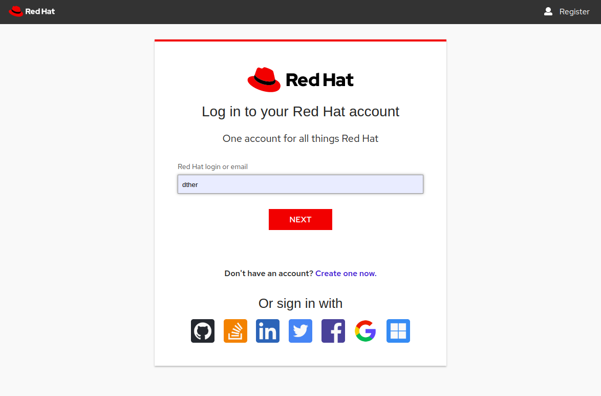
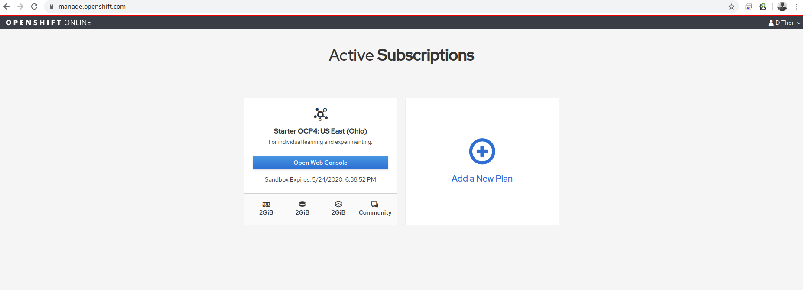
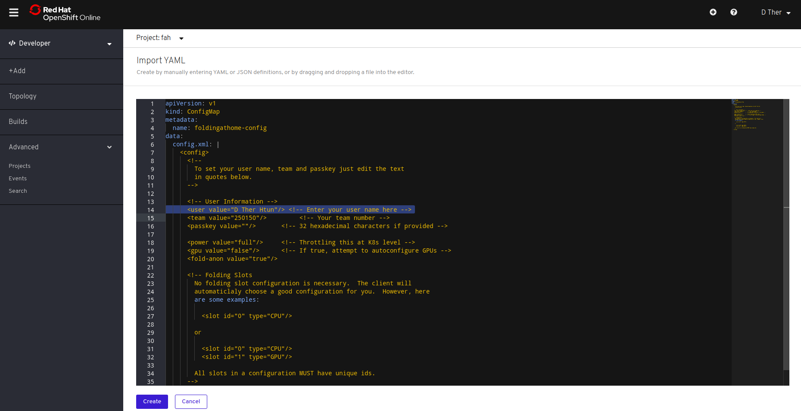
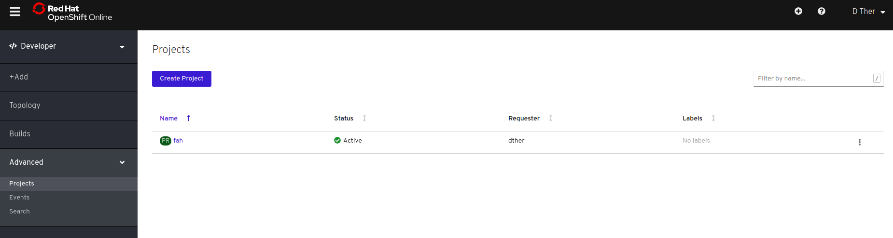
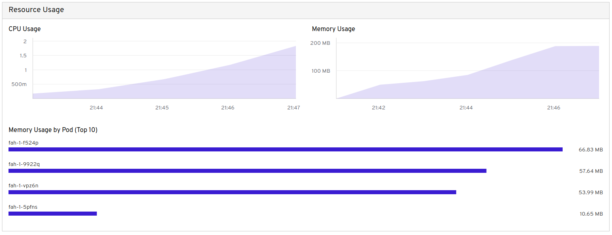
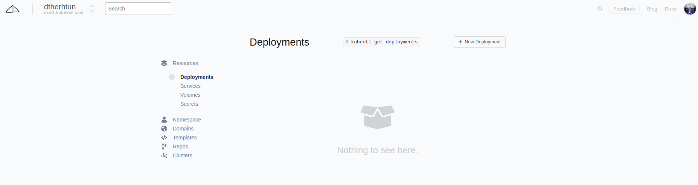

# Folding @ home using Containers

[Folding](https://foldingathome.org/start-folding/) လုပ္တယ္၊ [Folding at home project](https://foldingathome.org/) က ဘယ္လုိဘာညာ  စတာေတြကိုေတာ့ မရွင္းျပေတာ့ပါဘူး။ [Ubuntu-mm.net](https://ubuntu-mm.net/knowledge/foldinghome-project-coronavirus/) မွာ ေရးထားတဲ့ [post](https://ubuntu-mm.net/knowledge/foldinghome-project-coronavirus/) ကို ဖတ္ရွုနိုင္ပါတယ္။ အခု ဒီ articles ကို ေရးရတဲ့ အေၾကာင္းအရင္ ကေတာ့ ကြ်န္ေတာ္တို႔ folding ကို container နဲ႔ ဘယ္လုိ အလြယ္တကူ ျပုလုပ္နိုင္မလဲ၊ ကုိယ္မွာ server မရွိတဲ့ အခါ သို႔မဟုတ္ ကိုယ္ laptop ရဲ႕ resource ကို အျမဲ \(အခ်ိန္ျပည့္\) ေပးမသံုးနိုင္တဲ့ အခါ container ကို free run လုိ႔ ရတဲ့  service ေတြကို အသံုးျပဳျပီး တစ္နိုင္တစ္ပိုင္ folding ဘယ္လုိ ျပဳလုပ္မလဲ ဆိုတာကို ေျပာျပေပးသြားမွာ ျဖစ္ပါတယ္။ အခု ဒီ articles မွာ container ကို  free အသံုးျပဳလုိ႔ရတဲ့ service ႏွစ္မ်ိဳးနဲ႔ ေျပာျပေပးသြားမွာ ျဖစ္ပါတယ္။ ပထမတစ္ခု ကေတာ့ Redhat ရဲ႕ openshift online ကို အသံုးျပဳသြားမွာျဖစ္ျပီး ဒုတိယ တစ္မ်ိဳးကေတာ့  kubesail ဆိုတာကို အသံုးျပဳသြားမွာ ျဖစ္ပါတယ္။ 

## Folding Using Openshift Online

1 - ပထမ အရင္ဆံုး browser မွာ manage.openshift.com ကို ဖြင့္ပါ ကို ဖြင့္ပါ။



2 - ျပီးရင္ Sign up ျပဳလုပ္ပါ။ ေအာက္မွာ ျပထားတဲ့ အတိုင္း Github \| stackoverflow \| linkedin \| twitter \| facebook \| gmail \| microsoft စတာေတြနဲ႔ လည္း အလြယ္တကူ Sign in ျပဳလုပ္နုိင္ပါတယ္။



3 - Sign in ျပဳလုပ္ျပီးလို႔ openshift online console ထဲ ကို ေရာက္သြားျပီ ဆိုရင္ေတာ့ ေအာက္မွ ျပထားတဲ့ Screenshot ထဲက အတိုင္းျမင္ရပါမယ္။ Open Web Console ကို  ႏွိပ္ျပီးေတာ့ openshift console ထဲကို ထက္၀င္ပါ။ 



4 - ေအာက္မွာ ျမင္ရတဲ့ screen shot ကေတာ့ openshift console ျဖစ္ပါတယ္။ ကြ်န္ေတာ္တို႔ အရင္ဆံုး အသံုးျပဳမဲ့ project တစ္ခု တည္ေဆာက္ ေပးဖို႔ လုိပါတယ္။ Project က kubernetes မွာ ဆိုရင္ namespace နဲ႔ ဆင္တူပါတယ္။


5 - Project တစ္ခု တည္ေဆာက္ဖို႔ ကြ်န္ေတာ္တို႔ project ဆိုတဲ့ အေပၚကို click  ႏွိပ္ လိုက္ယံုပါဘဲ။ Create Project  ဆိုတဲ့ popup တစ္ခု ေအာက္မွာ ျပထားတဲ့ အတိုင္း ထြက္လာမွာ ျဖစ္ပါတယ္။ ကြ်န္ေတာ္ကေတာ့ project name ကို fah လုိ႔ ေပးခဲ့ျပီးေတာ့ Display  Name ကိုေတာ့ Folding At Home ဆို ေပးထားပါတယ္။ ဒီေနရာမွာ ကိုယ္ ၾကိဳက္တဲ့ နာမည္ကို ေပးလုိ႔ရပါတယ္။ ျပီးရင္ေတာ့ Create ဆိုတဲ့ button ႏွိပ္လို္က္ယံုျဖင့္ fah ဆိုတဲ့ project ကို တည္ေဆာက္ ေပးသြားမွာ ျဖစ္ပါတယ္။ 


6 - Project တည္ေဆာက္ျပီးသြားရင္ေတာ့ ကြ်န္ေတာ္တို႔ Folding ျပဳလုပ္ဖို႔ Openshift ရဲ႕ resource နွစ္ခုကို yaml နဲ႔ create လုပ္ရပါမယ္။ ဒါေၾကာင့္မလုိ႔ ေအာက္မွာ ျပထားတဲ့ ပံုထဲက Yaml ကို ေရြးရပါမယ္။ 


7 - Import Yaml ဆိုတဲ့ ေနရာမွာ configmap ကို create ျပဳလုပ္ရပါမယ္။ မခက္ပါဘူး ေအာက္မွာ ေပးထားတဲ့ code ကို copy paste ျပဳလုပ္ ရံုပါဘဲ။ ဒါကေတာ့ အလြယ္ေျပာရရင္ folding ကို run ဖို႔ လိုအပ္တဲ့ configuration ကို  openshift ထဲမွာ save တဲ့ သေဘာျဖစ္ပါတယ္။  line number 14 နဲ႔ 15 မွာ ကိုယ္ရဲ႕ နာမည္နဲ႔ Team id ကို ထည့္ေပးရမွာ ျဖစ္ပါတယ္။ ျပီးရင္ေတာ့ create button ကို နိပ္ေပးရမွာျဖစ္ပါတယ္။ 



Team Id ေနရာမွာေတာ့ အခု လူအမ်ား အသံုးျပဳေနတဲ့  Team create ျပဳလုပ္ျပီးသာ ျဖစ္တဲ့ Ubuntu-MM ရဲ႕ team id ကို ထည့္သြင္းေပးထားပါတယ္။  ကိုယ္ကိုတိုင္ Team အသစ္ တစ္ခု တည္ေဆာက္ခ်င္ရင္ေတာ့ ဒီမွာ [https://apps.foldingathome.org/team](https://apps.foldingathome.org/team) ျပဳလုပ္နိုင္ပါတယ္။ အခုေအာက္မွာ ျပထားတဲ့ configmap.yaml ကေတာ့ အေပၚက Import Yaml မွာ ထည့္ေပးရမွာ yaml ျဖစ္ပါတယ္။ 


```yaml
apiVersion: v1
kind: ConfigMap
metadata:
  name: foldingathome-config
data:
  config.xml: |
    <config>
      <!--
        To set your user name, team and passkey just edit the text
        in quotes below.
      -->

      <!-- User Information -->
      <user value="D Ther Htun"/> <!-- Enter your user name here -->
      <team value="250150"/>         <!-- Your team number -->
      <passkey value=""/>       <!-- 32 hexadecimal characters if provided -->

      <power value="full"/>     <!-- Throttling this at K8s level -->
      <gpu value="false"/>      <!-- If true, attempt to autoconfigure GPUs -->
      <fold-anon value="true"/>

      <!-- Folding Slots
        No folding slot configuration is necessary.  The client will
        automaticlaly choose a good configuration for you.  However, here
        are some examples:

          <slot id="0" type="CPU"/>

        or

          <slot id="0" type="CPU"/>
          <slot id="1" type="GPU"/>

        All slots in a configuration MUST have unique ids.
      -->
    </config>
```


8 -  Configmap ကို create ျပဳလုပ္ျပီးေနာက္မွာေတာ့ +Add ကို ႏွိပ္ျပီး Openshift ရဲ႕ Deployment Config တည္ေဆာက္ဖို႔ ေနာက္တစ္ေခါက္ YAML ကို ေရြးခ်ယ္ေပးရမွာျဖစ္ပါတယ္။ 


9 - ဒီတစ္ခါမွာေတာ့ folding ကို container အေနနဲ႔ run ဖို႔ YAML ကို Import ျပဳလုပ္ေပးရမွာ ျဖစ္ပါတယ္။  ေအာက္မွာ ေပးထားတဲ့ DeploymentConfig YAML ကို ဘာမွျပင္စရာမလုိဘဲ copy paste လုပ္ျပီး  Import YAML ထဲ ထည့္ေပး ထည့္ေပး ရံုးပါဘဲ။ ျပီးရင္ေတာ့ create button ကို ႏွိပ္ေပးရမွာ ျဖစ္ပါတယ္။ 


ဒါကေတာ့ container ကို run မဲ့ DeploymentConfig Yaml ျဖစ္ပါတယ္။


```yaml
kind: DeploymentConfig
apiVersion: apps.openshift.io/v1
metadata:
  annotations:
    openshift.io/generated-by: OpenShiftWebConsole
  name: fah
  labels:
    app: fah
    app.kubernetes.io/component: fah
    app.kubernetes.io/instance: fah
    app.kubernetes.io/part-of: fah-covid-app
spec:
  strategy:
    type: Rolling
    rollingParams:
      updatePeriodSeconds: 1
      intervalSeconds: 1
      timeoutSeconds: 600
      maxUnavailable: 25%
      maxSurge: 25%
    resources: {}
    activeDeadlineSeconds: 21600
  replicas: 4
  revisionHistoryLimit: 10
  selector:
    app: fah
    deploymentconfig: fah
  template:
    metadata:
      labels:
        app: fah
        deploymentconfig: fah
      annotations:
    spec:
      containers:
        - name: fah-cpu
          image: "richstokes20/fah-covid:latest"
          imagePullPolicy: Always
          volumeMounts: # Mount config.xml file
            - name: data
              mountPath: /etc/fahclient
      initContainers:
        - name: copy-ro-scripts
          image: busybox
          command:
            [
              "sh",
              "-c",
              "cp /etc/fahclient-config/config.xml /etc/fahclient/config.xml",
             ]
          volumeMounts:
            - name: fah-cpu-config
              mountPath: /etc/fahclient-config
            - name: data
              mountPath: /etc/fahclient
      volumes:
        - name: data
          emptyDir: {}
        - name: fah-cpu-config
          configMap:
            name: foldingathome-config
```


10 - အခုဆိုရင္ ျပီးသေလာက္္နီးနီး ျဖစ္ပါျပီ။ create button ကို ႏွိပ္ျပီးတဲ့ ေနာက္မွာေတာ့ အခုလုိ 0 အလည္မွာ ျပတဲ့ အ၀ိုင္း   မွိန္မွိန္ေလး  ေတြ႕ျမင္ရမွာျဖစ္ပါတယ္။ ဒါကေတာ့ container ကို pull လုပ္မယ္  schedule လုပ္မယ္  စတင္ run မယ္ဆိုတဲ့ အေျခေနေတြ ျပဳလုပ္ေနလို႔ ျဖစ္ပါတယ္။ ခဏ ေစာင့္ရပါမယ္။ 


11 -  အေပၚက DeploymentConfig မွာ replicas: 4 ထားခဲ့တာေၾကာင့္ containers  ၄ ခု  ကို pod ၄ ခု အေနနဲ႔ run သြားမွာ ျဖစ္ပါတယ္။ အခုပံုမွာဆိုရင္ေတာ့  4 ပတ္ပတ္လည္က အ၀ိုင္းက အျပာေရာင္ ေတာက္ေတာက္ျဖစ္သြားပါျပီ။  containers ေတြ အကုန္ စတင္ run ျပီး  folding ျပဳလုပ္ျပီ။


12 -  ေဘးက Advanced ထဲက Projects ကို ႏွိပ္လုိက္ရင္ ေအာက္မွာ ျပထားတဲ့ အ တုိင္း fah project ကို ျမင္ရမွာ ျဖစ္ပါတယ္။ 



fah ကို ထက္နိပ္လုိက္ရင္ေတာ့ project overview ကို ျမင္ရမွာျဖစ္ပါတယ္။ folding ျပဳလုပ္ေနတာရဲ႕ resources အသံုး ျပဳတာကိုလဲ ေအာက္မွာ ျပထားတဲ့ အတုိင္း ျမင္ရမွာျဖစ္ပါတယ္။ 




ဒါဆိုရင္ေတာ့ Openshift Online ရဲ႕ Starter plan ကို အသံုးျပဳျပီးေတာ့ folding ျပဳလုပ္တာ အဆင္ေျပေျပ ျပီးသြားျပီ ျဖစ္ပါတယ္။ 

## Folding Using KubeSail

1 - ပထမ အရင္ဆံုး kubesail.com ကို browser မွာ ဖြင့္ပါ။ ျပီးရင္ေတာ့ free အသံုးျပဳနိုင္ဖို႔ Github account နဲ႔ sign in ျပဳလုပ္ပါ။




2 - Sign in ျပဳလုပ္ျပီး ေအာက္မွာ ျပထားတဲ့ screen shot အတိုင္း ျမင္ရတဲ့ အခါ က်ရင္ New Deployment ကို click ပါ။ 



3 -  New Deployment ကို click ျပီးတဲ့ အခါမွာေတာ့ ေအာက္မွာ ျပထားတဲ့ အတိုင္း ျမင္ရမွာ ျဖစ္ပါတယ္။ ကြ်န္ေတာ္ တို႔ အခု node.js / ror / python / postgres / redis / nginx တို႔ကို run  မွာ မဟုတ္ပါဘူး။ ကြ်န္ေတာ္တို႔  folding လုပ္မွာ ျဖစ္ပါတယ္။ ဒါေၾကာင့္မလုိ႔ ကြ်န္ေတာ္တို႔ custom အသံုးျပဳနုိင္ဖို႔ kubeconfig လုိအပ္ပါတယ္။ ေအာက္က ပံုထဲက get  kubectl config ကို ထက္ click ပါ။ kubeconfig ကို ျမင္ရမွာ ျဖစ္ပါတယ္။ 


4 -  ေအာက္မွာ ျပထားတဲ့ kubeconfig ထက္ ေပၚလာပါလိမ့္မယ္။ copy လုပ္ျပီးေတာ့ laptop ထဲက directory တစ္ခု ေအာက္မွာ config.yaml ဆိုျပီးေတာ့ save ပါ။ 


5 - kubeconfig ကို အသံုးျပဳျပီးေတာ့ folding ကို run မွာ ျဖစ္တဲ့ အတြက္ kubectl command line tools ကို လုိအပ္ မွာ ျဖစ္ပါတယ္။ laptop ထဲမွာ မရွိေသးရင္ ဒီမွာ  download လုပ္နိုင္ပါတယ္။ 

6 - ကြ်န္ေတာ္တို႔ folding ျပဳလုပ္ဖို႔ အတြက္ အေပၚက openshift မွာ ျပဳလုပ္သြားတဲ့ အတိုင္း configmap နဲ႔ deployment ကို kubectl အသံုးျပဳျပီး ဖန္တီးရပါမယ္။ 


```yaml
apiVersion: apps/v1
kind: Deployment
metadata:
  name: fah
  labels:
    app: fah
spec:
  selector:
    matchLabels:
      app: fah
  replicas: 1 # Set number of replicas to run - one replica per node
  strategy:
    type: RollingUpdate
    rollingUpdate:
      maxUnavailable: 100%
      maxSurge: 100%
  template:
    metadata:
      labels:
        app: fah
    spec:
      containers:
        - name: fah
          image: "richstokes20/fah-covid:latest"
          imagePullPolicy: Always
          volumeMounts: # Mount config.xml file
            - name: data
              mountPath: /etc/fahclient
      initContainers:
        - name: copy-ro-scripts
          image: busybox
          command:
            [
              "sh",
              "-c",
              "cp /etc/fahclient-config/config.xml /etc/fahclient/config.xml",
            ]
          volumeMounts:
            - name: fah-config
              mountPath: /etc/fahclient-config
            - name: data
              mountPath: /etc/fahclient
      volumes:
        - name: data
          emptyDir: {}
        - name: fah-config
          configMap:
            name: foldingathome-config
      # priorityClassName: low-priority-class
---
apiVersion: v1
kind: ConfigMap
metadata:
  name: foldingathome-config
data:
  config.xml: |
    <config>
      <!--
        To set your user name, team and passkey just edit the text
        in quotes below.
      -->

      <!-- User Information -->
      <user value="D Ther Htun"/> <!-- Enter your user name here -->
      <team value="250150"/>         <!-- Your team number -->
      <passkey value=""/>       <!-- 32 hexadecimal characters if provided -->

      <power value="full"/>     <!-- Throttling this at K8s level -->
      <gpu value="false"/>      <!-- If true, attempt to autoconfigure GPUs -->
      <fold-anon value="true"/>

      <!-- Folding Slots
        No folding slot configuration is necessary.  The client will
        automaticlaly choose a good configuration for you.  However, here
        are some examples:
      
          <slot id="0" type="CPU"/>

        or
        
          <slot id="0" type="CPU"/>
          <slot id="1" type="GPU"/>

        All slots in a configuration MUST have unique ids.
      -->
    </config>
---
```


အေပၚက YAML ထဲက line number 64 နဲ႔ 65 မွာ name နဲ႔  Team id ကို ထည့္ေပးရပါမယ္။ yaml manifest ကို  gist ကေန လဲ wget/curl နဲ႔ download ဆြဲနုိင္ပါတယ္။ 

```bash
$ wget https://gist.githubusercontent.com/DTherHtun/3708a3a06aba06257381f8afdcd5ee94/raw/055bef9955b7d7c362eda588e891df3a1a3f47f0/fah-kube.yaml
```

7 - ျပီးရင္ေတာ့ ေအာက္မွာ ျပထားတဲ့ အတိုင္း  kubectl command ကို run ရမွာ ျဖစ္ပါတယ္။ 


8 - ေအာက္မွာ ျပထားတဲ့ အတုိင္း ျမင္ရျပီဆိုရင္ေတာ့  ကြ်န္ေတာ္ တို႔ folding ကို kubesail မွာ Deployment အေနနဲ႔ ျပဳုလုပ္ေနတာ အဆင္ေျပစြာနဲ႔ ျပီးျပီ ျဖစ္ပါတယ္။ 


တစ္ညေလာက္ ေစာင့္ျပီးတဲ့ ေနာက္မွာ ေတာ့ ဒီမွာ ကိုယ္နာမည္ကို ေတြ႕ရမွာ ျဖစ္ပါတယ္။


