# Folding @ home with Containers

[Folding](https://foldingathome.org/start-folding/) လုပ်တယ်၊ [Folding at home project](https://foldingathome.org/) က ဘယ်လိုဘာညာ စတာတွေကိုတော့ မရှင်းပြတော့ပါဘူး။ [ubuntu-mm.net](https://ubuntu-mm.net/knowledge/foldinghome-project-coronavirus/) မှာ ရေးထားတဲ့ [post](https://ubuntu-mm.net/knowledge/foldinghome-project-coronavirus/) ကို ဖတ်ရှုနိုင်ပါတယ်။ အခု ဒီ articles ကို ရေးရတဲ့ အကြောင်းအရင်းကတော့ ကျွန်တော်တို့ folding ကို container နဲ့ ဘယ်လို အလွယ်တကူ ပြုလုပ်နိုင်မလဲ၊ ကိုယ်မှာ server မရှိတဲ့အခါ သို့မဟုတ် ကိုယ့် laptop ရဲ့ resource ကို အမြဲ \(အချိန်ပြည့်\) ပေးမသုံးနိုင်တဲ့အခါ container ကို free run လို့ရတဲ့ service တွေကို အသုံးပြုပြီး တစ်နိုင်တစ်ပိုင် folding ဘယ်လိုပြုလုပ်မလဲ ဆိုတာကို ပြောပြပေးသွားမှာ ဖြစ်ပါတယ်။ အခု ဒီ articles မှာ container ကို free အသုံးပြုလို့ရတဲ့ service နှစ်မျိုးနဲ့ ပြောပြပေးသွားမှာ ဖြစ်ပါတယ်။ ပထမတစ်ခုကတော့ Redhat ရဲ့ openshift online ကို အသုံးပြုသွားမှာဖြစ်ပြီး ဒုတိယတစ်မျိုးကတော့ kubesail ဆိုတာကို အသုံးပြုသွားမှာ ဖြစ်ပါတယ်။

## Folding Using Openshift Online

1 - ပထမ အရင်ဆုံး browser မှာ manage.openshift.com ကို ဖွင့်ပါ ကို ဖွင့်ပါ။



2 - ပြီးရင် Sign up ပြုလုပ်ပါ။ အောက်မှာ ပြထားတဲ့အတိုင်း Github \| stackoverflow \| linkedin \| twitter \| facebook \| gmail \| microsoft စတာတွေနဲ့လည်း အလွယ်တကူ Sign in ပြုလုပ်နိုင်ပါတယ်။

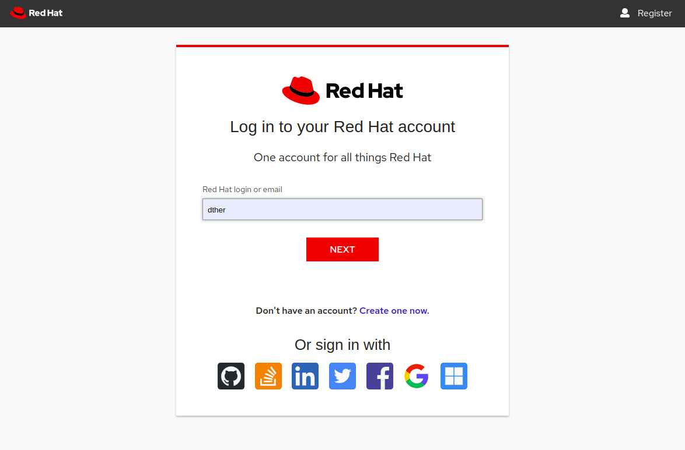

3 - Sign in ပြုလုပ်ပြီးလို့ openshift online console ထဲကို ရောက်သွားပြီ ဆိုရင်တော့ အောက်မှာ ပြထားတဲ့ Screenshot ထဲက အတိုင်းမြင်ရပါမယ်။ Open Web Console ကို နှိပ်ပြီးတော့ openshift console ထဲကို ထပ်ဝင်ပါ။

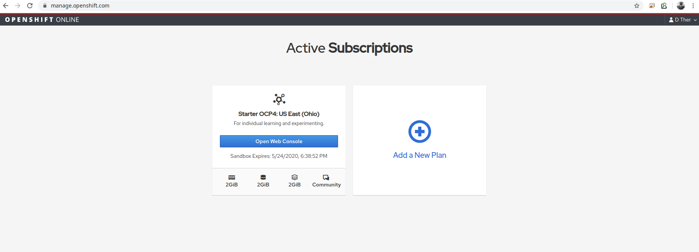

4 -အောက်မှာ မြင်ရတဲ့ screenshot ကတော့ openshift console ဖြစ်ပါတယ်။ ကျွန်တော်တို့ အရင်ဆုံး အသုံးပြုမယ့် project တစ်ခု တည်ဆောက် ပေးဖို့လိုပါတယ်။ Project က kubernetes မှာ ဆိုရင် namespace နဲ့ ဆင်တူပါတယ်။

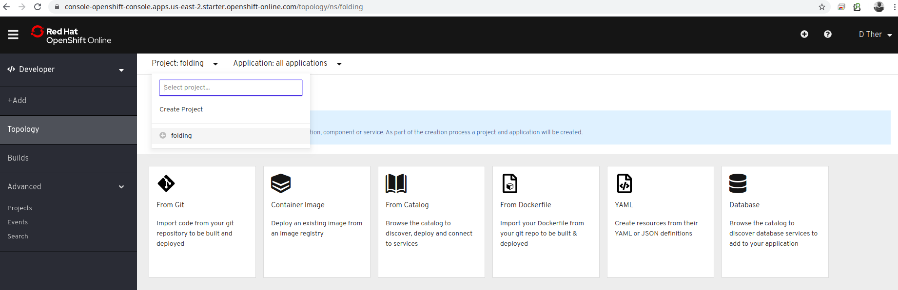

5 - Project တစ်ခု တည်ဆောက်ဖို့ ကျွန်တော်တို့ project ဆိုတဲ့ အပေါ်ကို click နှိပ်လိုက်ရုံပါပဲ။ Create Project ဆိုတဲ့ popup တစ်ခုအောက်မှာ ပြထားတဲ့အတိုင်း ထွက်လာမှာ ဖြစ်ပါတယ်။ ကျွန်တော်ကတော့ project name ကို fah လို့ ပေးခဲ့ပြီးတော့ Display Name ကိုတော့ Folding At Home လို့ ပေးထားပါတယ်။ ဒီနေရာမှာ ကိုယ်ကြိုက်တဲ့ နာမည်ကို ပေးလို့ရပါတယ်။ ပြီးရင်တော့ Create ဆိုတဲ့ button နှိပ်လိုက်ရုံဖြင့် fah ဆိုတဲ့ project ကို တည်ဆောက် ပေးသွားမှာ ဖြစ်ပါတယ်။

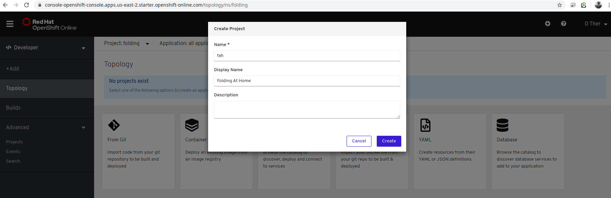

6 - Project တည်ဆောက်ပြီးသွားရင်တော့ ကျွန်တော်တို့ Folding ပြုလုပ်ဖို့ Openshift ရဲ့ resource နှစ်ခုကို yaml နဲ့ create လုပ်ရပါမယ်။ ဒါကြောင့်မို့လို့ အောက်မှာ ပြထားတဲ့ ပုံထဲက yaml ကို ရွေးရပါမယ်။ 

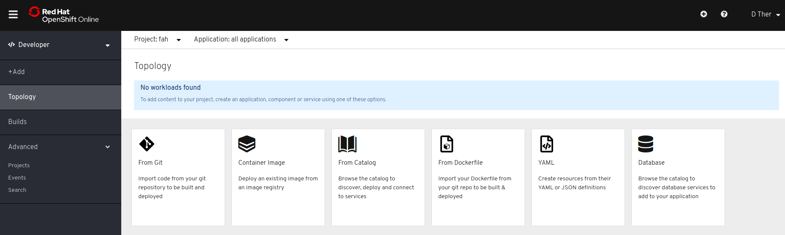

7 - Import yaml ဆိုတဲ့ နေရာမှာ configmap ကို create ပြုလုပ်ရပါမယ်။ မခက်ပါဘူး အောက်မှာ ပေးထားတဲ့ code ကို copy paste ပြုလုပ်ရုံပါပဲ။ ဒါကတော့ အလွယ်ပြောရရင် folding ကို run ဖို့လိုအပ်တဲ့ configuration ကို openshift ထဲမှာ save တဲ့သဘောဖြစ်ပါတယ်။ line number 14 နဲ့ 15 မှာ ကိုယ့်ရဲ့ နာမည်နဲ့ Team id ကို ထည့်ပေးရမှာ ဖြစ်ပါတယ်။ ပြီးရင်တော့ create button ကို နိပ်ပေးရမှာဖြစ်ပါတယ်။

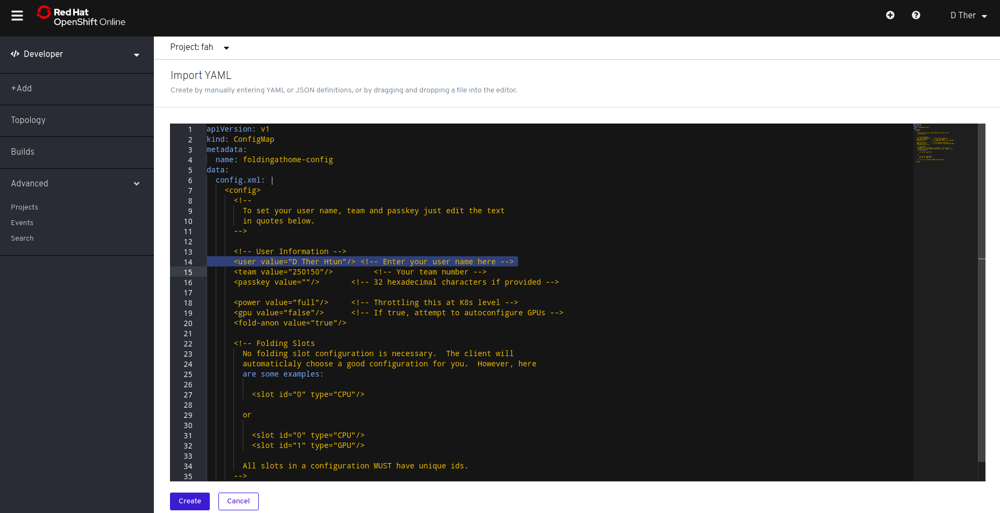

Team Id နေရာမှာတော့ အခု လူအများ အသုံးပြုနေတဲ့ Team create ပြုလုပ်ပြီးသား ဖြစ်တဲ့ Ubuntu-MM ရဲ့ team id ကို ထည့်သွင်းပေးထားပါတယ်။ ကိုယ်ကိုတိုင် Team အသစ် တစ်ခု တည်ဆောက်ချင်ရင်တော့ ဒီမှာ [https://apps.foldingathome.org/team](https://apps.foldingathome.org/team) ပြုလုပ်နိုင်ပါတယ်။ အခုအောက်မှာ ပြထားတဲ့ configmap.yaml ကတော့ အပေါ်က Import yaml မှာ ထည့်ပေးရမှာ yaml ဖြစ်ပါတယ်။


```yaml
apiVersion: v1
kind: ConfigMap
metadata:
  name: foldingathome-config
data:
  config.xml: |
    <config>
      <!--
        To set your user name, team and passkey just edit the text
        in quotes below.
      -->

      <!-- User Information -->
      <user value="D Ther Htun"/> <!-- Enter your user name here -->
      <team value="250150"/>         <!-- Your team number -->
      <passkey value=""/>       <!-- 32 hexadecimal characters if provided -->

      <power value="full"/>     <!-- Throttling this at K8s level -->
      <gpu value="false"/>      <!-- If true, attempt to autoconfigure GPUs -->
      <fold-anon value="true"/>

      <!-- Folding Slots
        No folding slot configuration is necessary.  The client will
        automaticlaly choose a good configuration for you.  However, here
        are some examples:

          <slot id="0" type="CPU"/>

        or

          <slot id="0" type="CPU"/>
          <slot id="1" type="GPU"/>

        All slots in a configuration MUST have unique ids.
      -->
    </config>
```


8 -  Configmap ကို create ပြုလုပ်ပြီးနောက်မှာတော့ +Add ကို နှိပ်ပြီး Openshift ရဲ့ Deployment Config တည်ဆောက်ဖို့ နောက်တစ်ခေါက် YAML ကို ရွေးချယ်ပေးရမှာဖြစ်ပါတယ်။

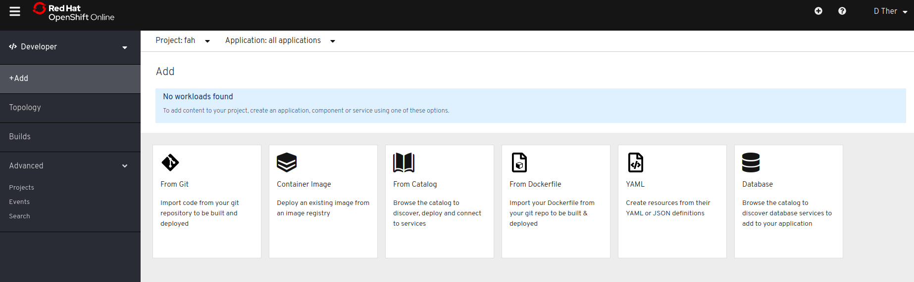

9 -ဒီတစ်ခါမှာတော့ folding ကို container အနေနဲ့ run ဖို့ YAML ကို Import ပြုလုပ်ပေးရမှာ ဖြစ်ပါတယ်။ အောက်မှာ ပေးထားတဲ့ DeploymentConfig YAML ကို ဘာမှပြင်စရာမလိုဘဲ copy paste လုပ်ပြီး Import YAML ထဲ ထည့်ပေး ထည့်ပေးရုံပါပဲ။ ပြီးရင်တော့ create button ကို နှိပ်ပေးရမှာ ဖြစ်ပါတယ်။ 

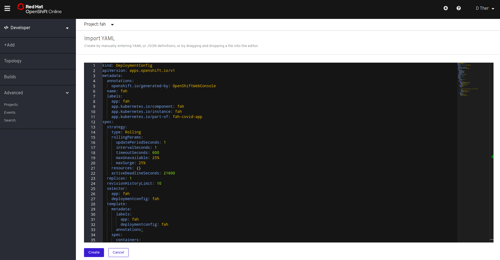

ဒါကတော့ container ကို run မဲ့ DeploymentConfig yaml ဖြစ်ပါတယ်။


```yaml
kind: DeploymentConfig
apiVersion: apps.openshift.io/v1
metadata:
  annotations:
    openshift.io/generated-by: OpenShiftWebConsole
  name: fah
  labels:
    app: fah
    app.kubernetes.io/component: fah
    app.kubernetes.io/instance: fah
    app.kubernetes.io/part-of: fah-covid-app
spec:
  strategy:
    type: Rolling
    rollingParams:
      updatePeriodSeconds: 1
      intervalSeconds: 1
      timeoutSeconds: 600
      maxUnavailable: 25%
      maxSurge: 25%
    resources: {}
    activeDeadlineSeconds: 21600
  replicas: 4
  revisionHistoryLimit: 10
  selector:
    app: fah
    deploymentconfig: fah
  template:
    metadata:
      labels:
        app: fah
        deploymentconfig: fah
      annotations:
    spec:
      containers:
        - name: fah-cpu
          image: "richstokes20/fah-covid:latest"
          imagePullPolicy: Always
          volumeMounts: # Mount config.xml file
            - name: data
              mountPath: /etc/fahclient
      initContainers:
        - name: copy-ro-scripts
          image: busybox
          command:
            [
              "sh",
              "-c",
              "cp /etc/fahclient-config/config.xml /etc/fahclient/config.xml",
             ]
          volumeMounts:
            - name: fah-cpu-config
              mountPath: /etc/fahclient-config
            - name: data
              mountPath: /etc/fahclient
      volumes:
        - name: data
          emptyDir: {}
        - name: fah-cpu-config
          configMap:
            name: foldingathome-config
```


10 - အခုဆိုရင် ပြီးသလောက်နီးနီး ဖြစ်ပါပြီ။ create button ကို နှိပ်ပြီးတဲ့ နောက်မှာတော့ အခုလို 0 အလယ်မှာ ပြတဲ့အဝိုင်း မှိန်မှိန်လေး တွေ့မြင်ရမှာဖြစ်ပါတယ်။ ဒါကတော့ container ကို pull လုပ်မယ် schedule လုပ်မယ် စတင် run မယ်ဆိုတဲ့ အခြေအနေတွေ ပြုလုပ်နေလို့ ဖြစ်ပါတယ်။ ခဏ စောင့်ရပါမယ်။

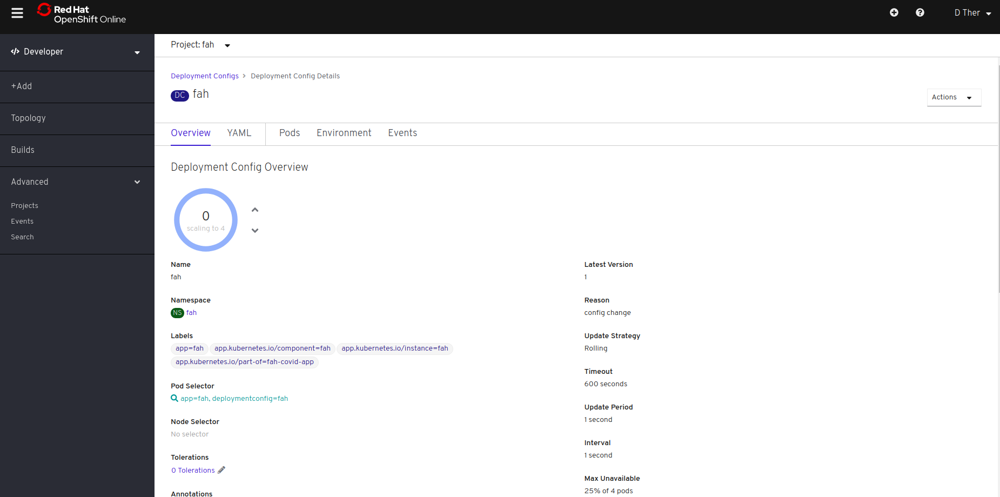

11 -  အပေါ်က DeploymentConfig မှာ replicas: 4 ထားခဲ့တာကြောင့် containers ၄ ခု ကို pod ၄ ခု အနေနဲ့ run သွားမှာ ဖြစ်ပါတယ်။ အခုပုံမှာဆိုရင်တော့ 4 ပတ်ပတ်လည်က အဝိုင်းက အပြာရောင် တောက်တောက်ဖြစ်သွားပါပြီ။ containers တွေ အကုန် စတင် run ပြီး folding ပြုလုပ်ပြီ။

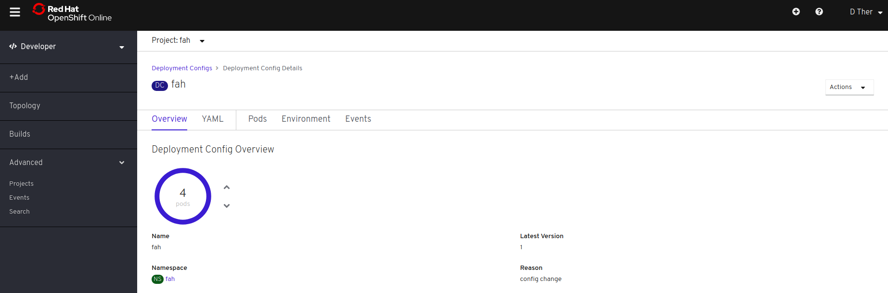

12 - ဘေးက Advanced ထဲက Projects ကို နှိပ်လိုက်ရင် အောက်မှာ ပြထားတဲ့ အတိုင်း fah project ကို မြင်ရမှာ ဖြစ်ပါတယ်။

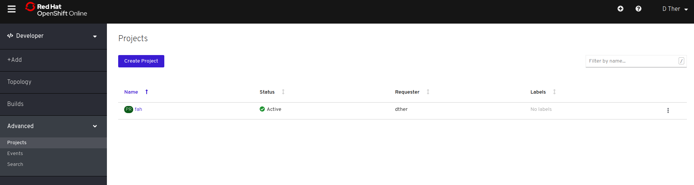

fah ကို ထပ်နိပ်လိုက်ရင်တော့ project overview ကို မြင်ရမှာဖြစ်ပါတယ်။ folding ပြုလုပ်နေတာရဲ့ resources အသုံးပြုတာကိုလဲ အောက်မှာ ပြထားတဲ့အတိုင်း မြင်ရမှာဖြစ်ပါတယ်။ 

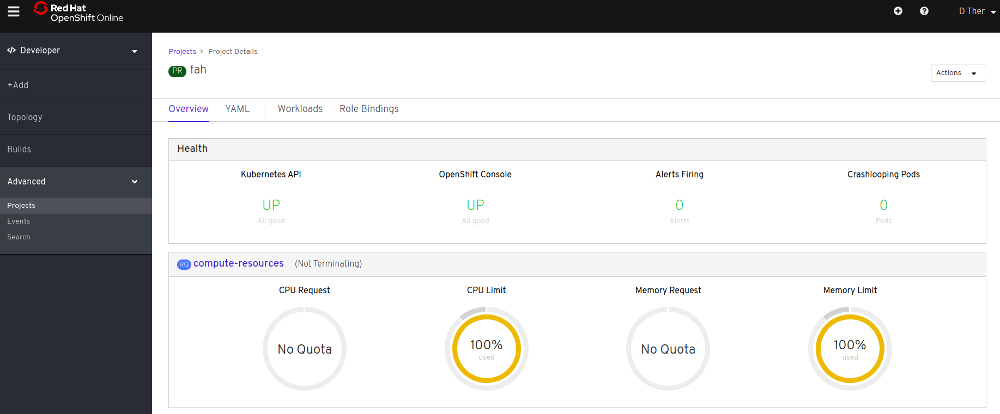


ဒါဆိုရင်တော့ Openshift Online ရဲ့ Starter plan ကို အသုံးပြုပြီးတော့ folding ပြုလုပ်တာ အဆင်ပြေပြေ ပြီးသွားပြီ ဖြစ်ပါတယ်။

## Folding Using KubeSail

1 - ပထမ အရင်ဆုံး kubesail.com ကို browser မှာ ဖွင့်ပါ။ ပြီးရင်တော့ free အသုံးပြုနိုင်ဖို့ Github account နဲ့ sign in ပြုလုပ်ပါ။



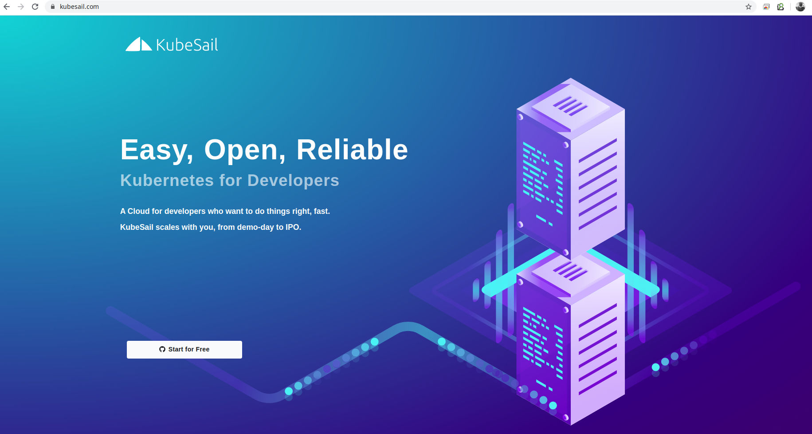

2 - Sign in ပြုလုပ်ပြီး အောက်မှာ ပြထားတဲ့ screen shot အတိုင်း မြင်ရတဲ့ အခါ ကျရင် New Deployment ကို click ပါ။

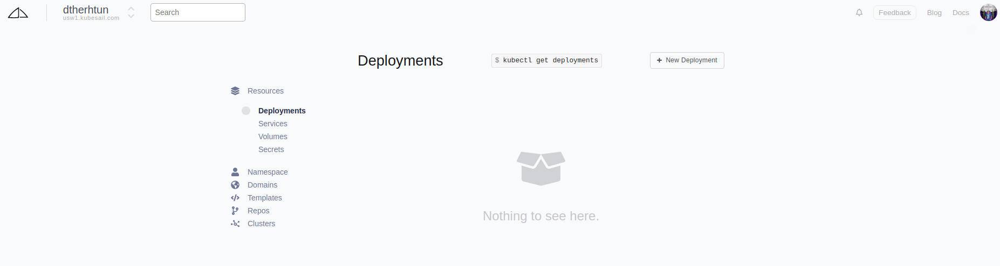

3 - New Deployment ကို click ပြီးတဲ့အခါမှာတော့ အောက်မှာ ပြထားတဲ့အတိုင်း မြင်ရမှာ ဖြစ်ပါတယ်။ ကျွန်တော်တို့ အခု node.js / ror / python / postgres / redis / nginx တို့ကို run မှာ မဟုတ်ပါဘူး။ ကျွန်တော်တို့ folding လုပ်မှာ ဖြစ်ပါတယ်။ ဒါကြောင့်မလို့ ကျွန်တော်တို့ custom အသုံးပြုနိုင်ဖို့ kubeconfig လိုအပ်ပါတယ်။ အောက်က ပုံထဲက Get kubectl config ကို ထပ် click ပါ။ kubeconfig ကို မြင်ရမှာ ဖြစ်ပါတယ်။ 

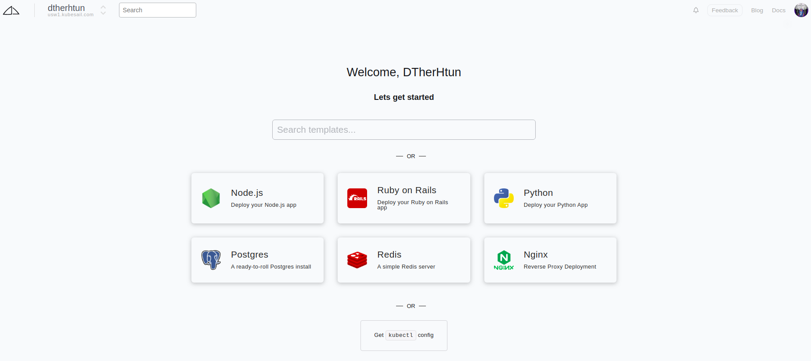

4 - အောက်မှာ ပြထားတဲ့ kubeconfig ထပ် ပေါ်လာပါလိမ့်မယ်။ copy လုပ်ပြီးတော့ laptop ထဲက directory တစ်ခုအောက်မှာ config.yaml ဆိုပြီးတော့ save ပါ။ 

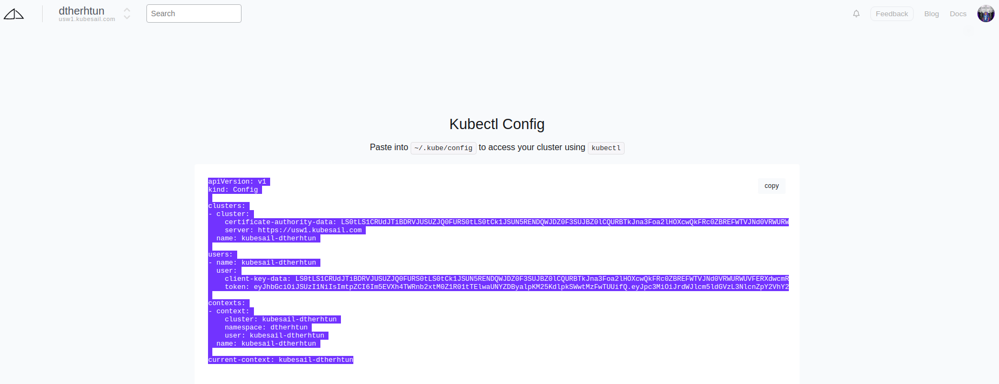

5 - kubeconfig ကို အသုံးပြုပြီးတော့ folding ကို run မှာ ဖြစ်တဲ့ အတွက် kubectl command line tools ကို လိုအပ်မှာ ဖြစ်ပါတယ်။ laptop ထဲမှာ မရှိသေးရင် ဒီမှာ download လုပ်နိုင်ပါတယ်။ 

6 - ကျွန်တော်တို့ folding ပြုလုပ်ဖို့ အတွက် အပေါ်က openshift မှာ ပြုလုပ်သွားတဲ့ အတိုင်း configmap နဲ့ deployment ကို kubectl အသုံးပြုပြီး ဖန်တီးရပါမယ်။


```yaml
apiVersion: apps/v1
kind: Deployment
metadata:
  name: fah
  labels:
    app: fah
spec:
  selector:
    matchLabels:
      app: fah
  replicas: 1 # Set number of replicas to run - one replica per node
  strategy:
    type: RollingUpdate
    rollingUpdate:
      maxUnavailable: 100%
      maxSurge: 100%
  template:
    metadata:
      labels:
        app: fah
    spec:
      containers:
        - name: fah
          image: "richstokes20/fah-covid:latest"
          imagePullPolicy: Always
          volumeMounts: # Mount config.xml file
            - name: data
              mountPath: /etc/fahclient
      initContainers:
        - name: copy-ro-scripts
          image: busybox
          command:
            [
              "sh",
              "-c",
              "cp /etc/fahclient-config/config.xml /etc/fahclient/config.xml",
            ]
          volumeMounts:
            - name: fah-config
              mountPath: /etc/fahclient-config
            - name: data
              mountPath: /etc/fahclient
      volumes:
        - name: data
          emptyDir: {}
        - name: fah-config
          configMap:
            name: foldingathome-config
      # priorityClassName: low-priority-class
---
apiVersion: v1
kind: ConfigMap
metadata:
  name: foldingathome-config
data:
  config.xml: |
    <config>
      <!--
        To set your user name, team and passkey just edit the text
        in quotes below.
      -->

      <!-- User Information -->
      <user value="D Ther Htun"/> <!-- Enter your user name here -->
      <team value="250150"/>         <!-- Your team number -->
      <passkey value=""/>       <!-- 32 hexadecimal characters if provided -->

      <power value="full"/>     <!-- Throttling this at K8s level -->
      <gpu value="false"/>      <!-- If true, attempt to autoconfigure GPUs -->
      <fold-anon value="true"/>

      <!-- Folding Slots
        No folding slot configuration is necessary.  The client will
        automaticlaly choose a good configuration for you.  However, here
        are some examples:
      
          <slot id="0" type="CPU"/>

        or
        
          <slot id="0" type="CPU"/>
          <slot id="1" type="GPU"/>

        All slots in a configuration MUST have unique ids.
      -->
    </config>
---
```


အပေါ်က YAML ထဲက line number 64 နဲ့ 65 မှာ name နဲ့ Team id ကို ထည့်ပေးရပါမယ်။ yaml manifest ကို gist ကနေ လဲ wget/curl နဲ့ download ဆွဲနိုင်ပါတယ်။ 

```bash
$ wget https://gist.githubusercontent.com/DTherHtun/3708a3a06aba06257381f8afdcd5ee94/raw/055bef9955b7d7c362eda588e891df3a1a3f47f0/fah-kube.yaml
```

7 -ပြီးရင်တော့ အောက်မှာ ပြထားတဲ့ အတိုင်း kubectl command ကို run ရမှာ ဖြစ်ပါတယ်။ 

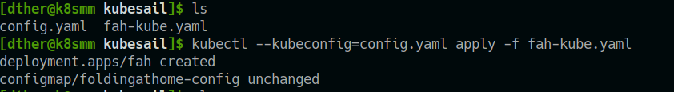

8 - အောက်မှာပြထားတဲ့အတိုင်း မြင်ရပြီဆိုရင်တော့ ကျွန်တော် တို့ folding ကို kubesail မှာ Deployment အနေနဲ့ ပြုလုပ်နေတာ အဆင်ပြေစွာနဲ့ ပြီးပြီ ဖြစ်ပါတယ်။


တစ်ညလောက် စောင့်ပြီးတဲ့နောက်မှာတော့ [ဒီမှာ](https://stats.foldingathome.org/team/250150) ကိုယ့်နာမည်ကို တွေ့ရမှာ ဖြစ်ပါတယ်။

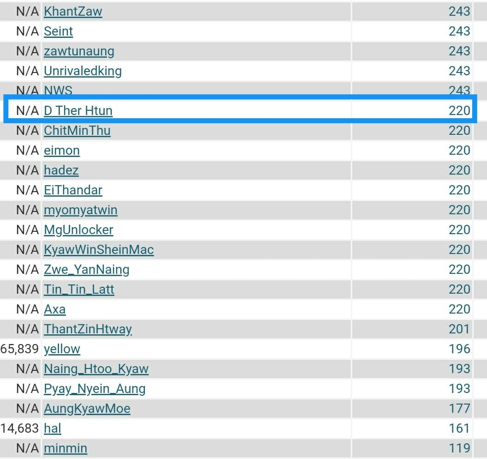

