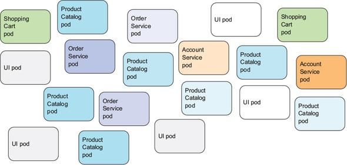
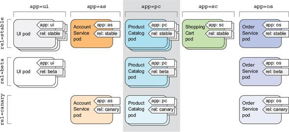

# Labels and Selectors

Kubernetes မှာ တော်တော်အသုံးများတဲ့ labels နဲ့ selectors အကြောင်းဆွေးနွေးပေးချင်ပါတယ်  
အရင်ဆုံး labels နဲ့ selectors ဆိုတာ ဘာလဲ ဘာကြောင့်သုံးရသလဲဆိုတာ မပြောခင် ကျွန်တော်တို့ Marketplace တစ်ခုသွားရအောင်

ကျွန်တော်တို့ ဝယ်ချင်တဲ့ မျိုးမတူတဲ့ပစ္စည်းတွေကို ဆိုင်မှာသွားဝယ်ကြတဲ့အခါ ဆိုင်ထဲမှာ သက်ဆိုင်ရာ products အလိုက် \( Fast foods, Drinks, Frozen foods, Cosmetic, Medicines စသဖြင့် \) category ခွဲပေးထားတဲ့အတွက် တစ်စုတစီးတည်း အမျိုးအမည်တူတွေကို အလွယ်တကူ ရှာဖွေလို့ရပါတယ်။ ဝယ်ယူလိုက်တဲ့ ပစ္စည်းတွေကို cashier မှာရှင်းရတဲ့အခါ ပစ္စည်းတစ်ခုစီတိုင်းမှာရှိတဲ့ barcode ကို scan ဖတ်လိုက်ရုံဖြင့် စျေးနှုန်းသိရတဲ့အပြင် ထိုပစ္စည်းအမျိုးအစား လက်ကျန်ကိုပါ ဆိုင်ကသိရတယ်။  
ဒါဖြင့်ရင် ကျွန်တော်တို့ သိရှိပီးထားသည့်အတိုင်း labels ဆိုတာကတော့ products တွေကို category ခွဲပေးထားတာနဲ့တူသည့်အပြင် item တစ်ခုချင်းစီမှာရှိတဲ့ barcode label နဲ့တူပါတယ်။  
ဒီ ပစ္စည်းတွေကို သက်ဆိုင်ရာ label အလိုက် ဆွဲထုတ်ပီး လိုအပ်သလို အသုံးပြုတာက selector ဖြစ်ပါတယ်။

Labels and selectors ကို k8s မှာ ဘယ်လိုသုံးသလဲ ?

ဆိုပါစို့ microservice application တစ်ခုကို pod တစ်ခုလို့သတ်မှတ်မယ်ဆိုရင် ဒီ application နဲ့ပတ်သက်လို့ beta, canary, stable စသဖြင့် release version တွေခွဲပီး ရှိမယ်ဆိုရင် pod ၃ခု ရှိနေပြီ။ pod ၃ခုတုန်းကတော့ လွယ်သေးတယ်။ ဒီ application ကိုပဲ replica အနေနဲ့ တစ် pod စီထပ်တိုးမယ်ဆိုရင် pod ၆ခု ဖြစ်နေပီ။ Application တွေ များလာတာနဲ့အမျှ pod အရေအတွက်လဲ တိုးလာမှာဖြစ်တယ်။  
ဥပမာ ကျွန်တော်တို့ architecture မှာ pod ၂၀ နီးပါး ရှိတယ်။ Replica ပွားထားတဲ့ app တွေလဲရှိမယ်။ version အမျိုးမျိုးနဲ့လဲ run နေတာလဲရှိမယ်ဆိုရင် ဘယ် pod က ဘယ် application အတွက်လဲ ဘယ် version နဲ့လဲ။ ဘယ် application ရဲ့ beta version တွေကိုပဲ feature update ထည့်ချင်တယ်။ stable version နဲ့ pod တွေပဲ list လုပ်ချင်တယ် ဘယ် application ရဲ့ ​replica pod တွေကို ဖယ်ထုတ်ချင်တယ် တိုးချင်တယ် စသဖြင့် များပြားလှတဲ့ pod တွေထဲက လိုချင်တဲ့ အခြေအနေတစ်ခုအပေါ်မူတည်ပြီး ထိန်းချူပ်ချင်တဲ့အခါ သိပ်ပီး မလွယ်ကူတော့ဘူး။



Label ကို pod တစ်ခုတည်းမဟုတ်ပါဘူး kubernetes တခြား resources \(node, deployment, service, replicaset, etc,. \) တွေမှာလဲ label ကိုသုံးပါတယ်။ Label ကရိုးရှင်းတယ် key-value အနေနဲ့ resource မှာ သုံးတယ်။ Resource တည်ဆောက်ကတည်းက label ထည့်ပီး ဆောက်သွားလို့ရပါတယ်။ နောက်မှ ထပ်ထည့်ချင်တယ် ရှိပီးသား label ကို ပြင်ချင်တယ်ဆိုလဲ ရပါတယ်။ Resource တစ်ခုမှာ label တစ်ခုထက်ပိုပီး ရှိလို့ရပါတယ်။ Resource ထဲမှာ သတ်မှတ်လိုက်တဲ့ label ကို selector နဲ့ တွဲပီး resource ကိုလိုအပ်သလို သုံးလို့ရပါတယ်။ ရှေ့မှာပြောခဲ့တဲ့ example ကိုပြန်သွားကြည့်ရအောင်။ ပွထနေတဲ့ pod resource တွေကို label ၂ခုစီ ထည့်ကြည့်လိုက်မယ်။ ဘယ် application လဲဆိုတာသိဖို့အတွက် key က app, value က application ရဲ့ short form နဲ့ label တစ်ခု ဘယ် release version လဲဆိုတာသိဖို့အတွက် rel ဆိုတဲ့ key, value ကို release version ဆိုပီး label တစ်ခု ဒီ label ၂ခုစီနဲ့ application တွေကို list လုပ်ကြည့်လို့ရမယ့်ပုံစံကို ပုံမှာတစ်ချက်ကြည့်ကြည့်ရအောင်



Label အသုံးပြုလိုက်မယ်ဆိုရင် ရှင်းလင်းပြီး စနစ်တကျ စုစုစည်းစည်းဖြစ်သွားတဲ့ pod တွေကို လွယ်လွယ်ကူကူ manage လုပ်လို့ရပါတယ်

Resource တည်ဆောက်ကတည်းက Label ကိုသတ်မှတ်လိုရင် manifest ထဲမှာ metadata ေအာက်မှာ label parameter မှာ key-value pair ထည့်ပေးရုံပါပဲ

```yaml
apiVersion: v1
kind: Pod
metadata:
   name: label_lab1
   labels:
     app: label_lab1
     env: dev
spec:
   containers:
   - image: ws/lab
     name: label_lab1
```

pod တစ်ခု create လုပ်လိုက်မယ်

```text
 $ kubectl create -f label_lab1.yaml
 pod "label_lab1" created
```

**kubectl get pods command** နဲ့ဆိုရင် label ကို မြင်ရမှာ မြင်ရမှာမဟုတ်ပါဘူး။ **--show-labels** option ထည့်ပေးပီး pod ရဲ့ label ကို တွေ့ရပါမယ်။

```text
$ kubectl get pods --show-labels
NAME READY STATUS RESTARTS AGE LABELS
label_lab1 1/1 Running 0 10m app=label_lab1, env=dev
```

Pod ေဆာက်ပီးမှ label ထည့်လို့လဲရပါတယ်။

```text
$ kubectl label pods label_lab1 rel=1.0
pod "label_lab1" labeled

$ kubectl get pods --show-labels
NAME READY STATUS RESTARTS AGE LABELS
label_lab1 1/1 Running 0 16m app=label_lab1, env=debug, rel=1.0
```

Pod resource ကို filter ပီး လိုသလို manage လုပ်လိုတဲ့အခါမှာ --selector ဒါမှမဟုတ် -l option သုံးပါတယ်။

```text
$ kubectl get pods --selector app=label_lab1
NAME READY STATUS RESTARTS AGE
label_lab1 1/1 Running 0 27m

$ kubectl get pods -l rel=1.0
NAME READY STATUS RESTARTS AGE
label_lab1 1/1 Running 0 27m
```

Label ကို key ကိုပဲသုံးပီး value မပါပဲနဲ့ ရှာလို့လဲရပါတယ်။

```text
$ kubectl get pods -l rel
NAME READY STATUS RESTARTS AGE
label_lab1 1/1 Running 0 37m

$ kubectl get pods -l '!rel'
NAME READY STATUS RESTARTS AGE
kube-manual 1/1 Running 0 1dpodex 1/1 Running 0 1d
```

Label အကြောင်းကတော့ ဒီလောက်ပါပဲ။ Label ကို kubernetes ရဲ့ တခြား resource တော်တော်များများမှာလဲ ပို၍အသုံးပြုပါတယ်။ Label ကို နားလည်သဘောပေါက်ထားမယ်ဆိုရင် kubernetes resources ေတွကို manage လုပ်ရမှာ ပိုမိုလွယ်ကူစေပါတယ်။  
အချိန်ပေး ဖတ်ရှုပေးသည့်အတွက် ကျေးဇူးတင်ပါတယ်။

