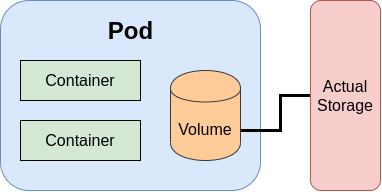
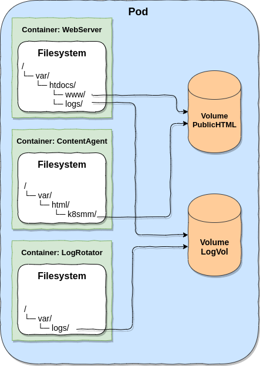

# Volumes

           ဒီနေရာမှာ Volumes က electronic devices တွေက အသံ အတိုးအချဲ့ကို ပြောတာ မဟုတ်ဘူး။ စာအုပ် အတွဲဆက်တွေ ကို ပြောတာ မဟုတ်ဘူး။ အရွယ်အစား ဆိုဒ် တစ်ခု၊ တစ်ခုခုကို သိုလှောင်ဖို့ Storage ကို ပြောတာ ဖြစ်တယ်။ အဲတော့ kubernetes အသုံးပြုပြီးတော့ Pod တွေ က တစ်ခုခုကို ယာယီဖြစ်စေ၊ အမြဲတမ်းဖြစ်စေ ထားရှိဖို့ သိုလှောင်ဖို့ လိုလာပြီဆိုရင် volumes ကို အသုံးပြုတယ်။ အခု volume အကြောင်း ကို လေ့လာဖို့၊ သိရှိဖို့ container တွေကနေ ပြန်တွေးဖို့ လိုအပ်မယ်။ pods တွေက logical hosts တွေနဲ့ တူတယ်။ အထဲမှာ CPU၊ RAM၊ network interfaces စတဲ့ resources တွေကိုတော့ share သုံးတယ်။ အဲလို share မသုံးဘဲ သီးသန့် ဖြစ်နေတာကတော့ Pod အထဲမှာ ရှိတဲ့ container တွေရဲ့ file-system ပဲဖြစ်ပါတယ်။ ဘာလို့လဲ ဆိုတော့ file-system က container ရဲ့ image ကနေ ဖြစ်လာလို့ ဖြစ်ပါတယ်။ container image ကို build လုပ်တဲ့ အချိန်မှာ ထည့်သွင်းသမျှ files တွေ folders တွေက container run တဲ့ အချိန်မှာ အတိအကျ file-system အနေနဲ့ ဖြစ်ပေါ်လာပါတယ်။ နောက်တစ်ခု က အဲ file-system တွေက container ကို run နေတဲ့ အချိန်မှာပဲ ဖြစ်ပေါ်နေတာပါ၊ run နေတဲ့ container ကို restart လုပ် ဒါမှ မဟုတ် stop ပြုလုပ် ပြီး start ပြန်တဲ့ အခါ အဲ့ File system အပေါ်မှာ running ဖြစ်စဉ်တုန်က ထားရှိတဲ့ data တွေ ပျက်သွားမှာ ဖြစ်ပါတယ်။ ဒီ သဘောတရားကိုတော့ container ကို အသုံးပြုဖူးသူ အတော်အများ သတိထားမိမယ် ထင်ပါတယ်။ အဲလိုဘဲ pod တစ်ခု အထဲမှာ ရှိတဲ့ containers တွေ restarted ဖြစ်ရင် သို့မဟုတ် liveness probe fail လို့ kill ခံလိုက်ရရင် အသစ်တစ်ဖန် ပြန်ဖြစ်လာတဲ့ container သည် ပထမ container က File system အပေါ် သိမ်းခဲ့သမျှ အရာတွေကို ပြန်မြင်ရမှာ မဟုတ်တော့ပါဘူး။ container တွေရဲ့ အခုလို File System သဘောသဘာ၀ ကြောင့် pod တစ်ခု ထဲမှာတောင် ဒီ အတိုင်းဆိုရင် running ဖြစ်တဲ့ အချိန်မှာ data share သုံးဖို့ အဆင်မပြေပါဘူး။ မတူတဲ့ pod တွေ replicate ပြုလုပ်ထားတဲ့ pods တွေ အများကြီး ဆို ပိုလို့တောင် အဆင်မပြေပါဘူး။ ကျွန်တော်တို့ ရဲ့ ရည်ရွယ်ချက်က data တွေကို အမြဲတမ်း သိမ်းချင်တာ မျိုးဖြစ်ချင်ဖြစ်မယ်၊ ခနတဖြုတ် အလုပ်လုပ်နေတဲ့ အချိန်မှာ ယာယီ ထားရှိချင်တာ မျိုးလဲ ဖြစ်ချင်ဖြစ်ပါမယ်။ လိုအပ်ချက် အပေါ် မူတည်ပြီးတော့ပေါ့။ အခုလိုမျိုး ရည်ရွယ်ချက်တွေ အတွက်လဲ container ရဲ့ file system တစ်ခုလုံးကို persistent ဖြစ်ဖို့မလိုအပ်ပါဘူး၊ တကယ် data ထားမဲ့ directories တွေကိုဘဲ လိုအပ်တာပါ။ linux မှာဆိုရင်တော့ mount လုပ်ပေးတဲ့ သဘောမျိုးပေါ့။

                Kubernetes မှာ ဒီ storage ပြဿနာ အတွက် အခု ပြောနေတဲ့ volumes ဆိုတဲ့ အစိတ်အပိုင်း တစ်ခုကို ထည့်သွင်းထားပါတယ်။ Volumes က ခုနက ပြောသလိုဘဲ pod ရဲ့ အစိတ်အပိုင်း တစ်ခုပါပဲ။ Pod, Service, Replicaset, Daemonset တို့လို့ resources မဟုတ်ပါဘူး။ volume က pod ရဲ့ အစိတ် အပိုင်း တစ်ခု ဖြစ်လို့ volume ရဲ့ lifecycle ကတော့ Pod အတိုင်းဖြစ်ပါတယ်။ Pod ကို start လုပ်တာနဲ့ လိုချင်တဲ့ volume တွေ တည်ဆောက်သွားပါတယ်။ Pod ကို deleted လုပ်လိုက်တာနဲ့ တစ်ခါထဲ volume ကို ပါဖျက်သွားပါတယ်။ Pod ကို မဖျက်မချင်း volume က တည်ရှိနေမှာ ဖြစ်ပါတယ်။ ဒါကြောင့်မလို့ pod အထဲက container တွေ restart ချတဲ့ အခါမှာ share သုံးတဲ့ data တွေက volume အပေါ်မှာ တည်ရှိနေမှာ ဖြစ်ပါတယ်။ အပေါ်မှာ ပြထားတဲ့ ပုံကတော့ pod တစ်ခု ထဲက multi containers တွေ volume ကို share သုံးနေတာ ဖြစ်ပါတယ်။ ပုံမှာ မြင်ရတဲ့ အတိုင်း volume ၂ ခုက containers တွေလိုမျိုး pod ရဲ့ အစိတ်အပိုင်း ဖြစ်ပါတယ်။ file-system အပေါ်က လိုအပ်တဲ့ file path မှာ volume ကို mount ပြီး အသုံးပြုနိုင်ပါတယ်။ ပုံဥပမာ အရဆိုရင် အလယ်က container \(`ContentAgent`\) ကနေ `/var/html/k8smm/` အောက်ကို content တွေကို ၅ စက္ကန့် တစ်ခါ သို့မဟုတ် စက္ကန့် ၃၀ တစ်ခါ random generate ထုတ်ပါမယ်။ ဒီ path `/var/html/k8smm/` ကို `PublicHTML` ဆိုတဲ့ volume နဲ့ mount ထားမှာ ဖြစ်ပါတယ်။ အပေါ်ဆုံးက webserver ဆိုတဲ့ container ကတော့ `/var/www/htdocs/www/` ဆိုတဲ့ file path ကို serve လုပ်ထားမှာ ဖြစ်ပါတယ်။ အဲဒီ serve လုပ်ထားတဲ့ file path ကို ခုနက `PublicHtml` ဆိုတာနဲ့ mount ပြန်လုပ်ထားပါတယ်၊ ဒါမှ အလယ်က container random generate ထုတ် သမျှကို Web Server ကနေ တဆင့် ခေါ်ယူနိုင်မှာ ဖြစ်ပါတယ်။ Web Server container က `/var/www/htdocs/logs` ဆိုတဲ့ path ထဲကို access logs တွေ၊ error logs တွေ သိမ်းပါတယ်။ ဒီ logs သိမ်းတဲ့ path ကိုတော့ Logvol ဆိုတဲ့ volume နဲ့ mount ထားပါတယ်။ အောက်ဆုံးက `LogRotator` ဆိုတဲ့ container ကတော့ ခုနက `Logvol` volume ကို `/var/logs` အောက်မှာ mount ပြီး central logs server ရှိရာဆီကို ပို့ဖို့ ရည်ရွယ်ပါတယ်။ အဲတော့ ပုံပါ ဥပမာ အရ volume ၂ ခုရှိပြီး တစ်ခုကတော့ web page မှာ ပေါ်တဲ့ content တွေကို share ဖို့ရယ်၊ နောက် volume တစ်ခုကတော့ log ship ဖြစ်ပါတယ်။ ဒါကတော့ အကြမ်းဖျင်း usage case တစ်ခုကို ချပြထားတာ ဖြစ်ပါတယ်။

 Volumes မှာ volume types တွေ အများကြီး ရှိပါတယ်။ volume types တွေ ကတော့ - [emptyDir](https://blog.k8smm.org/volumes/emptydir), [hostPath](https://blog.k8smm.org/volumes/hostpath), [gitRepo](https://blog.k8smm.org/volumes/gitrepo), NFS, [gcePersistentDisk](https://blog.k8smm.org/volumes/gce-persistent-disk), [awsElastic BlockStore](https://blog.k8smm.org/volumes/aws-elastic-blockstore), AzureDisk, Cinder, Cephfs, iSCSI, flocker, Glusterfs, Quobyte, Rook, configMap, Secret, downwardAPI, persistentVolumeClaim စတာတွေ အများကြီး ရှိပါတယ်။ ဒီ blog မှာတော့ ယခု ဖော်ပြထားတဲ့ အတိုင်း volume ဆိုတာ ဘာလဲ၊ volumes ကို ဘယ်လို အသုံးပြုရလဲ ဆိုတဲ့ concept နဲ့ အသုံးများတဲ့ တချို့ volumes types တွေ ကို ဖော်ပြ ပေးသွားမှာ ဖြစ်ပါတယ်။ ကိုယ်လုပ်ငန်းရဲ့ လိုအပ်ချက် အပေါ်မူတည်ပြီးတော့ သုံးချင်တဲ့ volume ကို [kubernetes document](https://kubernetes.io/docs/concepts/storage/volumes/#types-of-volumes) မှာ လေ့လာနိုင်ပါတယ်။ 

