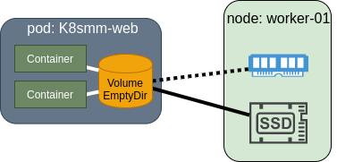

# EmptyDir

EmptyDir \(Empty Directory\) ဒီ volume type ကတော့ ရိုးရှင်းပြီး pod တစ်ခု အတွင်းမှာ ရှိတဲ့ containers တွေက data တွေကို share သုံးဖို့ အတွက် ဖြစ်ပါတယ်။ ဒါကြောင့်မလို့ EmptyDir က မတူညီတဲ့ pod တစ်ခုနဲ့ တစ်ခုကြားမှာ အသုံးပြုလို့မရနိုင်ပါဘူး။ EmptyDir က တော်တော် အသုံးဝင်ပါတယ်။ EmptyDir ကို အဓိက သုံးရတဲ့ ရည်ရွယ်ချက်တွေကတော့ volumes အကြောင်းမှာ ပြောသွားတဲ့ example \(content ageant/webserver/logRotator\) လို use case မျိုးတွေ မှာ ဖြစ်ပါတယ်။ single container ဘဲရှိတဲ့ pod မှာလဲ သုံးလို့ရပါတယ်။

  EmptyDir Volume နဲ့ အတူ pod တစ်ခုကို တည်ဆောက်တဲ့ အခါမှာ scheduler က worker ကို assign ပေးပြီးတာနှင့် အရင်ဆုံး EmptyDir ကို create လုပ်ပါတယ်။ ဘယ်မှာလုပ်လဲ ဆိုတော့ အဲဒီ pod ကို တည်ဆောက်မဲ့ node ရဲ့ SSD/HDD\(node storage\) သို့မဟုတ် RAM\(memory\) အပေါ်မှာ လုပ်ပါတယ်။ Default ကတော့ RAM အပေါ်မှာ မလုပ်ပါဘူး၊ node ရဲ့ storage ဖြစ်တဲ့ SSD/HDD အပေါ်မှာ ဘဲ ပြုလုပ်ပါတယ်။ node ရဲ့ operating system ထဲမှာ ဆိုရင်တော့ အောက်မှာ ဖေါ်ပြထားတဲ့ path ထဲမှာ ရှိနေမှာဖြစ်ပါတယ်။

```text
$/var/lib/kubelet/pods/[pod's uuid]/volumes/kubernetes.io~empty-dir
```



 EmptyDir ရဲ့ lifetime ကတော့ EmptyDir ပါရှိတဲ့ Pod ရဲ့ lifetime နဲ့ အတူတူပါဘဲ။ Pod တည်ဆောက် တဲ့ အချိန်ကနေ အကြောင်းအမျိုးမျိုးကြောင့် Pod မပျက်ခင် အချိန်ထိ ရှိနေမှာ ဖြစ်ပါတယ်။ replication controller / replicaset / job / etc စတဲ့ controller တွေမှ တဆင့် pod ကို run ထားသည်တိုင်အောင် Pod အဟောင်း ပျက်ပြီး Pod အသစ်ကို recreate လုပ်တဲ့ အခါမှာ EmptyDir ဆိုသည့် နာမည် အတိုင်း initial empty ဖြစ်တဲ့ directory ဘဲ ပြန်တည်ဆောက် ပေးသွားမှာ ဖြစ်ပါတယ်။ ဒါကြောင့် မို့ persistent data တွေကို သိမ်ဖို့ အတွက်ဆိုရင် အဆင် ပြေနိုင်မှာ မဟုတ်ပါဘူး။ Pod up and running ဖြစ်နေတဲ့ အချိန် မှာ container တစ်ခုနဲ့ တစ်ခုကြား လုပ်ဆောင်တဲ့ operation အတွက် ယာယီ data write ဖို့၊ read ဖို့ အတွက် အသုံးပြုကြပါတယ်။ တကယ်လို့ storage medium ကို RAM ကို အသုံးပြုမယ်ဆိုရင် ကြီးမှာတဲ့ dataset တွေနဲ့ ပြုလုပ်ရမဲ့ operation တွေကို မလုပ်သင့်ပါဘူး။


```yaml
apiVersion: v1
kind: Pod
metadata:
  name: generator
spec:
  containers:
  - image: quay.io/dther/hola:generator   #first container
    name: html-generator
    volumeMounts:
    - name: html                   #first container's mount point name
      mountPath: /var/htdocs              #first container's mount point
  - image: nginx:alpine                   #second container
    name: web-server
    volumeMounts:
    - name: html                    #second container's mount point name
      mountPath: /usr/share/nginx/html  #second container's mount point
      readOnly: true
    ports:
    - containerPort: 80
      protocol: TCP
  volumes:                           #declare volume
  - name: html   #volume name #volume name must be same with mount point name
    emptyDir: {}   #volume type #Empty Directory
```


`emptydir-pod.yaml` ကတော့ EmptyDir ကို နမူနာ အသုံးပြုပြီး multi containers နဲ့ Pod ဆောက်တဲ့ manifest ဖြစ်ပါတယ်။ ပထမ container \(html-generator\) က html content တွေကို EmptyDir volume အထဲကို write မယ်။ `/var/htdocs` ဆိုတဲ့ os path ထဲကို index.html အနေနဲ့ ၅ စက္ကန့် ခြား တစ်ခါ generate လုပ်နေမယ်။ ပထမ container ရဲ့ အလုပ်လုပ်သွားတဲ့ source code ကိုတော့ [ဒီမှာ](https://github.com/mm-k8s-ug/generator) ကြည့်ရှုနိုင်ပါတယ်။ ဒုတိယ container က nginx web-server ဖြစ်ပါတယ်။ ဒုတိယက တော့ ရှင်းတယ် `/usr/share/nginx/html` ဒီ path ထဲမှာ ရှိသမျှ file တွေ၊ .html ext နဲ့ ဆုံးတဲ့ web page တွေကို serve လုပ်ပေးနေမှာ ဖြစ်ပါတယ်။ အဲဒီ path ကို ခုနက ပထမ container အသုံပြုထားတဲ့ EmptyDir volume နဲ့ ပြန် mount ပြီး သုံးမှသာ web page မှာ generate ထုတ်ထားတဲ့ contents တွေ random ချိန်သွားမှာ ဖြစ်ပါတယ်။ အဲလိုမျိုး EmptyDir volume ကို mount သုံးတဲ့ အခါမှာ volume name နဲ့ volume mount path name တို့ က မဖြစ်မနေ တူညီ ရမှာ ဖြစ်ပါတယ်။ 

```bash
$ kubectl create -f emptydir-pod.yaml
$ kubectl get pod
$ kubectl port-forward generator 8080:80
$ google-chrome-stable http://localhost:8080
```

တချို့ အခြေအနေ တွေ အတွက် တကယ်လို့ medium ကို memory အပေါ်မှာ သုံးချင်တယ် ဆိုရင် အောက်မှာ ပြထားတဲ့ အတိုင်း အသုံးပြုနိုင်ပါတယ်။ ဒါဆိုရင်တော့ node ရဲ့ RAM ကို အသုံးပြုသွားမှာ ဖြစ်ပါတယ်။

```yaml
  volumes:                           
  - name: html   
    emptyDir: {}
      medium: Memory   #stored in memory   
```

