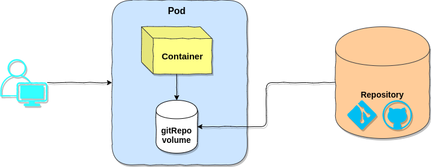

# GitRepo

`gitRepo` volume က တကယ်တော့ [`emptyDir`](https://blog.k8smm.org/volumes/emptydir) volume နဲ့ တူပါတယ်။ Persistent store လို့မရပါဘူး။ Pod တစ်ခုထဲရှိ container အချင်းချင်းပဲ share လို့ရပါတယ်။ pod တွေအချင်းချင်း share လို့မရပါဘူး။  ဒါပေမဲ့ `gitRepo` volume က Git repository များကို clone ပြုလုပ်ခြင်း၊ check out ပြုလုပ်ခြင်းတွေကို pod စတင် run တဲ့အချိန်၊  pod အထဲရှိ container တည်ဆောက်မှု မပြီးခင်မှာ  ပြုလုပ်ပေးသွားမှာဖြစ်ပါတယ်။ ယခု အချိန်မှာ `gitRepo` volume က သုံးလို့ရနေဆဲ ဖြစ်သေးပေမယ့်  deprecated ဖြစ်သွားပါပြီ။ [Kubernetes Documentation](https://kubernetes.io/docs/concepts/storage/volumes/#gitrepo) မှာ တော့ `gitRepo` volume အစား git ကို အသုံးပြုတဲ့ `InitContainer` နဲ့ `EmptyDir` volume ကို အသုံးပြုဖို့ အကြံပေးထားပါတယ်။ Deprecated  ဖြစ်သွားသော်လည်း သိရှိလေ့လာရအောင် ဖော်ပြပေးလိုက်ပါတယ်။




gitrepo ကို အသုံးပြုမယ်ဆိုရင် gitrepo ကို အသုံးပြုတဲ့ pod တွေ schedule လုပ်မယ့် worker node တိုင်းမှာ git client binary ကို ကြိုပြီးထည့်သွင်းပေးထားဖို့ လိုအပ်ပါတယ်။ git client binary မရှိရင် git clone / git check out မလုပ်နိုင်ပါဘူး။ 


GitRepo ရဲ့ feature ကမြင်တဲ့အတိုင်း awesome ဖြစ်ပါတယ်။ ဒါပေမဲ့ သူရဲ့ အားနည်းချက်တွေကတော့ အပေါ်မှာပြောခဲ့သလို kubernetes က git client binary အပေါ်မှီခိုရခြင်း၊ နောက်ထပ် တစ်ခုက တော့ ကျွန်တော်တို့ update ထက်လုပ်လိုက်တဲ့ git repository မှ နောက်ဆုံး commits အသစ်များကို sync မပြုလုပ်နိုင်ခြင်း၊ တို့ ဖြစ်ပါတယ်။ ဒါကြောင့်မို့လည်း Deprecated ဖြစ်သွားတယ် ထင်ပါတယ်။ 

GitRepo ကိုဘယ်လိုနေရာမျိုးတွေမှာ အသုံး၀င်နိုင်မလဲ ? ဘယ်လိုအသုံးပြုမလဲ ? အလွယ်ပြောရရင် တော့ kubernetes ကို သုံးတဲ့ environment မျိုးမှာ company website သို့မဟုတ် portfolio စတာတွေအတွက် static website တွေကို `gitRepo` volume အသုံးပြုပြီး အလွယ်တကူ အသုံးပြုလို့ ရနိုင်ပါတယ်။ ဒါကြောင့်မလို့ GitRepo ကို သုံးမယ်ဆို အသင့်ရှိပြီးသား git repository တစ်ခု မဖြစ်မနေရှိဖို့ လိုအပ်ပါတယ်။ GitRepo အတွက် sample manifest ကို ဖော်ပြပေးပါ့မယ်။

```yaml
apiVersion: v1
kind: Pod
metadata:
  name: gitrepo-volume-pod
spec:
  containers:
  - image: nginx:alpine
    name: web-server
    volumeMounts:
    - name: html
      mountPath: /usr/share/nginx/html
      readOnly: true
    ports:
    - containerPort: 80
      protocol: TCP
  volumes:
  - name: html
    gitRepo:
      repository: https://github.com/DTherHtun/static-gitrepo.git
      revision: master
      directory: .
```

Line number 18 ကတော့ volume type - `gitRepo` လို့ declare လုပ်ထားတာ ဖြစ်ပါတယ်။ `gitRepo` ရဲ့ parameter တွေကတော့ `repository` , `revision`, `directory` တို့ဖြစ်ပြီး `repository` သည် အသုံးပြုမယ့် repository url ကိုထည့်ပေးရမှာ ဖြစ်ပါတယ်။ `revision` ကတော့ repository မှ clone ချင်သည့် branch ကို ထည့်ပေးဖို့ ဖြစ်ပါတယ်။ `directory` ကတော့ destination နဲ့ တူပါတယ်။ ဘယ် path သို့မဟုတ် ဘယ် folder အောက်ကို clone မလဲ ဆိုတာကို ထည့်ပေးဖို့ဖြစ်ပါတယ်။

